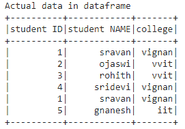
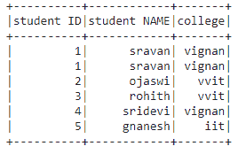
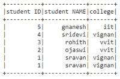
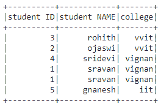

# 如何通过列列表对 Pyspark 数据帧进行排序？

> 原文:[https://www . geesforgeks . org/how-to-order-py spark-data frame-by-list-columns/](https://www.geeksforgeeks.org/how-to-order-pyspark-dataframe-by-list-of-columns/)

在本文中，我们将在 Python 中的 pyspark 数据框上应用多列 OrderBy。对行进行排序意味着按升序或降序排列行。

**方法 1:使用 OrderBy()**

OrderBy()函数用于根据对象的索引值对其进行排序。

> **语法:** dataframe.orderBy(['column1 '，' column2 '，' column n']，升序=True)。显示()
> 
> 哪里，
> 
> *   dataframe 是使用 pyspark 从嵌套列表中创建的 dataframe 名称
> *   其中列是第 11 列
> *   升序=真指定数据帧的升序，升序=假指定数据帧的降序
> *   用于显示列的 show()方法 id。

让我们创建一个示例数据帧

## 蟒蛇 3

```py
# importing module
import pyspark

# importing sparksession from pyspark.sql module
from pyspark.sql import SparkSession

# creating sparksession and giving an app name
spark = SparkSession.builder.appName('sparkdf').getOrCreate()

# list  of students  data
data = [["1", "sravan", "vignan"], ["2", "ojaswi", "vvit"],
        ["3", "rohith", "vvit"], ["4", "sridevi", "vignan"],
        ["1", "sravan", "vignan"], ["5", "gnanesh", "iit"]]

# specify column names
columns = ['student ID', 'student NAME', 'college']

# creating a dataframe from the lists of data
dataframe = spark.createDataFrame(data, columns)

print("Actual data in dataframe")
# show dataframe
dataframe.show()
```

**输出:**



### 对多列应用排序规则

## 蟒蛇 3

```py
# show dataframe by sorting the dataframe 
# based on two columns in ascending
# order using orderby() function
dataframe.orderBy(['student ID', 'student NAME'],
                  ascending=True).show()
```

**输出:**



## 蟒蛇 3

```py
# show dataframe by sorting the dataframe
# based on two columns in descending
# order using orderby() function
dataframe.orderBy(['student ID', 'student NAME'],
                  ascending=False).show()
```

**输出:**



**方法 2:使用 sort()**

它将布尔值作为参数，以升序或降序进行排序。

> **语法:** dataframe.sort(['column1 '，' column2 '，' column n']，升序=True)。显示()
> 
> 哪里，
> 
> 1.  dataframe 是使用 pyspark 从嵌套列表中创建的 dataframe 名称
> 2.  其中列是第 11 列
> 3.  升序=真指定数据帧的升序，升序=假指定数据帧的降序
> 4.  用于显示列的 show()方法 id。

## 蟒蛇 3

```py
# show dataframe by sorting the dataframe
# based on two columns in descending order
dataframe.sort(['college', 'student NAME'], ascending=False).show()
```

**输出:**

