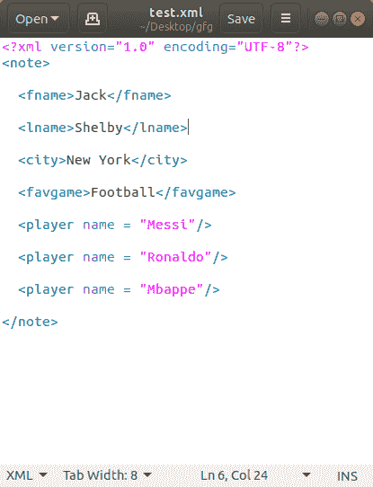
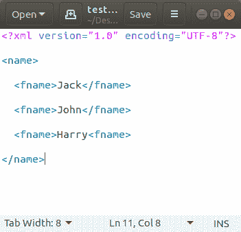
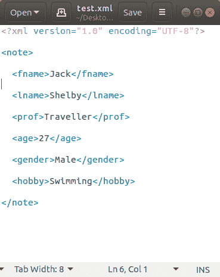
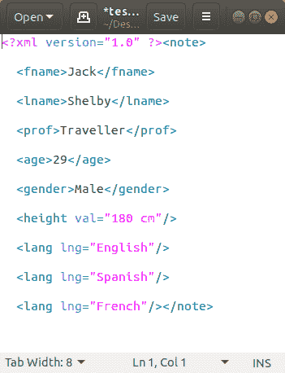

# 如何在 Python 中解析和修改 XML？

> 原文:[https://www . geesforgeks . org/如何解析和修改 python 中的 XML/](https://www.geeksforgeeks.org/how-to-parse-and-modify-xml-in-python/)

**XML** 代表可扩展标记语言。它被设计用来存储和传输数据。它被设计成人类可读和机器可读的。这就是为什么，XML 的设计目标强调互联网上的简单性、通用性和可用性。

**注:**更多信息请参考 [XML |基础知识](http://geeksforgeeks.org/xml-basics/)

这里我们认为 XML 文件存在于内存中。请阅读代码中的注释以获得清晰的理解。

**XML 文件:**



让我们将上面的 XML 文件保存为**“test . XML”**。在继续之前，你应该知道**在 XML 中，我们没有像在 HTML 中那样的预定义标签**。在编写 XML 时，**作者必须定义他/她自己的标签以及文档结构**。现在我们需要解析这个文件，并使用 Python 对其进行修改。我们将使用 **Python 3** 的**【minidom】**库来完成上述任务。这个模块没有内置 Python。要安装此软件，请在终端中键入以下命令。

```py
pip install minidom
```

### 正在读取 XML

首先我们将阅读 XML 文件的内容，然后我们将学习如何修改 XML 文件。
**例**

```py
import xml.dom.minidom as md

def main():

    # parsing the xml file and 
    # storing the contents in 
    # "file" object Put in the 
    # path of your XML file in
    # the parameter for parse() method.
    file = md.parse( "test.xml" ) 

    # nodeName returns the type of 
    # the file(in our case it returns
    # document)
    print( file.nodeName )

    # firstChild.tagName returns the 
    # name of the first tag.Here it 
    # is "note"
    print( file.firstChild.tagName )

    firstname = file.getElementsByTagName( "fname" )

    # printing the first name
    print( "Name: " + firstname[ 0 ].firstChild.nodeValue ) 

    lastname = file.getElementsByTagName( "lname" )

    # printing the last name
    print( "Surname: " + lastname[ 0 ].firstChild.nodeValue )

    favgame = file.getElementsByTagName( "favgame" )

    # printing the favourite game
    print( "Favourite Game: " + favgame[ 0 ].firstChild.nodeValue )

    # Printing tag values having 
    # attributes(Here tag "player"
    # has "name" attribute)
    players = file.getElementsByTagName( "player" )

    for player in players:
        print( player.getAttribute( "name" ) )

if __name__=="__main__":
    main();
```

**输出**:

```py
#document
note
Name: Jack
Surname: Shelby
Favourite Game: Football
Messi
Ronaldo
Mbappe

```

在上面打印**名字**或**姓氏**的 Python 代码中，我们使用了**名字【0】/姓氏【0】**。这是因为只有 1 个**“fname”**和 1 个**“lname”**标签。对于**多个相同的标签**，我们可以如下进行。
**XML:**



**蟒蛇**

```py
import xml.dom.minidom as md

def main():

    file = md.parse( "test.xml" )
    names = file.getElementsByTagName( "fname" )

    for name in names:

        print( name.firstChild.nodeValue )

if __name__=="__main__":
    main();
```

**输出**

```py
Jack
John
Harry

```

### 修改 XML

现在我们已经对如何使用 Python 解析和读取 XML 文件的内容有了一个基本的概念。现在让我们学习**修改**一个 XML 文件。
T3】XML 文件:



让我们**加上**如下:

*   高度
*   杰克知道的语言

让我们**删除****【爱好】**标签。也让我们**修改**把**年龄**改为 **29** 。
**Python 代码:(修改 XML)**

```py
import xml.dom.minidom as md

def main():

    file = md.parse("test.xml")

    height = file.createElement( "height" )

    # setting height value to 180cm
    height.setAttribute("val", "180 cm") 

    # adding height tag to the "file" 
    # object
    file.firstChild.appendChild(height) 

    lan = [ "English", "Spanish", "French" ]

    # creating separate "lang" tags for
    # each language and adding it to 
    # "file" object
    for l in lan: 

        lang = file.createElement( "lang" )
        lang.setAttribute( "lng", l )
        file.firstChild.appendChild( lang )

    delete = file.getElementsByTagName( "hobby" )

    # deleting all occurences of a particular 
    # tag(here "hobby")
    for i in delete: 

        x = i.parentNode
        x.removeChild( i )

    # modifying the value of a tag(here "age")
    file.getElementsByTagName( "age" )[ 0 ].childNodes[ 0 ].nodeValue = "29" 

    # writing the changes in "file" object to 
    # the "test.xml" file
    with open( "test.xml", "w" ) as fs: 

        fs.write( file.toxml() )
        fs.close() 

if __name__=="__main__":
    main();
```

**输出:**



Python 代码的最后 3 行使用 **toxml()** 方法将**“文件”**对象转换为 XML，并将其写入**“test . XML”**文件。如果您不想编辑原始文件，只想打印修改后的 XML，那么**将这 3 行替换为**:

```py
print(file.toxml())

```