# Python 中如何解析本地 HTML 文件？

> 原文:[https://www . geesforgeks . org/how-parse-local-html-file-in-python/](https://www.geeksforgeeks.org/how-to-parse-local-html-file-in-python/)

**先决条件** : [美丽组合](https://www.geeksforgeeks.org/implementing-web-scraping-python-beautiful-soup/)

**解析**是指将一个文件或输入划分为若干条信息/数据，这些信息/数据可以存储起来，供我们将来个人使用。有时，我们需要从存储在计算机上的现有文件中获取数据，在这种情况下可以使用解析技术。**解析**包括用于从文件中提取数据的多种技术。以下包括**修改**文件、**从文件中移除**东西、**打印**数据、使用**递归子生成器**方法遍历文件中的数据、从链接中找到标签的**子标签、**网页抓取**提取有用信息等。**

## 修改文件

使用**美化**方法修改来自-https://festive-knuth-1279a2.netlify.app/,的 HTML 代码看起来更好。**美化**使代码看起来像在 **VS 代码**中使用的标准形式。

**示例:**

## 蟒蛇 3

```
# Importing BeautifulSoup class from the bs4 module
from bs4 import BeautifulSoup

# Importing the HTTP library
import requests as req

# Requesting for the website
Web = req.get('https://festive-knuth-1279a2.netlify.app/')

# Creating a BeautifulSoup object and specifying the parser
S = BeautifulSoup(Web.text, 'lxml')

# Using the prettify method
print(S.prettify())
```

**输出:**

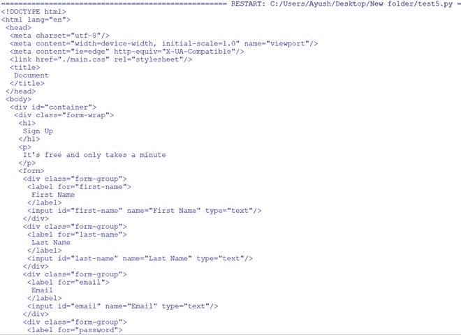 

## 移除标签

可以通过使用分解方法和 select_one 方法移除标签，使用 CSS 选择器选择并移除 li 标签中的第二个元素，然后使用美化方法修改 index.html 文件中的 HTML 代码。

**示例:**

**使用的文件:**

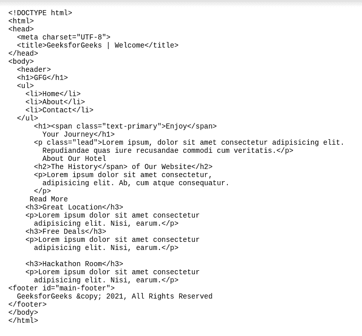

## 蟒蛇 3

```
# Importing BeautifulSoup class from the bs4 module
from bs4 import BeautifulSoup

# Opening the html file
HTMLFile = open("index.html", "r")

# Reading the file
index = HTMLFile.read()

# Creating a BeautifulSoup object and specifying the parser
S = BeautifulSoup(index, 'lxml')

# Using the select-one method to find the second element from the li tag
Tag = S.select_one('li:nth-of-type(2)')

# Using the decompose method
Tag.decompose()

# Using the prettify method to modify the code
print(S.body.prettify())
```

**输出:**

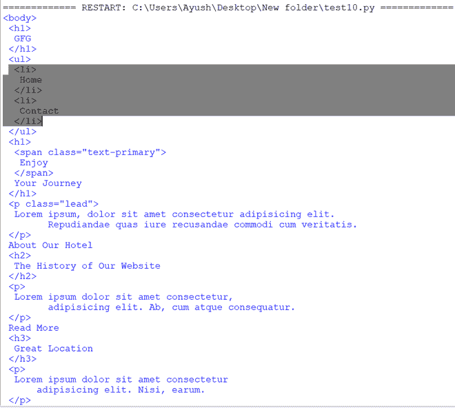 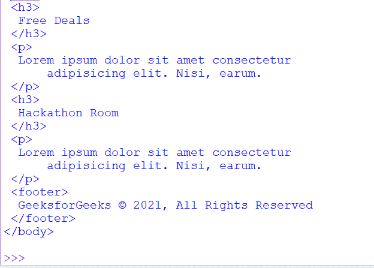

## **查找标签**

标签可以正常找到，并使用 print()正常打印。

**示例:**

## 蟒蛇 3

```
# Importing BeautifulSoup class from the bs4 module
from bs4 import BeautifulSoup

# Opening the html file
HTMLFile = open("index.html", "r")

# Reading the file
index = HTMLFile.read()

# Creating a BeautifulSoup object and specifying the parser
Parse = BeautifulSoup(index, 'lxml')

# Printing html code of some tags
print(Parse.head)
print(Parse.h1)
print(Parse.h2)
print(Parse.h3)
print(Parse.li)
```

**输出:**

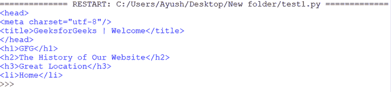

## **遍历标签**

**recursiveChildGenerator** 方法用于遍历标签，从文件中递归查找标签内的所有标签。

**示例:**

## 蟒蛇 3

```
# Importing BeautifulSoup class from the bs4 module
from bs4 import BeautifulSoup

# Opening the html file
HTMLFile = open("index.html", "r")

# Reading the file
index = HTMLFile.read()

# Creating a BeautifulSoup object and specifying the parser
S = BeautifulSoup(index, 'lxml')

# Using the recursiveChildGenerator method to traverse the html file
for TraverseTags in S.recursiveChildGenerator():
  # Traversing the names of the tags
    if TraverseTags.name:
      # Printing the names of the tags
        print(TraverseTags.name)
```

**输出:**

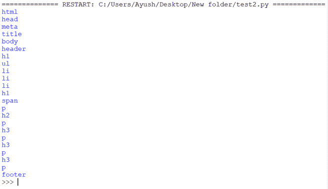

## **解析标签的名称和文本属性**

使用标签的**名称**属性打印其名称，使用**文本**属性打印其文本以及文件中标签的代码- **ul** 。

**示例:**

## 蟒蛇 3

```
# Importing BeautifulSoup class from the bs4 module
from bs4 import BeautifulSoup

# Opening the html file
HTMLFile = open("index.html", "r")

# Reading the file
index = HTMLFile.read()

# Creating a BeautifulSoup object and specifying the parser
S = BeautifulSoup(index, 'lxml')

# Printing the Code, name, and text of a tag
print(f'HTML: {S.ul}, name: {S.ul.name}, text: {S.ul.text}')
```

**输出:**

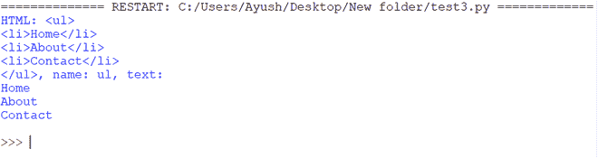

## **查找标签的子标签**

**子级**属性用于获取标签的子级。Children 属性返回“中间有空格的标签”，我们添加了一个条件- **e. name 不是 None** 来只打印文件中标签的名称。

**示例:**

## 蟒蛇 3

```
# Importing BeautifulSoup class from the bs4 module
from bs4 import BeautifulSoup

# Opening the html file
HTMLFile = open("index.html", "r")

# Reading the file
index = HTMLFile.read()

# Creating a BeautifulSoup object and specifying the parser
S = BeautifulSoup(index, 'lxml')

# Providing the source
Attr = S.html

# Using the Children attribute to get the children of a tag
# Only contain tag names and not the spaces
Attr_Tag = [e.name for e in Attr.children if e.name is not None]

# Printing the children
print(Attr_Tag)
```

**输出:**

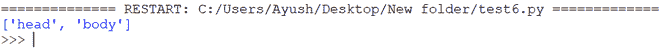

**在标签的所有级别查找孩子:**

**后代**属性用于从文件中获取标签的所有后代(所有级别的子代)。

**示例:**

## 蟒蛇 3

```
# Importing BeautifulSoup class from the bs4 module
from bs4 import BeautifulSoup

# Opening the html file
HTMLFile = open("index.html", "r")

# Reading the file
index = HTMLFile.read()

# Creating a BeautifulSoup object and specifying the parser
S = BeautifulSoup(index, 'lxml')

# Providing the source
Des = S.body

# Using the descendants attribute
Attr_Tag = [e.name for e in Des.descendants if e.name is not None]

# Printing the children
print(Attr_Tag)
```

**输出:**

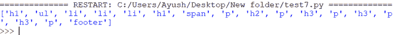

## **查找标签的所有元素**

**使用 find_all():**

**find_all** 方法用于从文件中查找 **p** 标签内的所有元素(**名称**和**文字**)。

**示例:**

## 蟒蛇 3

```
# Importing BeautifulSoup class from the bs4 module
from bs4 import BeautifulSoup

# Opening the html file
HTMLFile = open("index.html", "r")

# Reading the file
index = HTMLFile.read()

# Creating a BeautifulSoup object and specifying the parser
S = BeautifulSoup(index, 'lxml')

# Using the find_all method to find all elements of a tag
for tag in S.find_all('p'):

  # Printing the name, and text of p tag
    print(f'{tag.name}: {tag.text}')
```

**输出:**

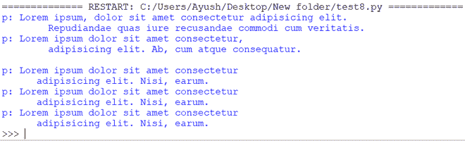

**CSS 选择器查找元素**:

使用**选择**方法，使用 **CSS 选择器**从文件的 **li** 标签中找到**第二个**元素。

**示例:**

## 蟒蛇 3

```
# Importing BeautifulSoup class from the bs4 module
from bs4 import BeautifulSoup

# Opening the html file
HTMLFile = open("index.html", "r")

# Reading the file
index = HTMLFile.read()

# Creating a BeautifulSoup object and specifying the parser
S = BeautifulSoup(index, 'lxml')

# Using the select method
# Prints the second element from the li tag
print(S.select('li:nth-of-type(2)'))
```

**输出:**

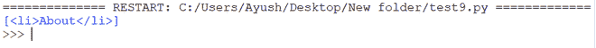