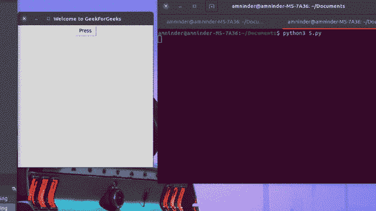
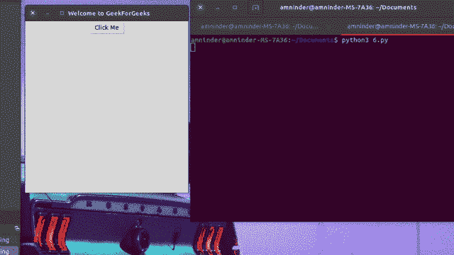

# 如何将参数传递给 Tkinter 按钮命令？

> 原文:[https://www . geesforgeks . org/如何将参数传递给-tkinter-button-command/](https://www.geeksforgeeks.org/how-to-pass-arguments-to-tkinter-button-command/)

[Tkinter](https://www.geeksforgeeks.org/python-gui-tkinter/) 是 Python 的标准 GUI 库。Tkinter 是 Python 附带的 Tk GUI 工具包的 Python 接口。它提供了一个健壮且独立于平台的窗口工具包，Python 程序员可以使用这个包。Python 与 Tkinter 相结合，为创建图形用户界面应用程序提供了一种快速简单的方法。Tkinter 为 Tk GUI 工具包提供了一个强大的面向对象的接口。

### **接近**

*   导入 tkinter package。
*   创建根窗口。给根窗口一个标题(使用 title())和尺寸(使用 geometry())。
*   使用(button())创建按钮。
*   使用 mainloop()调用窗口的循环。

这两种方法的步骤都是一样的，唯一需要改变的是如何应用这两种方法。

**方法一:使用λ函数**

## 蟒蛇 3

```py
# importing tkinter
import tkinter as tk

# defining function

def func(args):
    print(args)

# create root window
root = tk.Tk()

# root window title and dimension
root.title("Welcome to GeekForGeeks")
root.geometry("380x400")

# creating button
btn = tk.Button(root, text="Press", command=lambda: func("See this worked!"))
btn.pack()

# running the main loop
root.mainloop()
```

**输出:**



使用λ

**方法二:使用部分**

## 蟒蛇 3

```py
# importing necessary libraries
from functools import partial
import tkinter as tk

# defining function

def function_name(func):
    print(func)

# creating root window
root = tk.Tk()

# root window title and dimension
root.title("Welcome to GeekForGeeks")
root.geometry("380x400")

# creating button
btn = tk.Button(root, text="Click Me", command=partial(
    function_name, "Thanks, Geeks for Geeks !!!"))
btn.pack()

# running the main loop
root.mainloop()
```

**输出:**



使用部分