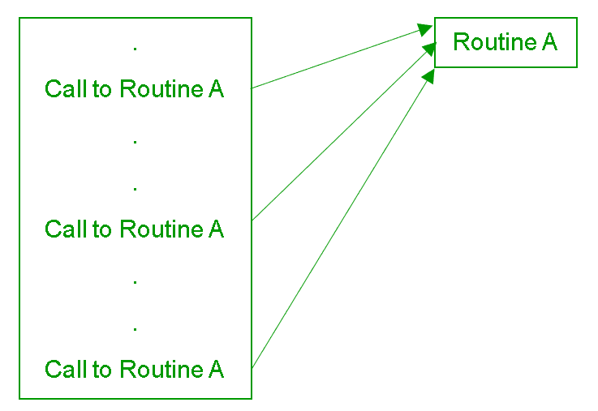

# 如何将多个参数传递给函数？

> 原文:[https://www . geesforgeks . org/如何将多个参数传递给函数/](https://www.geeksforgeeks.org/how-to-pass-multiple-arguments-to-function/)

一个**例程**是执行一些任务的一组命名指令。在给定的程序中，一个例程总是可以根据需要被调用多次。



当例程停止时，执行立即返回到调用例程的阶段。这种例程可以用编程语言预先定义，或者由程序员设计或实现。A **函数**是程序中例程的 Python 版本。有些函数是为了返回值而设计的，而另一些函数是为了其他目的而设计的。
我们在一个函数中传递参数，我们可以不传递任何参数，单个参数或者多个参数给一个函数，并且可以多次调用这个函数。
**例:**

## 计算机编程语言

```
# no argument is passed

# function definition
def displayMesaage():
      print("Geeks for Geeks")

# function call
displayMesaage()
```

**输出:**

```
Geeks for Geeks
```

在上面的程序中，调用 displayMessage()函数时没有向它传递任何参数。

## 计算机编程语言

```
# single argument is passed

# function definition
def displayMessage(msg):
       print("Hello "+msg+" !")

msg = "R2J"

# function call
displayMessage(msg)
```

**输出:**

```
Hello R2J !
```

在上面的程序中，通过向 displayMessage()函数传递参数来调用该函数。形式参数是存在于函数定义中的参数。实际的参数是一个参数，它存在于函数调用中。
**用 Python 向函数传递多个参数:**

*   我们可以通过预先确定函数定义中的形式参数，将多个参数传递给 python 函数。

    ## 计算机编程语言

    ```
    # multiple arguments are passed

    # function definition
    def displayMessage(argument1, argument2, argument3):
              print(argument1+" "+argument2+" "+argument3)

    # function call
    displayMessage("Geeks", "4", "Geeks")
    ```

*   **输出:**

```
Geeks 4 Geeks
```

*   在上面的程序中，多个参数被传递给 displayMessage()函数，其中要传递的参数数量是固定的。
*   我们可以使用以下语法将多个参数传递给 python 函数，而无需预先确定形式参数:

    ```
    def functionName(*argument)
    ```

*   *符号用于向函数传递可变数量的参数。通常，当我们不知道有多少参数将被发送到函数时，该语法用于避免代码失败。

    ## 计算机编程语言

    ```
    # variable number of non keyword arguments passed

    # function definition
    def calculateTotalSum(*arguments):
        totalSum = 0
        for number in arguments:
            totalSum += number
        print(totalSum)

    # function call
    calculateTotalSum(5, 4, 3, 2, 1)
    ```

*   **输出:**

```
15
```

*   在上面的程序中，可变数量的参数被传递给 displayMessage()函数，在该函数中，要传递的参数数量不是预先确定的。(此语法仅用于将非关键字参数传递给函数。)
*   我们可以使用以下语法将多个关键字参数传递给 python 函数，而无需预先确定形式参数:

    ```
    def functionName(**argument)
    ```

*   The ** symbol is used before an argument to pass a keyword argument dictionary to a function, this syntax used to successfully run the code when we don’t know how many keyword arguments will be sent to the function.

    ## 计算机编程语言

    ```
    # variable number of keyword arguments passed

    # function definition
    def displayArgument(**arguments): 
        for arg in arguments.items():
            print(arg)

    # function call
    displayArgument(argument1 ="Geeks", argument2 = 4,
                    argument3 ="Geeks")
    ```

    *   **输出:**

    ```
    ('argument2', 4)
    ('argument3', 'Geeks')
    ('argument1', 'Geeks')
    ```

    *   在上面的程序中，可变数量的关键字参数被传递给 displayArgument()函数。

    这里有一个程序来说明在一个函数中传递多个参数的所有上述情况。

    ## 计算机编程语言

    ```
    # single argument, non keyword argument 
    # and keyword argument are passed

    # function definition
    def dislplayArguments(argument1, *argument2, **argument3): 

        # displaying predetermined argument
        print(argument1)

        # displaying non keyword arguments
        for arg in argument2:
            print(arg)

        # displaying non keyword arguments
        for arg in argument3.items():
            print(arg)

    arg1 = "Welcome"
    arg3 = "Geeks"

    # function call
    dislplayArguments(arg1, "to", arg3, agr4 = 4,
                      arg5 ="Geeks !")
    ```

    **输出:**

    ```
    Welcome
    to
    Geeks
    ('agr4', 4)
    ('arg5', 'Geeks!')
    ```

    上面的程序说明了非关键字参数和关键字参数以及非星号参数在函数中的使用。在函数定义中，非星号参数总是用在单星号参数之前，单星号参数总是用在双星号参数之前。