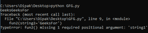

# Python 中如何给函数传递可选参数？

> 原文:[https://www . geesforgeks . org/如何将可选参数传递给 python 中的函数/](https://www.geeksforgeeks.org/how-to-pass-optional-parameters-to-a-function-in-python/)

在 Python 中，当我们为某些参数定义带有默认值的函数时，据说它会将其参数设置为用户的一个选项。用户可以传递他们的值，也可以假装函数使用他们指定的默认值。

这样，用户可以通过传递这些可选参数或只传递所需参数来调用函数。

在 python 中，传递可选参数有两种主要方式

*   不使用关键字参数。
*   通过使用关键字参数。

## **不使用关键字参数传递**

不使用关键字参数传递时需要注意的一些要点是:

*   应保持参数的顺序，即在调用函数时应保持函数中定义参数的顺序。
*   应该传递非可选参数的值，否则会引发错误。
*   默认参数的值可以传递或忽略。

下面是一些解释这个概念的代码。

**例 1:**

## 蟒蛇 3

```
# Here b is predefined and hence is optional.
def func(a, b=1098):
    return a+b

print(func(2, 2))

# this 1 is represented as 'a' in the function and
# function uses the default value of b
print(func(1))
```

**输出:**

```
4
1099
```

**例 2:** 我们也可以传递字符串。

## 蟒蛇 3

```
# Here string2 is the default string used
def fun2(string1, string2="Geeks"):
    print(string1 + string2)

# calling the function using default value
fun2('GeeksFor')

# calling without default value.
fun2('GeeksFor', "Geeks")
```

**输出:**

```
GeeksForGeeks
GeeksForGeeks
```

## **传递关键字参数**

定义函数后，参数以“数据类型关键字名称”的形式写入。因此 python 提供了一种机制，可以使用关键字名称来调用函数来传递值。这有助于程序员不用学习参数传递的顺序。

我们需要记住的一些要点如下:

*   在这种情况下，我们不需要维护传递值的顺序。
*   传递的关键字名称和声明的关键字名称之间应该没有区别。

**下面是它的实现代码。**

## 蟒蛇 3

```
# Here string2 is the default string used
def fun2(string1, string2="Geeks"):
    print(string1 + string2)

# Thiscan be a way where no order is needed.
fun2(string2='GeeksFor', string1="Geeks")

# since we are not mentioning the non-default argument
# so it will give error.
fun2(string2='GeeksFor')
```

**输出:**



我们可以看到，在上面的例子中，我们不需要维护任何订单。此外，我们可以看到，当我们试图只传递可选参数时，会产生一个错误。这是因为可选参数可以省略，因为它们有一个默认值，但是我们不能省略必需的参数(在上面的情况下是 string1。)因此，它显示了一个带有标志的错误:“缺少 1 个必需的参数”。

**本例将对上述话题给出更深入的见解:**

## 蟒蛇 3

```
def func(a, b, c='geeks'):
    print(a, "type is", type(a))
    print(b, "type is", type(b))
    print(c, "type is", type(c))

# The optional parameters will not decide
# the type of parameter passed.
# also the order is maintained
print("first call")
func(2, 'z', 2.0)

# below call uses the default
# mentioned value of c
print("second call")
func(2, 1)

# The below call (in comments) will give an error
# since other required parameter is not passed.
# func('a')
print("third call")
func(c=2, b=3, a='geeks')
```

**输出:**

```
first call
2 type is <class 'int'>
z type is <class 'str'>
2.0 type is <class 'float'>
second call
2 type is <class 'int'>
1 type is <class 'int'>
geeks type is <class 'str'>
third call
geeks type is <class 'str'>
3 type is <class 'int'>
2 type is <class 'int'>
```

所以基本上 python 函数调用只检查所需数量的函数参数是否通过。

**下面显示了用户试图以上面讨论的两种方式传递参数的情况，以及给出的预防措施:**

## 蟒蛇 3

```
def comp(a, b=2):
    if(a < b):
        print("first parameter is smaller")
    if(a > b):
        print("second parameter is smaller")
    if(a == b):
        print("both are of equal value.")

print("first call")
comp(1)
print("second call")
comp(2, 1)
print("third call")
comp(b=1, a=-1)
print("fourth call")
comp(-1, b=0)
```

**输出:**

```
first call
first parameter is smaller
second call
second parameter is smaller
third call
first parameter is smaller
fourth call
first parameter is smaller
```

所以有一点我们应该记住，关键字参数应该在所有位置参数都被传递之后使用。因此，当以两种方式将参数传递给同一个函数时，这是我们必须牢记的一件重要事情。