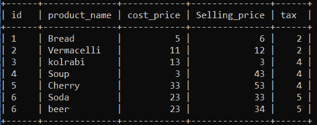
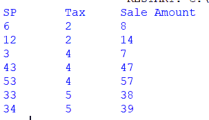
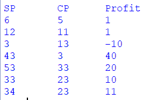

# 如何使用 Python 跨 MySQL 表的列执行算术运算？

> 原文:[https://www . geeksforgeeks . org/如何使用 python 跨 mysql 表的列执行算术/](https://www.geeksforgeeks.org/how-to-perform-arithmetic-across-columns-of-a-mysql-table-using-python/)

Python 是一种动态语言，Python 应用程序可以与数据库服务器集成。用于从 Python 访问 MySQL 数据库的模块是 [MySQL 连接器 Python](https://www.geeksforgeeks.org/connect-mysql-database-using-mysql-connector-python/) 。PyMySQL、MySQLDB 和 mysqlclient 是 Python 中与 MySQL 数据库服务器通信的其他 Python 模块。但是，我们将在本文中使用 MySQL Connector Python，因为它是一个纯粹用 Python 编写的 API，这意味着它没有依赖关系，只需要标准库。

为了对列数据执行算术运算，MySQL 有算术运算符。这些运算符对于对数据执行计算非常有用。MySQL 中的算术运算符如下:

<figure class="table">

| **操作** | **MySQL 算术运算符** | **MySQL 中的语法** |
| 添加 | +

 | 从表名*中选择 op1+op2；* |
| 减法 | – | 从表名中选择 op1–op2； |
| 分开 | / | 从表名中选择 op1/op2； |
| 增加 | * | 从表名中选择 op1 * op2 |
| 系数 | % | 从表名中选择 op1 % op2 |

</figure>

在上表中， *op1* 和 *op2* 可以是列名或数值(这种情况下不需要“from”子句)。以下程序将帮助您更好地理解这些运算符的用法。

**正在使用的数据库:**

我们将在程序中使用产品信息表。它由产品名称、成本价、售价、税和购买数量组成。



**例 1:** 加法运算符的使用

## 蟒蛇 3

```
# Import required packages
import mysql.connector

# Establish connection to MySQL database
mydb = mysql.connector.connect(
  host = "localhost",
  user = "username",
  password = "geeksforgeeks",
  database = "grocery"
)

# MySQLCursorDict creates a cursor
# that returns rows as dictionaries
mycursor = mydb.cursor( dictionary = True )

# MySQL query for getting total
# sale amount (i.e. selling price + tax)
query = "SELECT Selling_price, \
                tax, \
                concat(Selling_price + tax) AS sale_amount \
         FROM product"

# Execute the query 
mycursor.execute( query )
# Fetch result of query
myresult = mycursor.fetchall()

# Print result of query
print(f"SP \t Tax \t Sale Amount")

for row in myresult:

      # Each value printed for display purpose (you can simply print row)
    print(f"{ row[ 'Selling_price' ]} \t { row[ 'tax' ]} \t { row[ 'sale_amount' ]}")

mydb.close()
```

**输出:**



**例 2:** 减法运算符的使用。

## 蟒蛇 3

```
# Import required packages
import mysql.connector

# Establish connection to MySQL database
mydb = mysql.connector.connect(
  host = "localhost" ,
  user = "username" ,
  password = "geeksforgeeks" ,
  database = "grocery"
)

# MySQLCursorDict creates a cursor
# that returns rows as dictionaries
mycursor = mydb.cursor(dictionary = True )

# MySQL query for getting profit
# (i.e. selling price - cost price)
query = "SELECT selling_price, \
                cost_price, \
                concat(selling_price - cost_price) AS profit \
         FROM product_info"

# Execute the query 
mycursor.execute( query )

# Fetch result of query
myresult = mycursor.fetchall()

# Print result of query
print(f"SP \t CP \t Profit")
for row in myresult:
  print(f"{ row[ 'selling_price' ]} \t { row[ 'cost_price' ]} \t { row[ 'profit' ]}")

mydb.close()
```

**输出:**



**示例 3:** 乘法运算符的使用

## 蟒蛇 3

```
# Import required packages
import mysql.connector

# Establish connection to MySQL database
mydb = mysql.connector.connect(
  host = "localhost" ,
  user = "username" ,
  password = "geeksforgeeks" ,
  database = "grocery"
)

# MySQLCursorDict creates a cursor that returns rows as dictionaries
mycursor = mydb.cursor(dictionary = True)

# MySQL query for getting total amount (i.e. sale amount * quantity)
query = "SELECT selling_price, \
                tax, \
                concat((selling_price * tax)) AS total_amount \
         FROM product_info"

# Execute the query 
mycursor.execute( query )

# Fetch result of query
myresult = mycursor.fetchall()

# Print result of query
print(f"SP \t Tax \t Total")
for row in myresult:
  print(f"{row[ 'selling_price' ]} \t { row[ 'tax' ]}\t{row['total_amount']}")

# Close database connection
mydb.close()
```