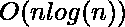
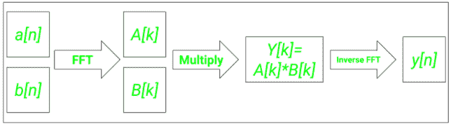

# 如何用 Python 中的快速傅里叶变换(FFT)进行更快的卷积？

> 原文:[https://www . geeksforgeeks . org/如何使用 python 中的快速傅立叶变换进行更快的卷积运算/](https://www.geeksforgeeks.org/how-to-perform-faster-convolutions-using-fast-fourier-transformfft-in-python/)

**卷积**是信号处理中最重要的数学运算之一。这种简单的数学运算在许多科学和工业应用中突然出现，从它在十亿层大型 CNN 中的使用到简单的图像去噪。卷积在本质上既可以是模拟的，也可以是离散的，但由于现代计算机的数字本质，离散卷积是我们随处可见的卷积！

两个一维向量![a[n]     ](img/69c70ba7a7102d1b044d331d2a030a74.png "Rendered by QuickLaTeX.com")和![b[n]     ](img/061dd19ac7cc9d576e24fedb0900e2f5.png "Rendered by QuickLaTeX.com")、![y[n]     ](img/d208dd5094625780501da5e3efd9e02d.png "Rendered by QuickLaTeX.com")的离散卷积定义为

![y[n] = a[n] * b[n] = \sum^{\infty}_{k=-\infty} a[k]b[n-k]](img/58d7f291a2608bbf5911377951139f4c.png "Rendered by QuickLaTeX.com")

由于需要两个向量相乘，使用乘法的离散卷积的时间复杂度(假设向量长度为)为。这就是快速傅立叶变换的由来。使用 FFT，我们可以把这个复杂度从降低到！

## 使用快速傅立叶变换进行卷积背后的直觉

一个最基本的信号处理结果表明， **时域中的**卷积相当于** **频域中的乘法。为了执行卷积，我们可以将两个信号转换为它们的频域表示，然后对哈达玛积(或点积)进行傅里叶逆变换，以获得卷积答案。工作流程可以用以下方式总结****



快速傅立叶变换工作流程的图示

### 安装:

出于本文的目的，我们将使用 Python 库 **numpy 和 scipy 中的一些内置函数。**可以使用 pip 包管理器进行安装。

```py
pip install scipy numpy
```

## Python 中的快速傅立叶变换卷积

对于使用 FFT 计算卷积，我们将使用 Python 中 scipy.signal 库中的 fftconvolve()函数。

> **语法:** scipy.signal.fftconvolve(a，b，mode='full ')
> 
> **参数:**
> 
> *   **a:** 第一个输入向量
> *   **b:** 第二输入向量
> *   **模式:**帮助指定卷积输出的大小和类型
>     *   **“全”:**该功能将返回全卷积输出
>     *   **“相同”:**该函数将返回一个输出，其尺寸与矢量“a”相同，但位于“全”模式输出的中心
>     *   **“有效”:**该函数将只返回那些不依赖于要计算的零填充的值

**下面是实现:**

## 计算机编程语言

```py
from scipy import signal

a = [1, 2, 3]
b = [4, 5, 6]

y = signal.fftconvolve(a, b, mode = 'full')
print('The convoluted sequence is ', y)
```

**输出**

```py
The convoluted sequence is  [ 4\. 13\. 28\. 27\. 18.]
```

## 快速傅立叶变换卷积与常规离散卷积的性能比较

*   为了计算两个向量的正常线性卷积，我们将使用 **np .卷积**函数。
*   Jupyter 笔记本的 **%timeit** 魔法函数用于计算给定向量的 2 个函数中每个函数所需的总时间。

**下面是实现:**

## 计算机编程语言

```py
import numpy as np
from scipy import signal

a = np.random.randn(10**5)
b = np.random.randn(10**5)

print('Time required for normal discrete convolution:')
%timeit np.convolve(a, b)

print('Time required for FFT convolution:')
%timeit signal.fftconvolve(a, b)
```

**输出:**

```py
Time required for normal discrete convolution:
1.1 s ± 245 ms per loop (mean ± std. dev. of 7 runs, 1 loop each)
Time required for FFT convolution:
17.3 ms ± 8.19 ms per loop (mean ± std. dev. of 7 runs, 10 loops each)
```

可以看到，FFT 卷积产生的输出比正常离散卷积产生的输出快 1000 倍！