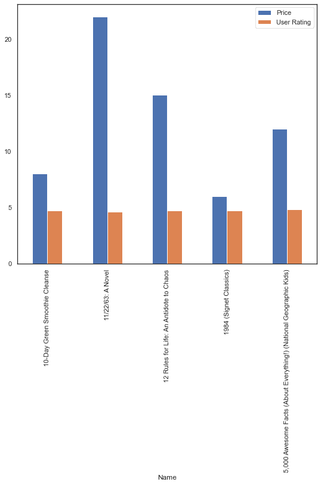
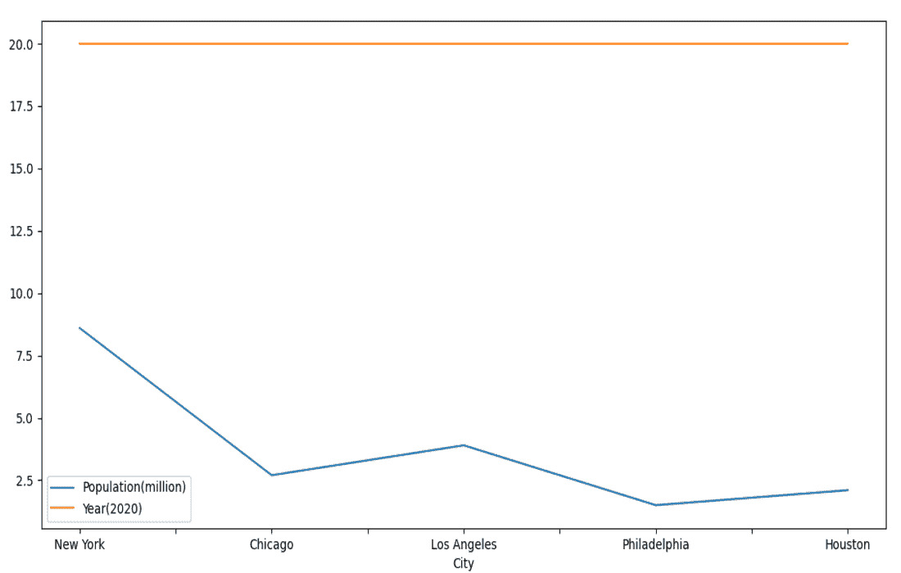

# 如何在一个数据帧中绘制多个数据列？

> 原文:[https://www . geeksforgeeks . org/如何绘制多数据列数据框/](https://www.geeksforgeeks.org/how-to-plot-multiple-data-columns-in-a-dataframe/)

**先决条件:**T2】熊猫

Python 附带了很多有用的包，比如熊猫、matplotlib、numpy 等。要使用数据框，我们需要 pandas 库，要绘制数据框的列，我们需要 matplotlib。 [**熊猫**](https://www.geeksforgeeks.org/python-pandas-dataframe/) 与 [**马特洛特利**关系密切。](https://www.geeksforgeeks.org/python-introduction-matplotlib/)您可以使用**绘图()**方法直接从数据框中绘制数据。

要在单个框架中绘制多个数据列，我们只需将列列表传递给绘图函数的 y 参数。下面给出了一个简单的实现方法和示例实现。

### **进场:**

*   导入模块
*   创建或加载数据
*   转换为数据帧
*   使用 plot()方法，沿 X 轴指定一列，沿 Y 轴指定多列作为数组。
*   显示图表。

以下是几个示例，说明了在数据框中绘制多个数据列的上述方法。

**例 1:**

**数据库:** [畅销书](https://drive.google.com/file/d/1KhtJuBtO73gItNku98y5ekCRWobzBify/view?usp=sharing)

## 蟒蛇 3

```
import pandas as pd
import matplotlib.pyplot as mp

# take data
data = pd.read_csv("Bestsellers.csv")

# form dataframe
data = data.head()

df = pd.DataFrame(data, columns=["Name", "Price", "User Rating"])

# plot the dataframe
df.plot(x="Name", y=["Price", "User Rating"], kind="bar", figsize=(9, 8))

# print bar graph
mp.show()
```

**输出:**



**例 2:**

## 蟒蛇 3

```
import pandas as pd
import matplotlib.pyplot as mp

# data to be plotted
data = [["New York", 8.6, 20],
        ["Chicago", 2.7, 20],
        ["Los Angeles", 3.9, 20],
        ["Philadelphia", 1.5, 20],
        ["Houston", 2.1, 20]]

# form dataframe from data
df = pd.DataFrame(data, columns=["City", "Population(million)", "Year(2020)"])

# plot multiple columns such as population and year from dataframe
df.plot(x="City", y=["Population(million)", "Year(2020)"],
        kind="line", figsize=(10, 10))

# display plot
mp.show()
```

**输出:**

