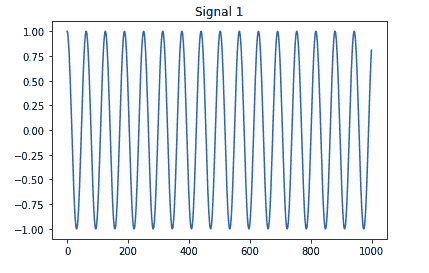
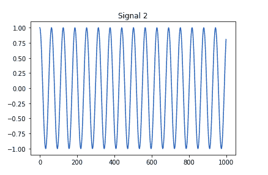
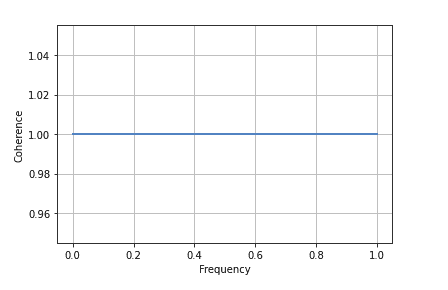
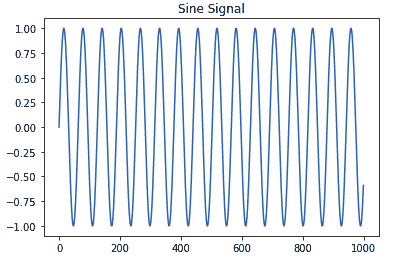
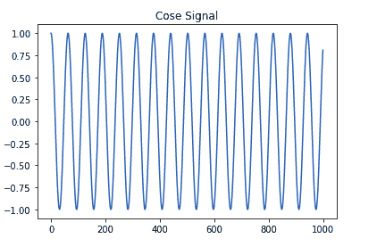
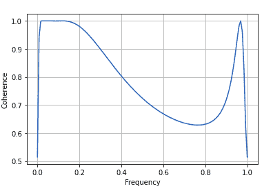

# 如何用 Python 绘制两个信号的相干性？

> 原文:[https://www . geeksforgeeks . org/如何绘制 python 中两个信号之间的一致性/](https://www.geeksforgeeks.org/how-to-plot-the-coherence-between-two-signals-in-python/)

[**Matplotlib**](https://www.geeksforgeeks.org/python-introduction-matplotlib/) 是 Python 中一个惊人的可视化库，用于数组的 2D 图。Matplotlib 是一个多平台数据可视化库，构建在 NumPy 数组上，旨在与更广泛的 SciPy 堆栈一起工作。

## 什么是连贯性和相关性？

**相干性:**用于测量两个信号之间的相关性。
**相关性:**它定义了一个量对另一个量的依赖程度。如果一个量完全依赖于另一个量，那么它们之间的相关性被称为 1。如果两个量或变量彼此不相关，那么它们的相关性为零。
相干性是归一化的互谱密度:

![\[Cxy = \frac{|Pxy|^2}{Pxx-Pyy}\] ](img/51bb0b6e262155ca40404d1eac5d8aab.png "Rendered by QuickLaTeX.com")

在 Python 中，[matplotlib . pyplot . cohere()](https://www.geeksforgeeks.org/matplotlib-pyplot-cohere-in-python/)用于寻找两个信号之间的相干性。

> **语法:***matplotlib . pyplot . cohere(x，y，NFFT=256，Fs=2，Fc=0，detrend=，window=，noverlap=0，pad_to=None，sides='default '，scale_by_freq=None，* data = None，**kwargs)*
> 
> **参数:**该方法接受以下参数-
> **1)x，y :** 是数据的序列。
> **2) Fs:** 为标量参数，默认值为 2，
> **3)窗口:**该参数以数据段为自变量，返回该段的窗口版本。其默认值为 window _ hanning()
> **4)sides:**此参数指定要返回光谱的哪些边。这可以有以下值:“默认值”、“单侧”和“双侧”。
> **5) pad_to :** 此参数包含数据段填充到的整数值。
> **6) Fc:** 此参数还包含偏移绘图 x 范围的整数值，以反映频率范围。其默认值为 0
> **7) NFFT:** 该参数包含用于快速傅立叶变换的每个块中的数据点数。
> **8)去趋势:**此参数包含 fft 前应用于每个分段的函数，旨在移除均值或线性趋势{'none '，' mean '，' linear'}。
> 按频率缩放:该参数允许对返回的频率值进行积分。
> **9)重叠:**此参数为块间重叠的点数。
> **10) Fc :** 此参数为 x 的中心频率。
> 
> **返回:**这个方法返回如下-
> **1) Cxy:** 这个返回相干向量。
> **2)频率:**返回 Cxy 中元素的频率。
> 
> **结果为(Cxy，freqs)**

让我们看看下面的例子，我们将使用上面的函数找到两个信号之间的一致性。

**例 1:**

```
import numpy as np
import matplotlib.pyplot as plt

# signal 1
time1=np.arange(0,100,0.1)
cossignal1= np.cos(time1)

plt.plot(cossignal1)
plt.title("Signal 1")
plt.show()

# signal 2
time2=np.arange(0,100,0.1)
cossignal2= np.cos(time2)

plt.plot(cossignal2)
plt.title("Signal 2")
plt.show()

# Store the value of correlation in a
# variable say 'cor' using the following code:
cor=plt.cohere(cossignal1,cossignal2)

# plot the coherence graph
plt.show()
```

**输出:**

  

**示例 2:** 正弦和余弦信号之间的相干性

```
import numpy as np
import matplotlib.pyplot as plt

# signal 1
time1 = np.arange(0, 100, 0.1)
sinsignal1 = np.sin(time1)

plt.plot(sinsignal1)
plt.title("Sine Signal")
plt.show()

# signal 2
time2 = np.arange(0, 100, 0.1)
cossignal2 = np.cos(time2)

plt.plot(cossignal2)
plt.title("Cose Signal")
plt.show()

# Store the value of correlation in
# a variable say 'cor' using the 
# following code
cor = plt.cohere(sinsignal1, cossignal2)    

# Plot the coherence graph
plt.show()
```

**输出:**

  