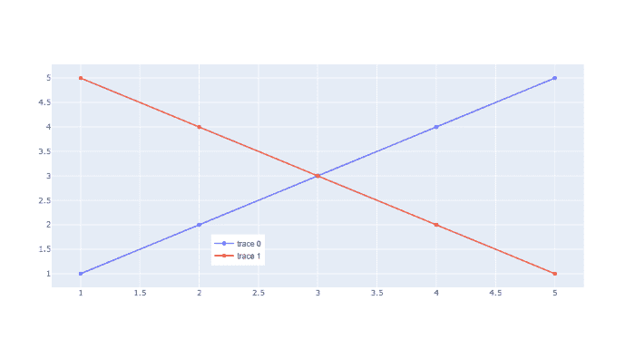
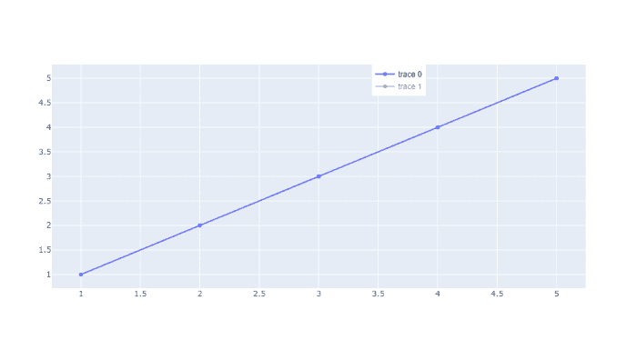
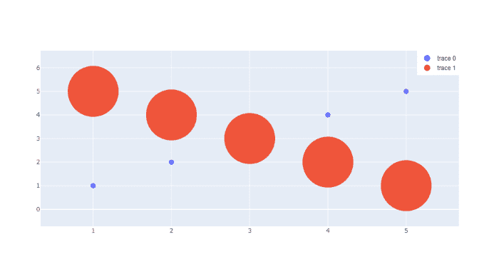

# 如何在 Plotly-Python 中定位剧情内部的传说？

> 原文:[https://www . geeksforgeeks . org/如何定位-图例-剧情中的剧情-python/](https://www.geeksforgeeks.org/how-to-position-legends-inside-a-plot-in-plotly-python/)

在本文中，我们将学习如何使用 Plotly Express 和 Plotly 隐藏图例。图例是描述图形元素的区域。在剧情中，图例用于在轴上放置图例。

**例 1:**

在本例中，我们借助于方法 fig.update_layout()，通过将位置传递为 **x=0.3 和 y=0.1** ，将图例定位在图中。

## 蟒蛇 3

```
# importing packages
import plotly.graph_objects as go

# using medals_wide dataset
fig = go.Figure()

# plotting the scatter chart
fig.add_trace(go.Scatter(
    x=[1, 2, 3, 4, 5],
    y=[1, 2, 3, 4, 5],
))

# plotting the scatter chart
fig.add_trace(go.Scatter(
    x=[1, 2, 3, 4, 5],
    y=[5, 4, 3, 2, 1],
))

#  position legends inside a plot
fig.update_layout(
    legend=dict(
        x=0.3,  # value must be between 0 to 1.
        y=.1,   # value must be between 0 to 1.
        traceorder="normal",
        font=dict(
            family="sans-serif",
            size=12,
            color="black"
        ),
    )
)

fig.show()
```

**输出:**



**例 2:**

在这个例子中，我们在方法**的帮助下，通过传递位置为 **x=0.6 和 y=1** ，将图例定位在图中。**

## 蟒蛇 3

```
# importing packages
import plotly.graph_objects as go

# using medals_wide dataset
fig = go.Figure()

# plotting the scatter chart
fig.add_trace(go.Scatter(
    x=[1, 2, 3, 4, 5],
    y=[1, 2, 3, 4, 5],
))

# plotting the scatter chart
fig.add_trace(go.Scatter(
    x=[1, 2, 3, 4, 5],
    y=[5, 4, 3, 2, 1],
    visible='legendonly'
))

# position legends inside a plot
fig.update_layout(
    legend=dict(
        x=0.6,  # value must be between 0 to 1.
        y=1,  # value must be between 0 to 1.
        traceorder="normal",
        font=dict(
            family="sans-serif",
            size=12,
            color="black"
        ),
    )
)

fig.show()
```

**输出:**



**例 3:**

在本例中，我们借助于方法 fig.update_layout()，通过将位置传递为 **x=0.9 和 y=1** ，将图例定位在图中。

## 蟒蛇 3

```
import plotly.graph_objects as go

fig = go.Figure()

fig.add_trace(go.Scatter(
    x=[1, 2, 3, 4, 5],
    y=[1, 2, 3, 4, 5],
    mode='markers',
    marker={'size': 10}
))

# plotting the scatter chart
fig.add_trace(go.Scatter(
    x=[1, 2, 3, 4, 5],
    y=[5, 4, 3, 2, 1],
    mode='markers',
    marker={'size': 100}
))

# position legends inside a plot
fig.update_layout(
    legend=dict(
        x=.9,  # value must be between 0 to 1.
        y=1,   # value must be between 0 to 1.
        traceorder="normal",
        font=dict(
            family="sans-serif",
            size=12,
            color="black"
        ),
    )
)

fig.update_layout(legend={'itemsizing': 'constant'})

fig.show()
```

**输出:**

