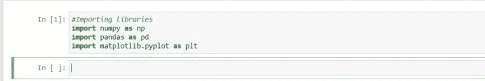
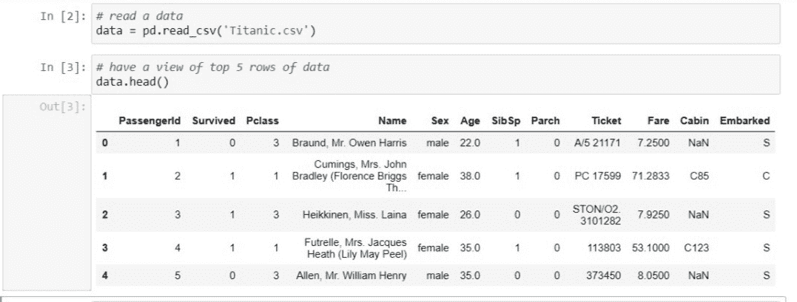
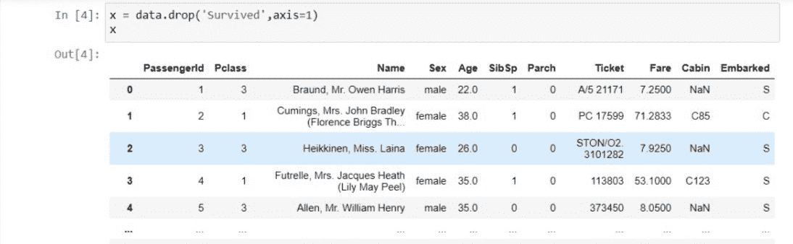

# 如何在部署机器学习模型之前准备数据？

> 原文:[https://www . geesforgeks . org/如何在部署机器学习模型之前准备数据/](https://www.geeksforgeeks.org/how-to-prepare-data-before-deploying-a-machine-learning-model/)

你很少能以你想要的形式得到准确的数据。[数据预处理](https://www.geeksforgeeks.org/data-preprocessing-machine-learning-python/)是构建和部署机器学习模型之前至关重要的第一步。在建立模型的时候，并不是每次你都会得到干净的格式化数据。使用前必须清洁和检查数据。所以，我们对这些使用数据预处理。在构建我们应该执行的模型之前，让我们检查一些步骤。

1.  获取数据集
2.  导入库
3.  导入数据集
4.  查找缺失值
5.  分类数据编码
6.  分割训练和测试集中的数据
7.  特征缩放

### **1。获取数据集**

我们首先需要的是数据集，因为机器学习完全在数据集上工作。以特定格式收集的数据称为 **DATASET。**很有必要很好地理解您要处理的数据集。因为数据集可能出于不同的目的而采用不同的格式。并且你需要很好地了解数据集来构建和分析模型。为了在我们的代码中使用数据集，我们基本上以 CSV 格式或 xlsx(Excel)格式使用它。

### **2。导入库**

为了使用 Python 执行数据预处理，我们需要导入一些预定义的 Python 库。为了执行某些特定的任务，这些库非常有用。

*   [**Numpy**](https://www.geeksforgeeks.org/numpy-in-python-set-1-introduction/)**:**Numpy Python 库用于在代码中执行任何种类的科学和数学计算。
*   [**【熊猫】**](https://www.geeksforgeeks.org/python-pandas-dataframe/) **:** 熊猫是最著名最有用的用于导入和管理数据集的 Python 库。Pandas 是开源数据，提供 python 中的高性能数据操作。
*   [**Matplotlib**](https://www.geeksforgeeks.org/using-matplotlib-with-jupyter-notebook/)**:**Matplotlib 非常重要，以便可视化我们的结果并更好地查看数据。而有了这个库，我们需要导入一个名为[**【Pyplot】**](https://www.geeksforgeeks.org/pyplot-in-matplotlib/)的子包。该库用于绘制任何类型的图或图表。

## 计算机编程语言

```
import numpy as np
import pandas as pd
import matplotlib.pyplot as plt
```



### **3。导入数据集**

现在，是时候导入我们为机器学习模型收集的数据集了。在导入数据集之前，请确保将当前目录设置为工作目录。现在要导入数据集，使用熊猫库的 [**read_csv()**](https://www.geeksforgeeks.org/python-read-csv-using-pandas-read_csv/) 来读取 csv 文件并对其执行各种操作。还有各种其他选项可用于读取不同格式的文件，如读取 excel 文件的 [**read_excel()**](https://www.geeksforgeeks.org/working-with-excel-files-using-pandas/) 。

## 计算机编程语言

```
data = pd.read_csv('dataset.csv')
```

数据集是将加载的数据集存储为以 CSV 格式命名为数据集的字段的变量的名称。这里有一个随机数据集的例子，叫做泰坦尼克数据集，你可以在这里下载[。](https://www.kaggle.com/c/titanic/data?select=train.csv)



**提取因变量和自变量:**探索过滤数据集后，需要创建一个自变量矩阵和一个因变量向量。首先，您应该决定并确认您使用哪些列或因素作为自变量(也称为特征)来训练影响您的目标变量的模型。例如，如果目标列是数据集的最后一列，则可以轻松地创建独立变量矩阵，如下所示:

## 计算机编程语言

```
x = data.iloc[:,:-1].values
```

这里，第一个冒号 **(:)** 表示我们想要数据集中的所有行。 **:-1** 表示我们要拿走除最后一列以外的所有列。还有**。价值观**意味着我们要拿走所有的价值观。如果目标变量没有像我们的例子(幸存)中那样最终出现，那么我们可以去掉它，取训练集中的所有其他列。示例:



取因变量的向量，也就是数据集的最后一列，可以写成:

## 计算机编程语言

```
y = data.iloc[:,-1].values
```

或者用这种方法，

## 计算机编程语言

```
y = data['Survived']
```