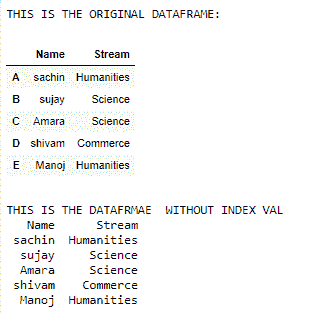
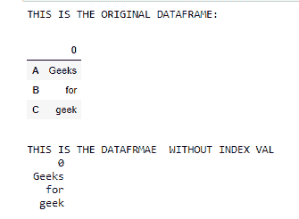

# 如何在没有索引的情况下用 Python 打印数据框？

> 原文:[https://www . geesforgeks . org/how-print-data frame-in-python-不带索引/](https://www.geeksforgeeks.org/how-to-print-dataframe-in-python-without-index/)

**先决条件:**T2】熊猫

打印数据帧时，默认情况下，索引会随输出一起显示，但如果需要，可以将其删除。要打印不带索引的数据帧，必须将 to_string()中的索引参数设置为 False。

**语法:**

> df.to_string(索引= False)

**进场:**

*   导入模块
*   创建一个简单的数据帧。
*   在 to_string()中将索引设置为 false
*   打印结果

下面给出了使用这种方法的实现

**例 1:**

## 蟒蛇 3

```py
import pandas as pd

df = pd.DataFrame({"Name": ["sachin", "sujay", "Amara", "shivam",
                            "Manoj"],

                   "Stream": ["Humanities", "Science", "Science",
                              "Commerce", "Humanities"]},

                  index=["A", "B", "C", "D", "E"])

print("THIS IS THE ORIGINAL DATAFRAME:")
display(df)
print()

print("THIS IS THE DATAFRAME  WITHOUT INDEX VAL")
print(df.to_string(index=False))
```

**输出:**



**例 2:**

## 蟒蛇 3

```py
import pandas as pd

df = pd.DataFrame(["Geeks", "for", "geek"],

                  index=["A", "B", "C"])

print("THIS IS THE ORIGINAL DATAFRAME:")
display(df)
print()

print("THIS IS THE DATAFRAME  WITHOUT INDEX VAL")
print(df.to_string(index=False))
```

**输出:**

