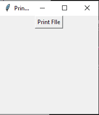

# 如何使用 Tkinter 打印硬拷贝？

> 原文:[https://www . geesforgeks . org/how-print-hard-copy-using-tkinter/](https://www.geeksforgeeks.org/how-to-print-hard-copy-using-tkinter/)

**先决条件:**T2【Tkit】T3、 [win32api](https://www.geeksforgeeks.org/design-a-keylogger-in-python/)

Python 为开发图形用户界面提供了多个选项。在所有的 GUI 方法中，tkinter 是最常用的方法。它是 Python 附带的 Tk 图形用户界面工具包的标准 Python 接口。Python 搭配 tkinter 是创建 GUI 应用程序最快最简单的方法。使用 tkinter 创建图形用户界面是一项简单的任务。

在本文中，我们将讨论如何使用 Tkinter 在打印机中打印硬拷贝。

### **逐步逼近**

*   制作一个 Tkinter 窗口。
*   添加一个按钮。
*   使用 Tkinter 中的 **askopenfilename()** 方法打开要打印的文件。
*   在 win32api 中使用 **ShellExecute()** 方法打印。

### **创建正常 Tkinter 窗口**

## 蟒蛇 3

```py
# Import Required Library
from tkinter import *

# Create Tkinter Object
root = Tk() 

# Set Title and geometry
root.title('Print Hard Copies') 
root.geometry("200x200")

# Make Button
Button(root,text="Print FIle").pack()

# Execute Tkinter
root.mainloop()
```

**输出:**



### 使用的方法

*   **askopenfilename:** 此方法用于打开给定的文件。

> filedialog.askopenfilename(模式='r '，文件类型=[('任何要显示的名称'，'文件类型的扩展名')])

*   **ShellExecute:** 用于执行系统的 shell 命令。

> win32api.ShellExecute(hwnd、dir、bShow、op、file、params、**args)
> 
> **hwnd:** 父窗口的句柄，如果没有父窗口，则为零。此窗口接收应用程序生成的相关消息框(例如，用于错误报告)。
> 
> **op:** 要执行的操作。也是“打开”、“打印”或“无”，默认为“打开”。
> 
> **文件:**要打开的文件的名称。
> 
> **参数:**要传递的参数，如果文件名包含 associate 可行。对于文档文件，应该是无。
> 
> **目录:**应用程序的初始目录。
> 
> **bShow:** 指定设备打开后是否显示。如果*文件*参数指定了文档文件，则该参数为零。

**以下是实施情况**

## 蟒蛇 3

```py
# Import Required Library
from tkinter import *
import win32api
from tkinter import filedialog

# Create Tkinter Object
root = Tk()

# Set Title and geometry
root.title('Print Hard Copies')
root.geometry("200x200")

# Print File Function
def print_file():

    # Ask for file (Which you want to print)
    file_to_print = filedialog.askopenfilename(
      initialdir="/", title="Select file", 
      filetypes=(("Text files", "*.txt"), ("all files", "*.*")))

    if file_to_print:

        # Print Hard Copy of File
        win32api.ShellExecute(0, "print", file_to_print, None, ".", 0)

# Make Button
Button(root, text="Print FIle", command=print_file).pack()

# Execute Tkinter
root.mainloop()
```

在执行上述 python 脚本时，会弹出一个 tkinter 窗口，要求上传一个文本文件，上传后，文本文件被打印出来。