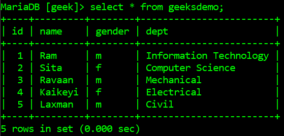
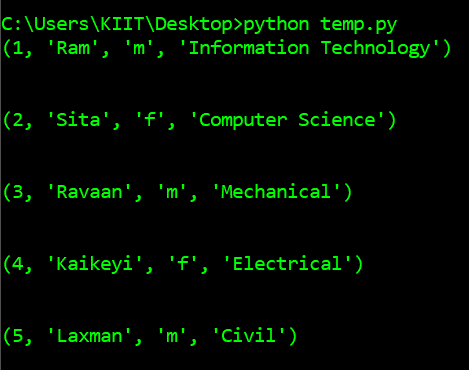
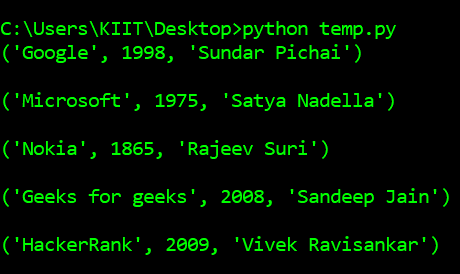

# 如何用 Python 打印出一个 MySQL 表的所有行？

> 原文:[https://www . geeksforgeeks . org/如何用 python 打印出所有行的 mysql 表/](https://www.geeksforgeeks.org/how-to-print-out-all-rows-of-a-mysql-table-in-python/)

MySQL 服务器是一个开源的关系数据库管理系统，是对基于 web 的应用程序的主要支持。数据库和相关表格是许多网站和应用程序的主要组成部分，因为数据是通过网络存储和交换的。为了从网络服务器(这里是 XAMPP)访问 MySQL 数据库，我们使用了 Python 中的各种模块，如 PyMySQL、mysql.connector 等。

在本文中，我们将看到如何通过在 python 和 MySQL 之间建立数据库连接来获取 MySQL 表的所有行。

首先，我们将连接到一个包含 MySQL 表的数据库。用于获取所有行的 SQL 查询:

```py
*SELECT * FROM table-name* 

```

最后，获取所有行后，使用迭代器显示表中的每一行。

**下面是一些描述如何从数据库的 MySQL 表中提取行的程序:**

**例 1:**

下表*极客数据库*是数据库*极客*，它将被 Python 脚本访问:



下面是获取 MYSQL 表中所有行的程序:

## 蟒蛇 3

```py
# import required modules
import pymysql
pymysql.install_as_MySQLdb()
import MySQLdb

# connect python with mysql with your hostname, 
# username, password and database
db= MySQLdb.connect("localhost", "root", "", "GEEK")

# get cursor object
cursor= db.cursor()

# execute your query
cursor.execute("SELECT * FROM geeksdemo")

# fetch all the matching rows 
result = cursor.fetchall()

# loop through the rows
for row in result:
    print(row)
    print("\n")
```

**输出:**



**例 2:**

下面是从给定数据库的表中提取所有行的另一个示例，下面是表方案和行:


下面是 Python 脚本从表中提取的所有每一行:

## 蟒蛇 3

```py
# import required modules
import MySQLdb
import pymysql
pymysql.install_as_MySQLdb()

# connect python with mysql with your hostname,
# username, password and database
db = MySQLdb.connect("localhost", "root", "", "techgeeks")

# get cursor object
cursor = db.cursor()

# execute your query
cursor.execute("SELECT * FROM techcompanies")

# fetch all the matching rows
result = cursor.fetchall()

# loop through the rows
for row in result:
    print(row, '\n')
```

**输出:**

