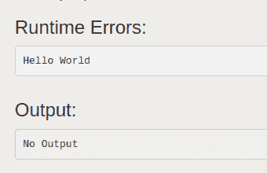
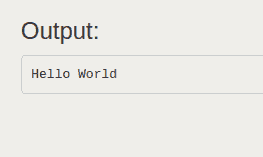

# 如何用 Python 打印到 stderr 和 stdout？

> 原文:[https://www . geeksforgeeks . org/如何在 python 中打印到 stderr-and-stdout/](https://www.geeksforgeeks.org/how-to-print-to-stderr-and-stdout-in-python/)

在 Python 中，每当我们使用 print()时，文本被写入 Python 的 **sys.stdout** ，每当使用 input()时，它来自 **sys.stdin** ，每当出现异常时，它被写入 **sys.stderr** 。我们可以将代码的输出重定向到 stdout 以外的文件。但是你可能想知道为什么一个人应该这样做？原因可能是保存代码输出的日志，或者关闭代码，即不向 stdout 发送任何输出。让我们用下面的例子来看看如何做。
**例 1:** 写入 stderr 而不是 stdout。

## 蟒蛇 3

```py
import sys

def print_to_stderr(*a):

    # Here a is the array holding the objects
    # passed as the argument of the function
    print(*a, file = sys.stderr)

print_to_stderr("Hello World")
```

**输出:**



**示例 2:** 写入标准输出

## 蟒蛇 3

```py
import sys

def print_to_stdout(*a):

    # Here a is the array holding the objects
    # passed as the argument of the function
    print(*a, file = sys.stdout)

print_to_stdout("Hello World")
```

**输出:**

