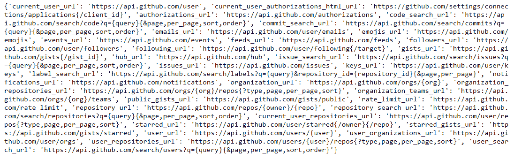

# 如何从 Python 中的链接读取 JSON 响应？

> 原文:[https://www . geesforgeks . org/how-read-a-JSON-response-from-a-link-in-python/](https://www.geeksforgeeks.org/how-to-read-a-json-response-from-a-link-in-python/)

网络上有大量的数据，其中大部分是以(JavaScript 对象符号) **JSON** 的形式出现的。但是人类很难直接阅读和使用。为了解决 python 中的这个问题，我们有不同的库来帮助我们读取从 web 获取的 JSON 数据。这些库有助于从网络上打开网址和读取数据的对象和功能。

要阅读 JSON 响应，python 中有一个被广泛使用的库，叫做[urllib](https://www.geeksforgeeks.org/python-urllib-module/) 。这个库有助于打开网址并从网上读取 JSON 响应。要在 python 中使用这个库并获取 json 响应，我们必须在代码中导入 **json** 和 **urllib** ， [json.loads()](https://www.geeksforgeeks.org/json-load-in-python/) 方法返回 JSON 对象。下面是我们从 python 中的链接或网址读取 JSON 响应的过程。

#### 方法:

*   导入所需模块。
*   分配网址。
*   使用 **urlopen()** 获取 URL 的响应。
*   使用 **json.loads()** 将其转换为 JSON 响应。
*   显示生成的 JSON 响应。

**实施:**

## 蟒蛇 3

```
# import urllib library
from urllib.request import urlopen

# import json
import json
# store the URL in url as 
# parameter for urlopen
url = "https://api.github.com"

# store the response of URL
response = urlopen(url)

# storing the JSON response 
# from url in data
data_json = json.loads(response.read())

# print the json response
print(data_json)
```

**输出:**



这样，通过使用 **urlopen()** 方法获取响应，然后使用 **json.loads()** 将响应转换为 json 对象，就可以轻松地从给定的 URL 中读取 JSON 响应。