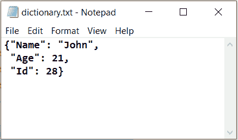

# 如何用 Python 从 File 中读取字典？

> 原文:[https://www . geesforgeks . org/如何从 python 文件中读取字典/](https://www.geeksforgeeks.org/how-to-read-dictionary-from-file-in-python/)

Python 中的字典是*键-值*对的集合，其中键总是唯一的，通常我们需要存储一个字典并再次读回来。

我们可以通过三种方式从文件中读取字典:

1.  使用 **`json.loads()`** 方法:将有效字典的字符串转换为 json 形式。
2.  使用 **`ast.literal_eval()`** 方法:函数比 eval 函数更安全，也可以用于字典以外的所有数据类型的相互转换。
3.  使用 **`pickle.loads()`** 方法:如果文件被序列化为字符流，我们也可以使用 Pickle 模块。

**输入文件:**
[](https://media.geeksforgeeks.org/wp-content/uploads/20200729122412/dictionary2.png)

**方法一:**使用 **`json.loads()`** :

```py
# importing the module
import json

# reading the data from the file
with open('dictionary.txt') as f:
    data = f.read()

print("Data type before reconstruction : ", type(data))

# reconstructing the data as a dictionary
js = json.loads(data)

print("Data type after reconstruction : ", type(js))
print(js)
```

**输出:**

```py
Data type before reconstruction :  <class 'str'>
Data type after reconstruction :  <class 'dict'>
{'Name': 'John', 'Age': 21, 'Id': 28}

```

**方法二:**使用 **`ast.literal_eval()`** :

```py
# importing the module
import ast

# reading the data from the file
with open('dictionary.txt') as f:
    data = f.read()

print("Data type before reconstruction : ", type(data))

# reconstructing the data as a dictionary
d = ast.literal_eval(data)

print("Data type after reconstruction : ", type(d))
print(d)
```

**输出:**

```py
Data type before reconstruction :  <class 'str'>
Data type after reconstruction :  <class 'dict'>
{'Name': 'John', 'Age': 21, 'Id': 28}

```

**方法 3 :** 我们可以出于同样的目的使用 Pickle 模块，但是这个方法只有在文件被序列化为字符流而不是文本格式时才会起作用。想了解更多关于蟒蛇皮腌制的知识[点击这里](https://www.geeksforgeeks.org/understanding-python-pickling-example/)

```py
# importing the module
import pickle

# opening file in write mode (binary)
file = open("dictionary.txt", "wb")

my_dict = {"Name": "John",
           "Age": 21,
           "Id": 28}

# serializing dictionary 
pickle.dump(my_dict, file)

# closing the file
file.close()

# reading the data from the file
with open('dictionary.txt', 'rb') as handle:
    data = handle.read()

print("Data type before reconstruction : ", type(data))

# reconstructing the data as dictionary
d = pickle.loads(data)

print("Data type after reconstruction : ", type(d))
print(d)
```

**输出:**

```py
Data type before reconstruction :  <class 'bytes'>
Data type after reconstruction :  <class 'dict'>
{'Name': 'John', 'Age': 21, 'Id': 28}

```