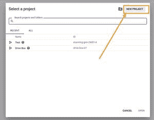
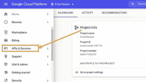
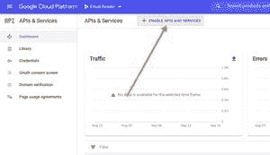
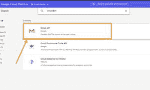
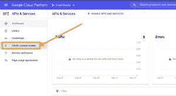
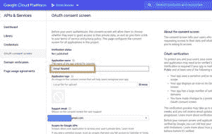
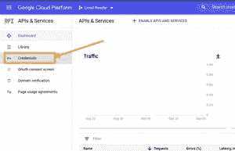
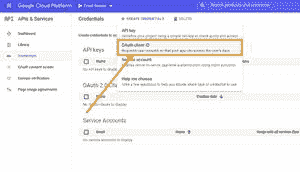
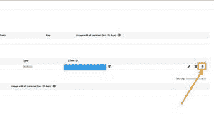
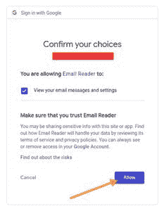

# 如何使用 Python 中的 Gmail API 从 Gmail 中读取 email？

> 原文:[https://www . geeksforgeeks . org/如何阅读来自 gmail 的电子邮件-使用-gmail-api-in-python/](https://www.geeksforgeeks.org/how-to-read-emails-from-gmail-using-gmail-api-in-python/)

在本文中，我们将看到如何使用 Python 中的 Gmail 应用编程接口从您的 Gmail 中读取电子邮件。Gmail 应用编程接口是一个 RESTful 应用编程接口，允许用户与您的 Gmail 帐户交互，并通过 Python 脚本使用其功能。

所以，让我们继续写一个简单的 Python 脚本来阅读电子邮件。

### 要求

*   Python (2.6 或更高版本)
*   启用了 Gmail 的谷歌帐户
*   美丽的汤库
*   谷歌应用编程接口客户端和谷歌 OAuth 库

### 装置

通过运行以下命令安装所需的库:

> pip 安装–升级 Google-API-python-client Google-auth-httplicb 2 Google-auth-oauthlib

运行此程序以安装美丽的汤:

> pip 安装美观套件 4

现在，您必须设置您的谷歌云控制台来与 Gmail 应用编程接口交互。因此，请遵循以下步骤:

*   登录[谷歌云控制台](https://console.cloud.google.com/)并创建**新项目**或继续现有项目。



创建新项目

*   转到**应用编程接口和服务**。



转到应用编程接口和服务

*   为所选项目启用 **Gmail API** 。



转到启用应用编程接口和服务



启用 Gmail API

*   现在，如果还没有配置同意屏幕，点击**打开同意屏幕**进行配置。



配置同意屏幕

*   输入应用程序名称并保存。



输入应用程序名称

*   现在转到**凭证**。



转到凭据

*   点击**创建凭证**，进入**验证客户端标识**。



创建 OAuth 客户端标识

*   选择应用程序类型作为桌面应用程序。
*   输入应用程序名称，然后单击创建按钮。
*   将创建客户端标识。下载到你的电脑，保存为**凭证**



**请对您的客户身份和客户秘密保密。**

现在，一切都设置好了，我们准备编写代码。所以，我们走吧。

### 密码

**进场:**

文件“ **token.pickle** ”包含用户的访问令牌，所以，首先我们要检查它是否存在。如果它不存在或无效，我们的程序将打开浏览器，要求访问用户的 Gmail，并保存它以备下次使用。如果它存在，我们将检查令牌是否需要刷新，并在需要时刷新。

现在，我们将使用访问令牌连接到 **Gmail API** 。一旦连接，我们将请求一个消息列表。这将返回该 Gmail 帐户最近 100 封电子邮件的 **ID** 列表(默认值)。我们可以通过传递可选参数“**最大结果**”来请求任意数量的电子邮件。

该请求的输出是一个字典，其中关键字“**消息**的值是字典列表。每个字典都包含一封电子邮件的**标识**和**线索** **标识**。

现在，我们将浏览所有这些词典，并通过它们的**id**请求电子邮件的内容。

这再次返回一个字典，其中关键字“**有效载荷**”以字典的形式包含电子邮件的主要内容。

本词典包含“**标题**”、“**部分**”、“**文件名**等。所以，我们现在可以轻松找到**发件人**、**主题**等标题。从这里。作为字典列表的关键字“ **parts** 包含了电子邮件正文的所有部分，如**文本**、 **HTML** 、附件详细信息等。因此，我们可以从这里获得电子邮件的正文。它通常在列表的第一个元素中。

正文编码在 **Base 64** 编码中。所以，我们必须把它转换成可读的格式。解码后，得到的文本为“ **lxml** ”。因此，我们将使用**美化程序库**解析它，并将其转换为文本格式。

最后打印**主题**、**发件人**、**邮件**。

## 蟒蛇 3

```py
# import the required libraries
from googleapiclient.discovery import build
from google_auth_oauthlib.flow import InstalledAppFlow
from google.auth.transport.requests import Request
import pickle
import os.path
import base64
import email
from bs4 import BeautifulSoup

# Define the SCOPES. If modifying it, delete the token.pickle file.
SCOPES = ['https://www.googleapis.com/auth/gmail.readonly']

def getEmails():
    # Variable creds will store the user access token.
    # If no valid token found, we will create one.
    creds = None

    # The file token.pickle contains the user access token.
    # Check if it exists
    if os.path.exists('token.pickle'):

        # Read the token from the file and store it in the variable creds
        with open('token.pickle', 'rb') as token:
            creds = pickle.load(token)

    # If credentials are not available or are invalid, ask the user to log in.
    if not creds or not creds.valid:
        if creds and creds.expired and creds.refresh_token:
            creds.refresh(Request())
        else:
            flow = InstalledAppFlow.from_client_secrets_file('credentials.json', SCOPES)
            creds = flow.run_local_server(port=0)

        # Save the access token in token.pickle file for the next run
        with open('token.pickle', 'wb') as token:
            pickle.dump(creds, token)

    # Connect to the Gmail API
    service = build('gmail', 'v1', credentials=creds)

    # request a list of all the messages
    result = service.users().messages().list(userId='me').execute()

    # We can also pass maxResults to get any number of emails. Like this:
    # result = service.users().messages().list(maxResults=200, userId='me').execute()
    messages = result.get('messages')

    # messages is a list of dictionaries where each dictionary contains a message id.

    # iterate through all the messages
    for msg in messages:
        # Get the message from its id
        txt = service.users().messages().get(userId='me', id=msg['id']).execute()

        # Use try-except to avoid any Errors
        try:
            # Get value of 'payload' from dictionary 'txt'
            payload = txt['payload']
            headers = payload['headers']

            # Look for Subject and Sender Email in the headers
            for d in headers:
                if d['name'] == 'Subject':
                    subject = d['value']
                if d['name'] == 'From':
                    sender = d['value']

            # The Body of the message is in Encrypted format. So, we have to decode it.
            # Get the data and decode it with base 64 decoder.
            parts = payload.get('parts')[0]
            data = parts['body']['data']
            data = data.replace("-","+").replace("_","/")
            decoded_data = base64.b64decode(data)

            # Now, the data obtained is in lxml. So, we will parse 
            # it with BeautifulSoup library
            soup = BeautifulSoup(decoded_data , "lxml")
            body = soup.body()

            # Printing the subject, sender's email and message
            print("Subject: ", subject)
            print("From: ", sender)
            print("Message: ", body)
            print('\n')
        except:
            pass

getEmails()
```

现在，运行脚本

```py
python3 email_reader.py

```

这将尝试在默认浏览器中打开一个新窗口。如果失败，请从控制台复制网址，并在浏览器中手动打开它。

现在，如果您还没有登录，请登录您的谷歌帐户。如果有多个帐户，将要求您选择其中一个。然后，点击**允许**按钮。



您的申请请求许可

身份验证完成后，您的浏览器将显示一条消息:“身份验证流程已经完成。你可以关闭这个窗口”。

该脚本将开始在控制台中打印电子邮件数据。

您还可以对此进行扩展，并将电子邮件保存在单独的文本或 csv 文件中，以收集来自特定发件人的电子邮件。