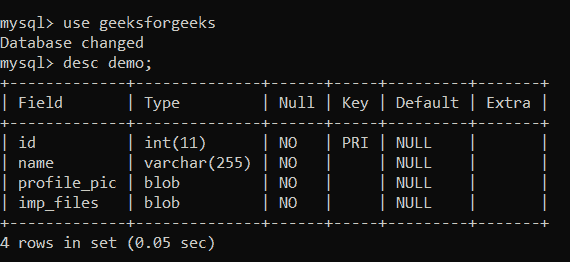
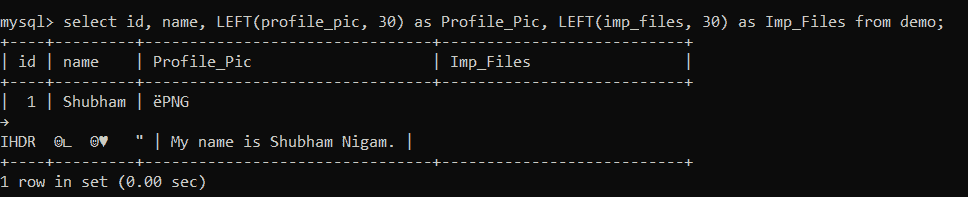
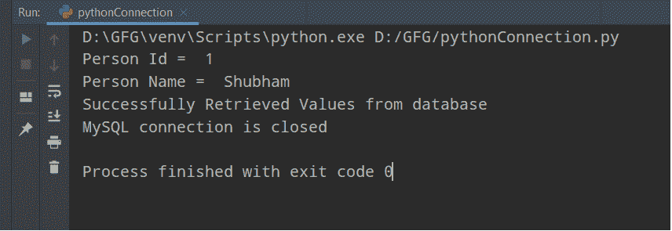

# 如何使用 Python 从 SQL 中读取图像？

> 原文:[https://www . geesforgeks . org/如何使用 python 从 sql 读取图像/](https://www.geeksforgeeks.org/how-to-read-image-from-sql-using-python/)

在本文中，我们将讨论如何使用 python 从 SQL 中读取图像或文件。为了进行实际的实现，我们将使用 MySQL 数据库。首先，我们需要将 Python 程序与 MySQL 数据库连接起来。为了完成这项任务，我们需要遵循以下步骤:

**连接我们的 Python 程序和 MySQL 的步骤:**

*   安装连接我们的程序和数据库的连接器。

```py
pip install mysql-connector-python
```

*   现在，让我们导入名为 **mysql.connector.** 的第一个模块

```py
import mysql.connector
```

*   借助 **connect()** 方法，我们将在 Python 程序和 MySQL 之间创建一个连接，并将该连接存储在一个连接对象中。我们必须在这个方法中传递一些参数，如主机、数据库名、用户名和密码，如字符串格式。

> connection = MySQL . connector . connect(主机='localhost '，数据库=' <database_name>'，用户=' <user_name>'，密码=' <password>')</password></user_name></database_name>

*   创建连接对象后，我们需要使用 **cursor()** 方法创建一个 cursor 对象。

```py
cursor = connection.cursor()
```

*   使用游标对象来用 execute()方法执行我们的 SQL 查询。

```py
cursor.execute("select * from table_name")
```

*   一旦一切完成，我们需要关闭所有的连接或资源。

```py
cursor.close()
con.close()
```

**表格结构:**



在这个表中，我们有一些数据，让我们看看已经插入了多少。为了检查，我们需要运行一个命令，例如

```py
select id, name, LEFT(profile_pic, 30) as Profile_Pic, LEFT(imp_files, 30) as Imp_Files from demo;
```



**实施:**

这里，在上图中，我们可以看到表中只有一条记录。现在，让我们看看它的实际实现:

点击此处下载[图像文件](https://drive.google.com/file/d/1ur_QXsnxrWJsJtBhW9fFc1bLimknOlAk/view?usp=sharing)和[文本文件](https://drive.google.com/file/d/11DCMdiqRZO0Ra_ZrWDJwKrg1tS-kLtIa/view?usp=sharing)。

## 蟒蛇 3

```py
# import module
import mysql.connector

#  function to convert data
def convert_data(data, file_name):
    # Convert binary format to images
    # or files data(with given file_name)
    with open(file_name, 'wb') as file:
        file.write(data)

try:
    # establish connection
    connection = mysql.connector.connect(host='localhost',
                                         database='geeksforgeeks',
                                         user='root',
                                         password='shubhanshu')
    cursor = connection.cursor()
    # getting data by id value
    query = """ SELECT * from demo where id = %s """

    id = 1
    cursor.execute(query, (id,))
    records = cursor.fetchall()
    for row in records:
        print("Person Id = ", row[0])
        print("Person Name = ", row[1])
        image = row[2]
        file = row[3]
        # Pass path with filename where we want to save our file
        convert_data(image, "D:\GFG\images\One.png")
        # Pass path with filename where we want to save our file
        convert_data(file, "D:\GFG\content.txt")

    print("Successfully Retrieved Values from database")

except mysql.connector.Error as error:
    print(format(error))

finally:
    if connection.is_connected():
        cursor.close()
        connection.close()
        print("MySQL connection is closed")
```

**输出:**



**说明:**

现在，让我们理解上面的代码，

1.  首先，我们创建一个名为 **convert_data** 的函数，并将两个参数作为**数据**和**文件名**。在这个函数中，我们用给定的文件名将二进制数据转换成人类可读或可理解的形式。在第一个参数中，数据存储二进制数据，在第二个参数中，文件名保存从数据库中检索的文件名。
2.  现在，使用上面的 python 程序创建与 MySQL 数据库的连接。
3.  创建一个选择 SQL 查询，该查询检索 id 等于给定 id 的数据(用户将给出该值)。
4.  借助 **fetchall()** 方法，我们正在检索所有具有给定 id 值的记录，并创建这些值的列表。
5.  使用 for 循环，用于逐个检索记录。为了访问每一列，我们使用索引值，例如第 1 列的 **0、第 2 列的**、**T3 等。**
6.  打印数据并用给定的文件名保存检索到的文件。

**视频演示:**

<video class="wp-video-shortcode" id="video-569757-1" width="640" height="360" preload="metadata" controls=""><source type="video/mp4" src="https://media.geeksforgeeks.org/wp-content/uploads/20210305022715/My-Video2.mp4?_=1">[https://media.geeksforgeeks.org/wp-content/uploads/20210305022715/My-Video2.mp4](https://media.geeksforgeeks.org/wp-content/uploads/20210305022715/My-Video2.mp4)</video>