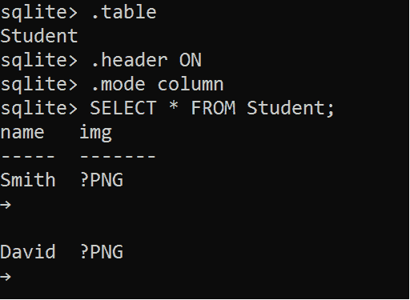
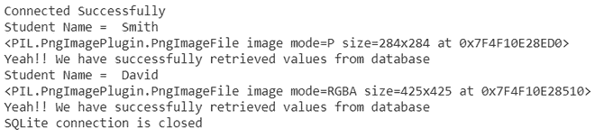

# 如何用 Python 读取 SQLite 中的图像？

> 原文:[https://www . geesforgeks . org/如何使用 python 读取 sqlite 中的图像/](https://www.geeksforgeeks.org/how-to-read-image-in-sqlite-using-python/)

本文向我们展示了如何使用 Python sqlite3 模块来读取或检索以 BLOB 数据类型的形式存储在 sqlite 表中的图像。首先，我们需要使用 python 脚本读取一个以 BLOB 格式存储在 SQLite 表中的图像，然后将文件写回硬盘上的任何位置，以便您可以以适当的格式查看和读取它。

**使用的 SQLite 数据库:**



这是我们的 sqlite3 数据库。

### 实施:

在这个例子中，我们正在读取学生姓名和学生图像，它们存储在以 BLOB 形式存储的 SQLite 表中。要使用 Python 从 SQLite 表中读取 BLOB 数据，您需要执行以下步骤:-

1.使用 Python 代码设置与 SQLite 数据库的连接

```py
con = sqlite3.connect('SQLite_Retrieving_data.db')
print("Connected Successfully")
```

2.我们需要定义一个 SELECT 查询来从表中获取 BLOB 列。

```py
query = "SELECT * FROM <table_name>"
```

3.使用**游标. execute()** 在 Python 中执行 SELECT 查询。

```py
cursor = con.cursor()
cursor.execute(query)
```

4.使用 **cursor.fetchall()** 检索并遍历结果集中的所有行。

```py
records = cursor.fetchall()
    for row in records:
        name = row[0]
        print("Student Name = ", name)
```

5.创建一个函数，将 **BLOB** 数据转换为正确的格式，并将其保存为**人类可读的格式**。

```py
def convert_data(data, file_name):
    # Convert binary format to images or files data
    with open(file_name, 'wb') as file:
        file.write(data)
```

6.关闭**光标**连接和 **MySQL 数据库**。

```py
if con:
     con.close()
     print("SQLite connection is closed")
```

下面是实现。

## 蟒蛇 3

```py
import sqlite3
from PIL import Image

# Function for Convert Binary
# Data to Human Readable Format
def convert_data(data, file_name):

    # Convert binary format to
    # images or files data
    with open(file_name, 'wb') as file:
        file.write(data)
    img = Image.open(file_name)
    print(img)

try:

    # Using connect method for establishing
    # a connection
    con = sqlite3.connect('SQLite_Retrieving_data.db')
    cursor = con.cursor()
    print("Connected Successfully")

    # Search from table query
    query = "SELECT * FROM Student"

    # using cursor object executing our query
    cursor.execute(query)

    # fectching all records from cursor object
    records = cursor.fetchall()

    # using for loop retrieving one by one
    # rows or data
    for row in records:

        # storing row[0] in name variable
        name = row[0]

        # printing name variable
        print("Student Name = ", name)

        # storing image (currently in binary format)
        image = row[1]

        # calling above convert_data() for converting
        # binary data to human readable
        convert_data(image, "D:\Internship Tasks\GFG\sqlite\\" + name + ".png")
        print("Yeah!! We have successfully retrieved values from database")

    # If we don't have any records in our database,
    # then print this
    if len(records) == 0:
        print("Sorry! Please Insert some data before reading from the database.")

# print exception if found any during program
# is running
except sqlite3.Error as error:
    print(format(error))

# using finally, closing the connection
# (con) object
finally:
    if con:
        con.close()
        print("SQLite connection is closed")
```

**输出:**

