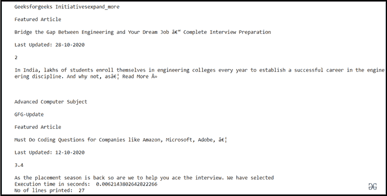

# 如何读取 Python 中的大型文本文件？

> 原文:[https://www . geesforgeks . org/如何阅读大型 python 文本文件/](https://www.geeksforgeeks.org/how-to-read-large-text-files-in-python/)

Python 是一种开源的动态类型和解释的编程语言。读写文件是编程不可或缺的一部分。在 Python 中，使用**readline()**方法读取文件。readlines()方法返回一个列表，列表中的每一项都是文件中的一个完整句子。当文件较小时，此方法很有用。由于 readlines()方法会将每一行追加到列表中，然后返回整个列表，因此如果文件大小非常大(比如以 GB 为单位)，将会非常耗时。此外，如果没有足够的内存，该列表将消耗大量内存，从而导致内存泄漏。为了避免这个问题，我们可以使用文件对象作为迭代器来迭代文件并执行所需的任务。由于迭代器只是对整个文件进行迭代，不需要任何额外的数据结构来存储数据，因此消耗的内存相对较少。此外，迭代器不执行像追加这样昂贵的操作，因此它也很省时。文件在 Python 中是可迭代的，因此建议使用迭代器。

以下两个程序演示了如何使用 Python 读取大型文本文件。

**方法 1:**

第一种方法利用迭代器对文件进行迭代。在这项技术中，我们使用 Python 中的**文件输入**模块。fileinput 模块的 input()方法可以用来读取文件。与 readlines()相比，使用此方法的优势在于 [fileinput.input()](fileinput.input() in Python) 不会将整个文件加载到内存中。因此，不存在内存泄漏的可能性。fileinput.input()方法获取文件名列表，如果没有传递参数，它将接受来自 stdin 的输入。该方法返回一个迭代器，该迭代器从被扫描的文本文件中返回单独的行。

**代码实现:**

## 蟒蛇 3

```
# import module
import fileinput
import time

#time at the start of program is noted
start = time.time()

#keeps a track of number of lines in the file
count = 0
for lines in fileinput.input(['sample.txt']):
    print(lines)
    count = count + 1

#time at the end of program execution is noted
end = time.time()

#total time taken to print the file
print("Execution time in seconds: ",(end - start))
print("No. of lines printed: ",count)
```

**输出:**


**说明:**

input()方法返回一个迭代器，它扫描整个文件并打印每一行。

**方法二:**

第二种方法也使用迭代器来读取文件。唯一的区别是我们将使用文件对象的迭代器。使用的方法是 open()将整个文件包装成一个文件对象。接下来，我们使用迭代器来获取文件对象中的行。我们在“with”块中打开文件，因为一旦整个块执行，它就会自动关闭文件。随着 with 块的完成，调用 __exit__()方法来释放任何打开的资源。

**代码实现:**

## 蟒蛇 3

```
import time

start = time.time()
count = 0
with open("sample.txt") as file:
    for line in file:
       print(line)
       count = count + 1
end =  time.time()
print("Execution time in seconds: ",(end-start))
print("No of lines printed: ",count)
```

**输出:**



**说明:**

这种方法所需的时间相对较少。这个程序也可以在没有块的情况下编写，但是在这种情况下，我们必须确保显式关闭文件资源。