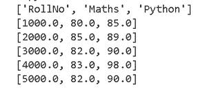
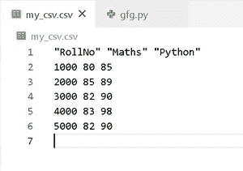
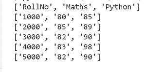
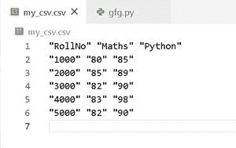

# 如何用 Python 读取 CSV 文件中的数字？

> 原文:[https://www . geesforgeks . org/how-read-numbers-in-CSV-files-in-python/](https://www.geeksforgeeks.org/how-to-read-numbers-in-csv-files-in-python/)

**先决条件:** [**在 CSV 中读写数据**](https://www.geeksforgeeks.org/reading-and-writing-csv-files-in-python/)**[**创建 CSV 文件**](https://www.geeksforgeeks.org/writing-csv-files-in-python/)**

**CSV 是一个逗号分隔值文件，允许以表格式保存纯文本数据。这些文件以. csv 扩展名存储在我们的系统中。CSV 文件不同于其他电子表格文件类型(如微软 Excel)，因为我们在一个文件中只能有一个工作表，并且它们不能保存单元格、列或行。此外，我们不能以这种格式保存公式。**

**为了解析 Python 中的 CSV 文件，我们使用了 [**csv 库**](https://www.geeksforgeeks.org/working-csv-files-python/) 。CSV 库包含用于从 CSV 文件读取数据、向 CSV 文件写入数据和处理数据的对象。让我们看看如何使用 csv 库在 CSV 文件中添加数字。**

### **读取 CSV 文件中数字的步骤:**

1.  **创建一个 python 文件(例如:gfg.py)。**
2.  **导入 csv 库。**
3.  **创建一个嵌套列表“标记”,以表格形式存储学生的数学和 python 卷号及其标记。**
4.  **在 writer 对象的“w”模式下打开一个新的 csv 文件(或一个现有的 csv 文件)和其他必要的参数(此处为分隔符&引号)。**
5.  **借助 writerows 方法将列表“标记”写入其中。**
6.  **为了读取行，使用 reader 对象，并将每一行(也是一个列表)存储在一个新的列表“输出”中。**
7.  **打印列表输出以验证代码。**

### **读取 CSV 文件中不带引号的数字:**

**为了写入我们的 CSV 文件“my_csv”，我们使用 writer 对象的 writerows()方法。但是要按原样读取数字，我们将使用 writer 对象的一个可选参数，即**“引用”**。“引用”参数告诉作者要引用哪个字符。**

**如果报价设置为 **csv。那么，报价 _ 非数值**。writerow()将引用所有包含文本数据的字段，并将所有数值字段转换为浮点数据类型。**

****代码:****

## **蟒蛇 3**

```py
import csv

# creating a nested list of roll numbers,
# subjects and marks scored by each roll number
marks = [
    ["RollNo", "Maths", "Python"],
    [1000, 80, 85],
    [2000, 85, 89],
    [3000, 82, 90],
    [4000, 83, 98],
    [5000, 82, 90]
]

# using the open method with 'w' mode
# for creating a new csv file 'my_csv' with .csv extension
with open('my_csv.csv', 'w', newline = '') as file:
    writer = csv.writer(file, quoting = csv.QUOTE_NONNUMERIC,
                        delimiter = ' ')
    writer.writerows(marks)

# opening the 'my_csv' file to read its contents
with open('my_csv.csv', newline = '') as file:

    reader = csv.reader(file, quoting = csv.QUOTE_NONNUMERIC,
                        delimiter = ' ')

    # storing all the rows in an output list
    output = []
    for row in reader:
        output.append(row[:])

for rows in output:
    print(rows)
```

****输出:****

**

gfg.py 的输出** 

**这是它在 CSV 文件“my_csv.csv”中的外观，一旦我们运行上述代码，就会创建该文件:**

**

my_csv.csv** 

### **读取带引号的 CSV 文件中的数字:**

**如果报价设置为 csv。那就报价吧。writerow()将引用所有字段，数字现在将存储在引号中。为了读取每一行的数字，我们使用 CSV 库中的 reader 对象，并将所有行存储在一个列表“输出”中，之后我们还会打印该列表。**

****代码:****

## **蟒蛇 3**

```py
import csv

# creating a nested list of roll numbers,
# subjects and marks scored by each roll number
marks = [
    ["RollNo", "Maths", "Python"],
    [1000, 80, 85],
    [2000, 85, 89],
    [3000, 82, 90],
    [4000, 83, 98],
    [5000, 82, 90]
]

# using the open method with 'w' mode
# for creating a new csv file 'my_csv' with .csv extension
with open('my_csv.csv', 'w', newline = '') as file:
    writer = csv.writer(file, quoting = csv.QUOTE_ALL,
                        delimiter = ' ')
    writer.writerows(marks)

# opening the 'my_csv' file to read its contents
with open('my_csv.csv', newline = '') as file:
    reader = csv.reader(file,
                        quoting = csv.QUOTE_ALL,
                        delimiter = ' ')

    # storing all the rows in an output list
    output = []
    for row in reader:
        output.append(row[:])

for rows in output:
    print(rows)
```

****输出:****

**

gfg.py 的输出** 

**以上输入是如何存储在“my_csv.csv”文件中的:**

**

my_csv.csv**