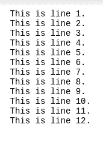

# 如何在 Python 中读取文件中的特定行？

> 原文:[https://www . geesforgeks . org/如何从 python 文件中读取特定行/](https://www.geeksforgeeks.org/how-to-read-specific-lines-from-a-file-in-python/)

文本文件由纯文本内容组成。文本文件也称为平面文件或普通文件。Python 为读取和访问文件中的内容提供了简单的支持。首先打开文本文件，然后按行的顺序从中访问内容。默认情况下，行号从第 0 个索引开始。在 python 中，有多种方法可以读取文本文件中的特定行，本文旨在讨论它们。

**正在使用的文件:** [test.txt](https://drive.google.com/file/d/1hXwB2yyv6SG3acJnzovIvB36z-K8gCQk/view?usp=sharing)



**方法 1:file object . readline()**

可以用 Python 创建一个文件对象，然后在这个对象上调用 readlines()方法，将行读入一个流。当需要同时访问文件中的一行或一系列行时，首选此方法。它可以很容易地用来打印从任意起始索引到某个结束索引的行。它首先读取文件的全部内容，并在内存中保留一份副本。然后访问指定索引处的行。

**示例:**

## 蟒蛇 3

```
# open the sample file used
file = open('test.txt')

# read the content of the file opened
content = file.readlines()

# read 10th line from the file
print("tenth line")
print(content[9])

# print first 3 lines of file
print("first three lines")
print(content[0:3])
```

**输出**

> 第十行
> 
> 这是 10 号线。
> 
> 前三行
> 
> 这是 1 号线。这是 2 号线。这是 3 号线。

**方法二:linecache 包**

linecache 包可以用 Python 导入，然后用 Python 提取和访问特定的行。该包可用于同时读取多行。它利用缓存在内部执行优化。这个包自己打开文件并到达特定的行。此包具有用于相同目的的 getline()方法。

**语法:**

```
getLine(txt-file, line_number)
```

**示例:**

## 蟒蛇 3

```
# importing required package
import linecache

# extracting the 5th line
particular_line = linecache.getline('test.txt', 4)

# print the particular line
print(particular_line)
```

**输出:**

```
This is line 5.
```

**方法三:枚举()**

enumerate()方法用于将字符串或列表对象转换为由数字索引的数据序列。然后在数据列表中结合 for 循环使用它。通过指定数组中所需的索引号，可以访问特定索引处的行。

**示例:**

## 蟒蛇 3

```
# open a file
file = open("test.txt")

# lines to print
specified_lines = [0, 7, 11]

# loop over lines in a file
for pos, l_num in enumerate(file):
    # check if the line number is specified in the lines to read array
    if pos in specified_lines:
        # print the required line number
        print(l_num)
```

**输出**

```
This is line 1.
This is line 8.
This is line 12.
```