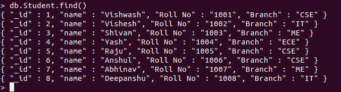
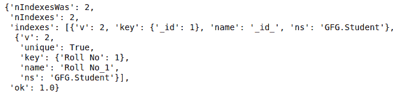

# 如何用 PyMongo 重建一个集合的所有索引？

> 原文:[https://www . geeksforgeeks . org/如何使用-pymongo/](https://www.geeksforgeeks.org/how-to-rebuild-all-the-indexes-of-a-collection-using-pymongo/) 重建集合的所有索引

**先决条件:** [MongoDB Python 基础知识](https://www.geeksforgeeks.org/mongodb-and-python/)

本文是关于使用 PyMongo reindex()函数重建 MongoDB 中集合的索引。

**根据 MongoDB 文档:**

> 通常，MongoDB 会在例行更新期间压缩索引。对于大多数用户来说，reIndex 命令是不必要的。但是，如果集合大小发生了显著变化，或者索引占用了过多的磁盘空间，那么运行它可能是值得的。

集合索引可能会占用过多的磁盘空间，这个问题可以通过重建集合索引来解决。

让我们从重建集合的索引开始:

1.  **Importing Required Modules:** Import the required module using the command:

    ```
    from pymongo import MongoClient

    ```

    如果您的机器上尚未安装 MongoDB，您可以参考指南:[使用 Python 安装 MongoDB 的指南](https://www.geeksforgeeks.org/guide-install-mongodb-python-windows/)

2.  **创建连接:**现在我们已经导入了模块，是时候建立与 MongoDB 服务器的连接了，该服务器大概运行在端口 27017(端口号)的 localhost(主机名)上。

    ```
    client = MongoClient(‘localhost’, 27017)
    ```

3.  **访问数据库:**由于与 MongoDB 服务器的连接已经建立。我们现在可以创建或使用现有的数据库。

    ```
    mydatabase = client.name_of_the_database
    ```

4.  **访问集合:**我们现在使用以下语法从数据库中选择集合:

    ```
    collection_name = mydatabase.name_of_collection
    ```

5.  **Rebuilding Index:**

    ```
    collection_name.reindex()

    ```

    上面的语句重建所有索引。请谨慎使用上述语句，因为重建索引是在前台进行的，这会阻止 MongoDB 服务器上的所有操作。

**示例:**

**样本数据库:**



```
# Python Program for demonstrating the 
# rebuilding of indexes in MongoDB

# Importing required modules
from pymongo import MongoClient

# Connecting to MongoDB server
# client = MongoClient('host_name',
# 'port_number')
client = MongoClient('localhost', 27017)

# Connecting to the database named
# GFG
mydatabase = client.GFG

# Accessing the collection named
# Student
mycollection = mydatabase.Student

# Now rebuilding all the indexes of
# the collection
mycollection.reindex()
```

**输出:**

