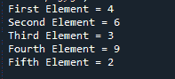

# 如何在 Python 中引用数组中的元素

> 原文:[https://www . geesforgeks . org/如何引用 python 中的数组元素/](https://www.geeksforgeeks.org/how-to-reference-elements-in-an-array-in-python/)

**先决条件:** [Numpy](https://www.geeksforgeeks.org/python-numpy/)

数组的元素可以像普通的 python 数组一样被引用。由于 python 在内部不支持数组，所以每当我们使用数组这个术语时，我们指的是可以用来构建任何所需维度的数组的 python 列表。除此之外，Python 的 NumPy 模块还提供了一个名为‘array’的容器来存储数据集合。在本文中，我们将讨论如何引用 Python 数组中的元素以及 Python 中的 numpy 数组。

*   对于数组引用，只需将所需元素的索引传递给数组的名称。

**语法:**

```py
array_name[index]
```

*   对于使用 numpy 数组的引用，首先使用 numpy 的数组函数创建一个数组，然后像引用常规数组一样引用它。

**语法:**

```py
np.array([array elements])
```

下面给出了两种方法在不同情况下的实现:

**示例 1:** 引用一维数组中的项目

Python 数组示例

## 蟒蛇 3

```py
# Creating a array of elements
arr = [4, 6, 3, 9, 2]

# Referring elements of the array
# by index to a new variable
first_element = arr[0]
second_element = arr[1]
third_element = arr[2]
fourth_element = arr[3]
fifth_element = arr[4]

# Print the variables
print("First Element =", first_element)
print("Second Element =", second_element)
print("Third Element =", third_element)
print("Fourth Element =", fourth_element)
print("Fifth Element =", fifth_element)
```

**输出:**



Python 的 numpy 模块数组示例

## 蟒蛇 3

```py
# Importing numpy module
import numpy as np

# Creating a numpy array of elements
arr = np.array([4, 6, 3, 9, 2])

# Referring elements of the array
# by index to a new variable
first_element = arr[0]
second_element = arr[1]
third_element = arr[2]
fourth_element = arr[3]
fifth_element = arr[4]

# Print the variables
print("First Element =", first_element)
print("Second Element =", second_element)
print("Third Element =", third_element)
print("Fourth Element =", fourth_element)
print("Fifth Element =", fifth_element)
```