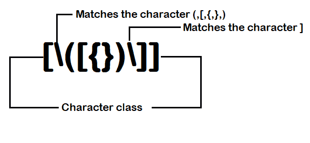
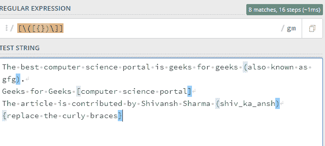
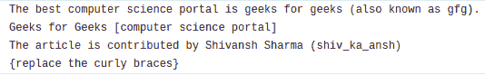

# 如何在 Python 中去掉文本文件的括号？

> 原文:[https://www . geesforgeks . org/如何从 python 文本文件中移除括号/](https://www.geeksforgeeks.org/how-to-remove-brackets-from-text-file-in-python/)

有时从文本文件中删除括号变得很困难，这对我们来说是不必要的。因此，python 可以为我们做到这一点。在 python 中，我们可以借助 [**正则表达式**](https://www.geeksforgeeks.org/regular-expression-python-examples-set-1/) 去掉括号。

**语法:**

> #使用正则表达式导入 re 模块
> 
> 进口 re
> 
> 路径=
> 
> # **模式**是查找括号的特殊 RE 表达式。
> 
> # **repl** 是一个字符串，用模式替换选中的东西
> 
> # RE 在**句子**字符串中搜索

**用于执行我们任务的正则表达式模式:**



**注意:**在这里，我们使用了 regex 的 2 个语法字符来完成这个操作-

*   [……]是一个字符类，用于匹配它们之间出现的任何一个字符
*   \用于为此匹配特殊字符，我们有括号作为特殊字符

**工作原理如下:**



**例 1:从字符串中删除正则表达式括号的程序**

## 蟒蛇 3

```
# importing re module for creating
# regex expression
import re

# string for passing
text = "Welcome to geeks for geeks [GFG] A (computer science portal)"

# creating the regex pattern & use re.sub()
# [\([{})\]] is a RE pattern for selecting
# '{', '}', '[', ']', '(', ')' brackets.
patn = re.sub(r"[\([{})\]]", "", text)

print(patn)
```

**输出:**

```
Welcome to geeks for geeks GFG A computer science portal
```

现在看来我们的剧本进展顺利。让我们在文本文件中尝试同样的方法。Python 使我们能够处理文件。

**注意:**更多信息请参考 Python 中的[文件处理。](https://www.geeksforgeeks.org/file-handling-python/)

**例 2:文本文件中去除括号的程序**

**使用的文件:**



## 蟒蛇 3

```
# importing re module for creating
# regex expression
import re

# reading line by line
with open('data.txt', 'r') as f:

    # looping the para and iterating
    # each line
    text = f.read()

    # getting the pattern for [],(),{}
    # brackets and replace them to empty
    # string
    # creating the regex pattern & use re.sub()
    patn = re.sub(r"[\([{})\]]", "", text)

print(patn)
```