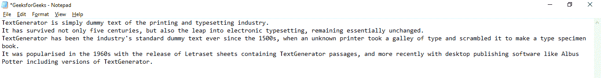
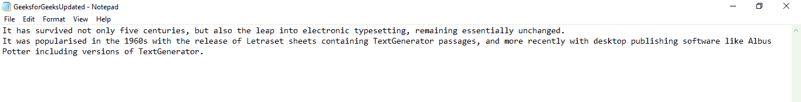
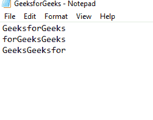
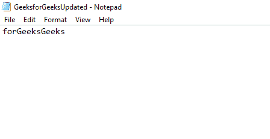

# 如何使用 Python 删除以任意前缀开头的行？

> 原文:[https://www . geesforgeks . org/如何删除行-以任何前缀开头-使用-python/](https://www.geeksforgeeks.org/how-to-remove-lines-starting-with-any-prefix-using-python/)

给定一个文本文件，逐行读取该文本文件的内容，并且只打印那些不以定义的前缀开头的行。同时将这些打印行存储在另一个文本文件中。有以下几种方法可以完成这项任务:

**方法 1:** 使用**循环**和[**从()开始。**](https://www.geeksforgeeks.org/python-string-startswith/)

在这种方法中，我们逐行读取文件的内容。阅读时，我们检查该行是否以给定的前缀开头，我们只需跳过该行并打印出来。也将该行存储在另一个文本文件中。

**例 1:**

假设应该从中读取行的文本文件如下所示:



原始文本文件

## 蟒蛇 3

```
# defining object file1 to
# open GeeksforGeeks file in 
# read mode
file1 = open('GeeksforGeeks.txt',
             'r')

# defining object file2 to 
# open GeeksforGeeksUpdated file
# in write mode
file2 = open('GeeksforGeeksUpdated.txt',
             'w')

# reading each line from original 
# text file
for line in file1.readlines():

     # reading all lines that do not
     # begin with "TextGenerator"
    if not (line.startswith('TextGenerator')):

        # printing those lines
        print(line)

        # storing only those lines that 
        # do not begin with "TextGenerator"
        file2.write(line)

# close and save the files
file2.close()
file1.close()
```

**输出:**

> 它不仅存活了五个世纪，而且飞跃到电子排版，基本上保持不变。
> 
> 它在 20 世纪 60 年代随着包含文本生成器段落的 Letraset 表单的发布而普及，最近随着像阿不思·波特这样的桌面出版软件包括文本生成器的版本而普及。



删除以“文本生成器”开头的行后，更新了文本文件

在上面的例子中，我们打开一个文件，一行行地读取它的内容。我们使用**start with()**方法检查该行是否以给定的前缀开始。如果该行以**【文本生成器】**开头，我们跳过该行，否则我们打印该行并将其存储在另一个文件中。这样，我们可以删除以指定前缀开头的行。

**方法二:**使用 [**Regex。**](https://www.geeksforgeeks.org/regular-expression-python-examples-set-1/)

在这个方法中，我们使用 python 的 **re 模块**，它提供了一组元字符。元字符是具有特殊含义的字符。要删除以指定前缀开头的行，我们使用**“^”(以)**元字符。

我们还利用了 **re.findall()** 函数，该函数返回一个包含所有匹配项的列表。



原始文本文件

## 蟒蛇 3

```
# importing regex module
import re

# defining object file1 to open
# GeeksforGeeks file in read mode
file1 = open('GeeksforGeeks.txt',
           'r')

# defining object file2 to open 
# GeeksforGeeksUpdated file in
# write mode
file2 = open('GeeksforGeeksUpdated.txt','w')

# reading each line from original
# text file
for line in file1.readlines():

    # reading all lines that begin 
    # with "TextGenerator"
    x = re.findall("^Geeks", line)

    if not x:

        # printing those lines
        print(line)

        # storing only those lines that 
        # do not begin with "TextGenerator"
        file2.write(line)

# close and save the files
file1.close()
file2.close()

```

**输出:**

```
forGeeksGeeks

```



更新文本文件

在上面的例子中，我们打开一个文件，一行行地读取它的内容。我们使用常规表达式检查该行是否以**“极客”**开头。如果那一行以**“极客”**开头，我们跳过那一行，打印其余的行，并将这些行存储在另一个文件中。