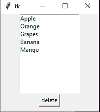

# 如何在 Tkinter 中移除列表框中的多个选中项？

> 原文:[https://www . geeksforgeeks . org/如何删除列表框中的多个选定项目/tkinter/](https://www.geeksforgeeks.org/how-to-remove-multiple-selected-items-in-listbox-in-tkinter/)

**先决条件:**[Tkinter](https://www.geeksforgeeks.org/python-gui-tkinter/https://www.geeksforgeeks.org/python-gui-tkinter/)[Tkinter](https://www.geeksforgeeks.org/python-tkinter-listbox-widget/)中的列表框

Python 为开发图形用户界面提供了多个选项。在所有的 GUI 方法中，Tkinter 是最常用的方法。它是 Python 附带的 Tk 图形用户界面工具包的标准 Python 接口。Python 搭配 Tkinter 是创建 GUI 应用程序最快最简单的方法。

在本文中，我们将学习如何使用 Python 中的 Tkinter 移除 Listbox 中的多个选中复选框。

**我们来了解一下分步实施:-**

**1。创建正常 Tkinter 窗口**

## 蟒蛇 3

```py
from tkinter import *

root = Tk()
root.geometry("200x200")

root.mainloop()
```

**输出:**


**2。使用 Listbox()方法添加 Listbox**

**语法:**

```py
Listbox(root, bg, fg, bd, height, width, font, ..) 
```

## 蟒蛇 3

```py
# Import Module
from tkinter import *

# Create Object
root = Tk()

# Set Geometry
root.geometry("200x200")

# Add Listbox
listbox = Listbox(root, selectmode=MULTIPLE)
listbox.pack()

# Listbox Items List
items = ["Apple", "Orange", "Grapes", "Banana", "Mango"]

# Iterate Through Items list 
for item in items:
    listbox.insert(END, item)

Button(root, text="delete").pack()

# Execute Tkinter
root.mainloop()
```

**输出:**



**3。从列表框中删除选定项目**

*   使用**光标选择()**方法从列表框中获取选定项目的列表。
*   使用 **delete()** 方法遍历所有列表并删除项目

**下面是实现:-**

## 蟒蛇 3

```py
# Import Module
from tkinter import *

# Function will remove selected Listbox items
def remove_item():
    selected_checkboxs = listbox.curselection()

    for selected_checkbox in selected_checkboxs[::-1]:
        listbox.delete(selected_checkbox)

# Create Object
root = Tk()

# Set Geometry
root.geometry("200x200")

# Add Listbox
listbox = Listbox(root, selectmode=MULTIPLE)
listbox.pack()

# Listbox Items List
items = ["Apple", "Orange", "Grapes", "Banana", "Mango"]

# Iterate Through Items list 
for item in items:
    listbox.insert(END, item)

Button(root, text="delete", command=remove_item).pack()

# Execute Tkinter
root.mainloop()
```

**输出:**

<video class="wp-video-shortcode" id="video-548595-1" width="640" height="360" preload="metadata" controls=""><source type="video/mp4" src="https://media.geeksforgeeks.org/wp-content/uploads/20210125172532/FreeOnlineScreenRecorderProject5.mp4?_=1">[https://media.geeksforgeeks.org/wp-content/uploads/20210125172532/FreeOnlineScreenRecorderProject5.mp4](https://media.geeksforgeeks.org/wp-content/uploads/20210125172532/FreeOnlineScreenRecorderProject5.mp4)</video>