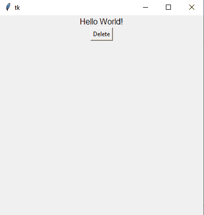
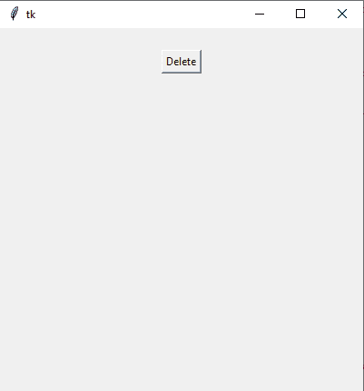

# 如何在 Python 中移除标签中的文本？

> 原文:[https://www . geesforgeks . org/如何从 python 标签中移除文本/](https://www.geeksforgeeks.org/how-to-remove-text-from-a-label-in-python/)

**先决条件:**[**Python GUI–tkinter**](https://www.geeksforgeeks.org/python-gui-tkinter/)

在本文中，任务是一旦文本在 Tkinter 中初始化，就从标签中移除文本。Python 为开发图形用户界面提供了多种选择，其中 Tkinter 是最受欢迎的方法。它是 Python 附带的 Tk 图形用户界面工具包的标准 Python 接口。Python 结合 Tkinter 是创建所需 GUI 应用程序的最快、最可靠和最简单的方法。

任务是从标签中移除文本，一旦文本在 Tkinter 中初始化。

**进场:**

*   导入模块
*   创建一个普通的 Tkinter 窗口。
*   添加标签和创建一个按钮

> **语法:**
> 
> 文本(对象名，文本=“输入文本”，* *属性)
> 
> *   为了删除文本，我们将在 Tkinter 中使用 **config()** 方法
> 
> **配置**用于在初始化后访问对象的属性。
> 
> **语法:**
> 
> 对象名配置(* *属性)

下面给出了实现相同功能的程序:

## 蟒蛇 3

```py
# Import Module
from tkinter import *

# Create Object
root = Tk()

# specify size of window.
root.geometry("400x400")

# Remove text from label

def remove_text():
    label.config(text="")

# Create Label
label = Label(root, text="Hello World!", font="BOLD")
label.pack()

# Create Delete Button
Button(root, text="Delete", command=remove_text).pack()

# Execute Tkinter
root.mainloop()
```

**输出:**



输出:在单击删除之前



输出:点击删除后