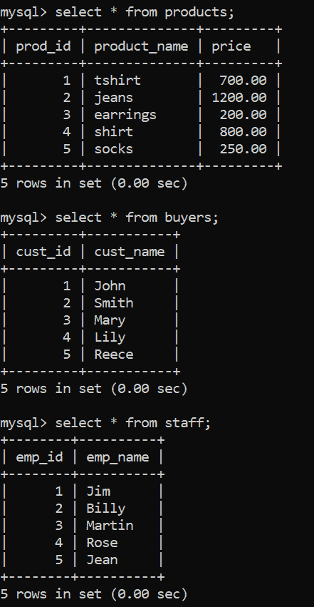
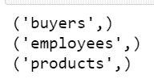
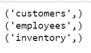

# 如何在 Python 中重命名 MySQL 表？

> 原文:[https://www . geesforgeks . org/how-rename-a-MySQL-table-in-python/](https://www.geeksforgeeks.org/how-to-rename-a-mysql-table-in-python/)

MySQL Connector-Python 模块是 Python 中的一个 API，用于与 MySQL 数据库服务器进行通信。它只需要标准的 Python 库，没有额外的依赖关系。Python 中还有各种其他模块，如 PyMySQL 和 mysqlclient，可以用来访问数据库服务器。在本文中，我们将使用 MySQL 连接器-Python 来执行 MySQL 查询，特别是通过 Python 重命名表。

**在 SQL 中重命名表**

ALTER 和 RENAME 语句用于重命名表。重命名表时，必须记住其他数据库对象，如视图、存储过程、触发器等。，可以参考该表并手动调整它们。

**RENAME 语句的语法:**

```py
RENAME TABLE table_name to new_table_name
```

这里，*表名*是需要重命名的现有表，*新表名*是要赋予现有表的新名称。此外，这个新名称不应与任何其他现有表重复。

**ALTER 语句语法:**

```py
ALTER TABLE table_name
RENAME to new_table_name
```

该语句类似于 RENAME 语句。但是，与 RENAME 不同，它也可以重命名临时表。

**实施:**

首先与数据库服务器建立连接，用 Python 中的 MySQL Connector-Python 模块的 *connect()* 和 *cursor()* 函数创建一个 cursor 对象。然后使用 RENAME 或 ALTER 语句更改表的名称。下面是一些更好理解的例子。

**正在使用的数据库:**



我们将使用一个样本数据库*存储*，其中包含一个*产品*表、*买家*表和*员工*表作为示例。

**示例 1:** 使用 ALTER 语句重命名

*   **步骤 1:** 使用连接()功能**建立与*商店*数据库的连接。**
*   **第二步:**使用 cursor()函数创建一个游标对象与数据库交互。
*   **步骤 3:** 使用 ALTER 语句将*员工*表重命名为*员工。*
*   **步骤 4:** 要检查表是否已被重命名，请执行 SHOW TABLES 命令。这会显示数据库中所有表的名称。

## 蟒蛇 3

```py
# Import required packages
import mysql.connector

# Establish connection to MySQL database
mydb = mysql.connector.connect(
    host="localhost",
    user="username",
    password="geeksforgeeks",
    database="store"
)

# Create a cursor object
mycursor = mydb.cursor()

# MySQL query for for renaming a table
query = "ALTER TABLE staff RENAME to employees"
# Execute the query
mycursor.execute(query)

# Print names of all tables in the database
mycursor.execute("SHOW TABLES")
myresult = mycursor.fetchall()
for row in myresult:
    print(row)

# Close database connection
mydb.close()
```

**输出:**



**示例 2:** 使用 Rename 语句重命名

按照与上述示例相同的步骤建立与数据库服务器的连接并创建游标对象。然后用 RENAME 语句执行 SQL 查询。该命令允许一次重命名多个表。本示例将*产品*表重命名为*库存*，将*买家*表重命名为*客户*。

## 蟒蛇 3

```py
# Import required packages
import mysql.connector

# Establish connection to MySQL database
mydb = mysql.connector.connect(
    host="localhost",
    user="username",
    password="geeksforgeeks",
    database="store"
)

# Create a cursor object
mycursor = mydb.cursor()

# MySQL query for renaming a table
query = "RENAME TABLE products to inventory,\
                      buyers to customers"
# Execute the query
mycursor.execute(query)

# Print names of all tables in the database
mycursor.execute("show tables")
myresult = mycursor.fetchall()
for row in myresult:
    print(row)

# Close database connection
mydb.close()
```

**输出:**

