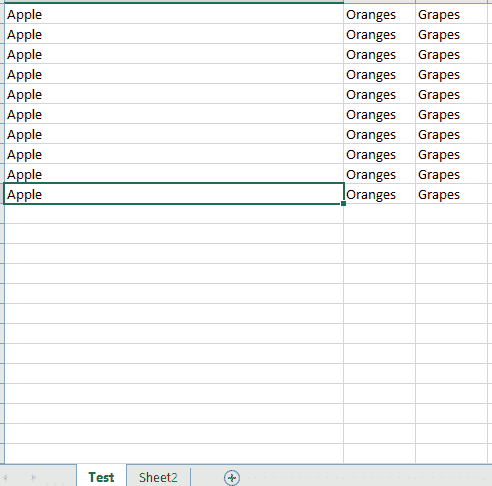
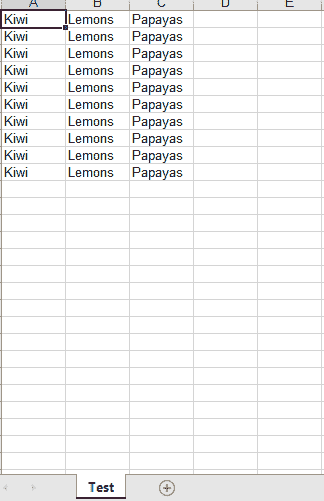
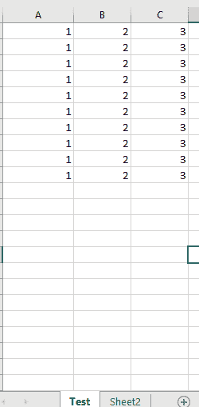
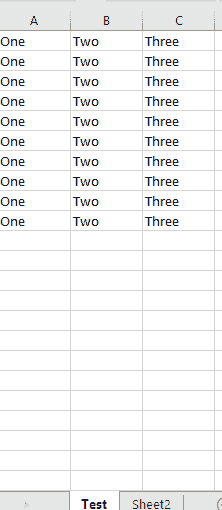

# 如何用 Python 在 excel 中替换一个单词？

> 原文:[https://www . geesforgeks . org/如何使用 python 替换 excel 中的单词/](https://www.geeksforgeeks.org/how-to-replace-a-word-in-excel-using-python/)

Excel 是一个非常有用的工具，我们可以将数据以行和列的格式保存。我们可以说，在数据库出现之前，excel 在数据存储中发挥了重要作用。如今使用 Excel 输入，许多批处理正在完成。因为 excel 总是保存着重要的数据，所以可能需要替换 Excel 工作表中的文本。在本文中，让我们看看如何使用 Python 在 Excel 中替换一个单词

### **使用的方法和途径**

这里让我们通过xlwt & xlrd 包和 openpyxl 包来看看用 Python 替换 excel 中的一个单词

**方法 1 : xlwt & xlrd**

要安装这些软件包，请在终端中键入以下命令。

```py
# for writing into excel
pip install xlwt

# for reading
pip install xlrd 

```

下面的代码有两个 excel 工作簿。一个用于阅读和获取文本。其他用于编写替换文本。我们可以做“n”个替换。该列应该具有需要替换的指定搜索文本，一旦找到，它们将被替换并写入新工作簿。

**示例:**

**使用的 Excel 文件–**



## 蟒蛇 3

```py
import xlwt
import xlrd

# Excel file can be in your local drive 
# and if not, specify the exact path
sampleWorkbook = xlrd.open_workbook('sampleexcel.xlsx')
originalSheet = sampleWorkbook.sheet_by_name('Test')

newWorkbookForTextReplacement = xlwt.Workbook()
newsheetForTextReplacement = newWorkbookForTextReplacement.add_sheet('Test')

replacementTextKeyPairs = {'Apple': 'Kiwi',
                           'Oranges': 'Lemons',
                           'Grapes': 'Papayas'}

# iterate over the rows of your sheet
# ncols - number of columns in the 
# selected sheet, here it is for 'Test' sheet
# nrows - number of rows in the selected
# sheet, here it is for 'Test' sheet
for i in range(originalSheet.nrows):
    print(i)

    # Get the data of each column
    data = [originalSheet.cell_value(i, col)
            for col in range(originalSheet.ncols)]

    for index, value in enumerate(data):

        # If any key present in replacementTextKeyPairs 
        # matches with excel column value, replace the
        # column with the value
        if value in replacementTextKeyPairs.keys():
            newsheetForTextReplacement.write(
                i, index, str(replacementTextKeyPairs.get(value)))
        else:
            newsheetForTextReplacement.write(i, index, value)

# Replaced text will be present in the new workbook
# with name sampleexcelwithreplacedtext.xls
newWorkbookForTextReplacement.save('sampleexcelwithreplacedtext.xls')
```

**输出:**



**方法二:openpyxl**

要安装此模块，请在终端中键入以下命令。

```py
pip install openpyxl

```

openpyxl 包的优点是可以用来读写 xlsx/xlsm/xltx/xltm 文件。下面的代码使用 openpyxl 从一个 excel 文件中读取和获取文本，替换文本并写入另一个 excel 文件。

**示例:**

**使用的 Excel 文件–**



## 蟒蛇 3

```py
# Reading and writing in excel can be done by single module
import openpyxl
from openpyxl.utils.cell import get_column_letter

workbook = openpyxl.load_workbook('sampleexcelopenpyxl.xlsx')
workbook.sheetnames
worksheet = workbook["Test"]

# Number of rows
number_of_rows = worksheet.max_row

# Number of columns
number_of_columns = worksheet.max_column

replacementTextKeyPairs = {'1': 'One', '2': 'Two', '3': 'Three'}

# Iterate over the columns and rows, search
# for the text and replace
for i in range(number_of_columns):
    for k in range(number_of_rows):

        cellValue = str(worksheet[get_column_letter(i+1)+str(k+1)].value)

        for key in replacementTextKeyPairs.keys():

            if str(cellValue) == key:
                newCellValue = replacementTextKeyPairs.get(key)
                worksheet[get_column_letter(i+1)+str(k+1)] = str(newCellValue)

workbook.save('sampleexcelwithreplacedtextusingopenpyxl.xlsx')
```

**输出:**



**注意:** openpyxl 不支持旧的。xls 文件格式，请使用 xlrd 读取该文件，或将其转换为最新的。xlsx 文件格式