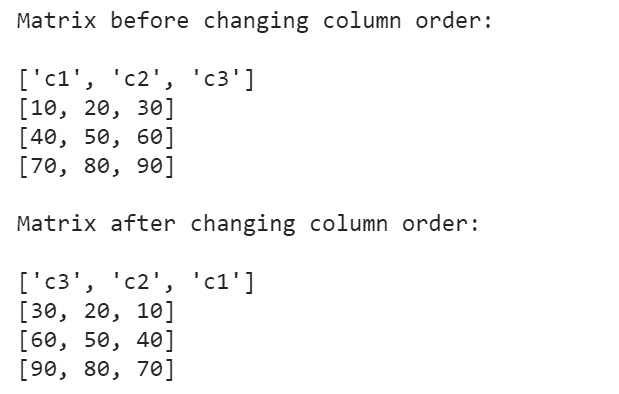
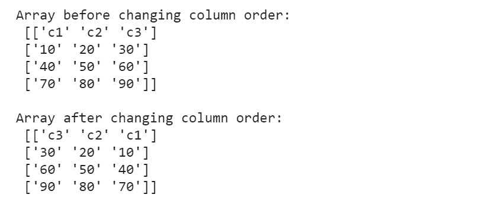

# 如何用 Python 反转矩阵中的列顺序？

> 原文:[https://www . geeksforgeeks . org/如何使用 python 反转矩阵中的列顺序/](https://www.geeksforgeeks.org/how-to-reverse-column-order-in-a-matrix-with-python/)

在本文中，我们将看到如何在 Python 中反转矩阵的列顺序。

**示例:**

```
Input: 
arr = [[10,20,30],
       [40,50,60],
       [70,80,90]]
Output:
30 20 10 
60 50 40
90 80 70 

Input:
arr = [[15,30],
       [45,60],
       [75,90],
       [105,120]]
Output:
30 15
60 45
90 75
120 105
```

矩阵是在 python 中使用嵌套列表/数组创建的。然而，在 python 中处理数组的一种更有效的方法是 NumPy 库。要使用 NumPy 创建数组，请使用[这个](https://www.geeksforgeeks.org/numpy-array-creation/)或 python 中的矩阵，一次通过[这个](https://www.geeksforgeeks.org/python-using-2d-arrays-lists-the-right-way/)。

**方法 1:**

1.  遍历每一行
2.  对于每一行，使用列表理解来反转该行(即 a[:-1])
3.  将反转的行追加到新矩阵中
4.  打印矩阵

**示例:**

## 蟒蛇 3

```
# creating a 3X4 matrix using nested lists
matrix_1 = [['c1', 'c2', 'c3'],
            [10, 20, 30],
            [40, 50, 60],
            [70, 80, 90]]

# creating an empty array to store the reversed column matrix
matrix_2 = []

# looping through matrix_1 and appending matrix_2
for i in range(len(matrix_1)):
    matrix_2.append(matrix_1[i][::-1])

print('Matrix before changing column order:\n')
for rows in matrix_1:
    print(rows)
print('\nMatrix after changing column order:\n')
for rows in matrix_2:
    print(rows)
```

**输出:**



**方法二:**

NumPy 中的数组对象称为 ndarray，它是使用 array()函数创建的。为了反转矩阵中的列顺序，我们使用 **numpy.fliplr()** 方法。该方法沿左/右方向翻转每行中的条目。列数据被保留，但显示顺序与以前不同。

> **语法:** numpy.fliplr(m)
> 
> **参数:**m(*array _ like*)–输入数组必须至少为 2d
> 
> **返回值:**n 数组–返回 m 的视图，列反转，该操作的时间复杂度为 O(1)。

**示例:**

## 蟒蛇 3

```
import numpy as np

# creating a numpy array(matrix) with 3-columns and 4-rows
arr = np.array([
    ['c1', 'c2', 'c3'],
    [10, 20, 30],
    [40, 50, 60],
    [70, 80, 90]])

# reversing column order in matrix
flipped_arr = np.fliplr(arr)

print('Array before changing column order:\n', arr)
print('\nArray after changing column order:\n', flipped_arr)
```

**输出:**



Flipped_arr 包含一个颠倒的列顺序矩阵，其中列顺序从 **c1、c2、c3** 变为 **c3、c2、c1、**，并且每列的元素在其各自的标题(c1、c2、c3)下保持不变。