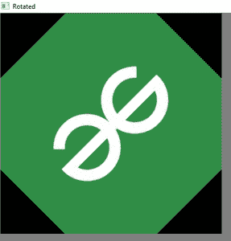
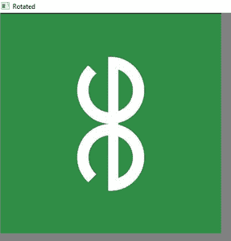

# 如何使用 Python 旋转图像？

> 原文:[https://www . geesforgeks . org/如何使用 python 旋转图像/](https://www.geeksforgeeks.org/how-to-rotate-an-image-using-python/)

在本文中，让我们看看如何使用 Python 旋转图像。通过图像旋转，图像将围绕其中心旋转指定的度数。图像的旋转是一种几何变换。它可以通过正向变换(或反向变换)来完成。

这里带枕头的图像处理库使用逆变换。如果为图像旋转指定的度数不是 90 度的整数倍，则某些像素值超出图像边界，即位于图像维度之外的像素值。这样的值不会显示在输出图像中。

**方法:1** 使用图像处理库 [**枕**](https://pillow.readthedocs.io/en/stable/)

## 蟒蛇 3

```py
# import the Python Image
# processing Library
from PIL import Image

# Giving The Original image Directory
# Specified
Original_Image = Image.open("./gfgrotate.jpg")

# Rotate Image By 180 Degree
rotated_image1 = Original_Image.rotate(180)

# This is Alternative Syntax To Rotate
# The Image
rotated_image2 = Original_Image.transpose(Image.ROTATE_90)

# This Will Rotate Image By 60 Degree
rotated_image3 = Original_Image.rotate(60)

rotated_image1.show()
rotated_image2.show()
rotated_image3.show()
```

**输出:**


这是旋转 180 度的图像


此图像旋转了 60 度


此图像旋转了 90 度

Python 图像处理库枕的**旋转()**方法以度数为参数，在**逆时针方向**旋转图像到指定的度数。

**方法 2:** 使用 Open-CV 在 Python 中将图像旋转一个角度

这很常见，因为每个人都知道 Python Open-CV 是一个模块，将处理与计算机视觉相关的实时应用程序。Open-CV 使用处理图像的图像处理库 [**imutils**](https://pypi.org/project/imutils/) 。 **imutils.rotate()** 功能用于在 Python 中将图像旋转一个角度。

## 蟒蛇 3

```py
import cv2  # importing cv
import imutils

# read an image as input using OpenCV
image = cv2.imread(r".\gfgrotate.jpg")

Rotated_image = imutils.rotate(image, angle=45)
Rotated1_image = imutils.rotate(image, angle=90)

# display the image using OpenCV of
# angle 45
cv2.imshow("Rotated", Rotated_image)

# display the image using OpenCV of
# angle 90
cv2.imshow("Rotated", Rotated1_image)

# This is used for To Keep On Displaying
# The Image Untill Any Key is Pressed
cv2.waitKey(0)
```

**输出:**



使用开放式 CV 旋转 45 度的图像



使用开放式 CV 旋转 90 度的图像

即使这样，Open-CV 也会在**逆时针**方向上将图像旋转到指定的度数