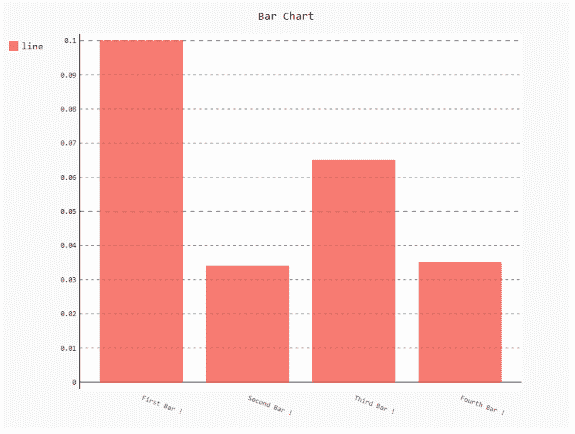
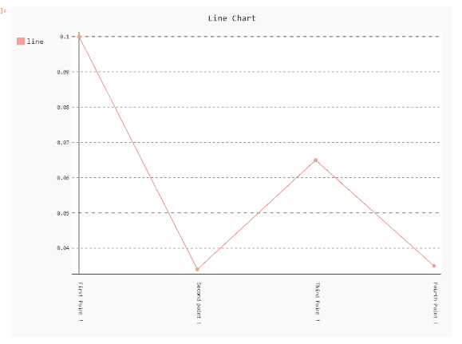

# 如何使用 Pygal 旋转 x 标签？

> 原文:[https://www . geesforgeks . org/如何旋转-x-标签-使用-pygal/](https://www.geeksforgeeks.org/how-to-rotate-x-labels-using-pygal/)

**先决条件:** [皮格尔](http://www.pygal.org/en/stable/)

Pygal 是 Python 的图形和用户界面库，提供设计和科学应用程序通常需要的功能。在制作剧情的同时，优化它的标签、标题、大小对我们来说很重要。在本文中，我们将看到如何在 Pygal 模块中旋转绘图窗口的 X-Label 值。这可以通过将旋转角度传递给 x_label_rotation 参数来实现。

以下是根据我们的要求更改默认绘图 x_label 的各种方法。

**进场:**

*   导入所需模块。
*   创建图表对象。
*   在函数中传递 x_label_rotation 值。
*   给图表贴上标签。
*   显示图形。

下面给出了上述概念的实现:

**例 1:**

## 蟒蛇 3

```
# import library
import pygal
import numpy

# creating the chart object
chart = pygal.Bar(x_label_rotation=20)

# Random data
chart.x_labels = [
    'First Bar !',
    'Second Bar !',
    'Third Bar !',
    'Fourth Bar !']
chart.add('line', [0.1, .034, .065, .035])

# naming the title
chart.title = 'Bar Chart'

chart.render_to_png('img.png');
```

**输出:**



**例 2:**

## 蟒蛇 3

```
# importing pygal
import pygal
import numpy

# creating the chart object
chart = pygal.Line(x_label_rotation=90)

# Random data
chart.x_labels = [
    'First Point !',
    'Second point !',
    'Third Point !',
    'Fourth Point !']
chart.add('line', [0.1, .034, .065, .035])

# naming the title
chart.title = 'Line Chart'

chart.render_to_png('img.png')
```

**输出:**

