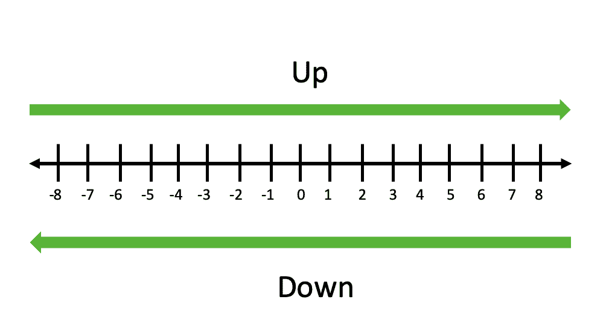

# Python 中的数字如何四舍五入？

> 原文:[https://www . geeksforgeeks . org/如何在 python 中舍入数字/](https://www.geeksforgeeks.org/how-to-round-numbers-in-python/)

舍入一个数字意味着通过保持其值不变但更接近下一个数字来使数字更简单。
**例如:**如果我们想四舍五入一个数字，比如说 3.5。它将被舍入到最接近的整数 4。但是，数字 3.74 将四舍五入到小数点后一位，得出 3.7。

**方法一:**使用内置[**轮()**](https://www.geeksforgeeks.org/round-function-python/) 功能。
Python 中有一个内置的 round()函数，它将一个数字舍入到给定的位数。函数 round()接受两个数字参数，n 和 n 个数字，然后在将其舍入到 n 个数字后返回数字 n。如果没有为舍入提供位数，该函数会将给定的数字 n 舍入到最接近的整数。

> **语法:**轮(数字，位数)
> 
> **参数:**
> 
> *   **数字:**要四舍五入的数字
> *   **位数(可选):**给定数字要四舍五入到的位数

**示例:**

## 蟒蛇 3

```
# For integers
print(round(11))

# For floating point
print(round(22.7))  

# if the second parameter is present

# when the (ndigit+1)th digit is =5 
print(round(4.465, 2)) 

# when the (ndigit+1)th digit is >=5 
print(round(4.476, 2))   

# when the (ndigit+1)th digit is <5 
print(round(4.473, 2))
```

**输出:**

```
11
23
4.46
4.48
4.47

```

**方法二:**使用**截断**概念。
截断是对一个数进行舍入的最简单方法之一，它包括将一个数截断为给定的位数。在这个函数中，给定位置后的每个数字都被替换为 0。 **truncate()** 函数既可以用于正数，也可以用于负数。

> 截断函数可以通过以下方式实现:
> 
> *   将数字乘以 10^p (10 的 pth 次方)将小数点向右移动 p 位。
> *   使用 int()获取新数字的整数部分。
> *   通过除以 10^p.将小数点后 p 位移回左边

使用 truncate()用户定义函数实现截断概念:

## 蟒蛇 3

```
# defining truncate function
# second argument defaults to 0
# so that if no argument is passed 
# it returns the integer part of number

def truncate(n, decimals = 0):
    multiplier = 10 ** decimals
    return int(n * multiplier) / multiplier

print(truncate(16.5))
print(truncate(-3.853, 1))
print(truncate(3.815, 2))

# we can truncate digits towards the left of the decimal point
# by passing a negative number.
print(truncate(346.8, -1))
print(truncate(-2947.48, -3))
```

**输出:**

```
16.0
-3.8
3.81
340.0
-2000.0

```

**方法三:**使用 [**数学**。 **ceil()**](https://www.geeksforgeeks.org/python-math-ceil-function/) 和**[**math . floor()**](https://www.geeksforgeeks.org/python-math-floor-function/)**功能。
**Math.ceil():** 此函数返回大于或等于给定数字的最近整数。
**Math.floor():** 此函数返回小于或等于给定数字的最近整数。
**例:******

## ****蟒蛇 3****

```
**# import math library
import math

# ceil value for positive
# decimal number
print(math.ceil(4.2))

# ceil value for negative
# decimal number
print(math.ceil(-0.5))

# floor value for decimal 
# and negative number
print(math.floor(2.2))
print(math.floor(-0.5))**
```

******输出:******

```
**5
0
2
-1** 
```

******方法三:**使用**四舍五入**概念。
在舍入中，一个数字被舍入到指定的位数。**** 

> ****舍入功能可以通过以下方式实现:****
> 
> *   ****首先，通过将 n 乘以 10 **小数，将 n 中的小数点向右移动正确的位数。****
> *   ****使用 math.ceil()将新值向上舍入到最接近的整数****
> *   ****最后，通过除以 10 **小数，小数点被移回左边。****

******使用 round_up()用户自定义函数实现舍入概念:******

## ****蟒蛇 3****

```
**# import math library
import math

# define a function for 
# round_up
def round_up(n, decimals = 0): 
    multiplier = 10 ** decimals 
    return math.ceil(n * multiplier) / multiplier

# passing positive values
print(round_up(2.1))
print(round_up(2.23, 1))
print(round_up(2.543, 2))

# passing negative values
print(round_up(22.45, -1))
print(round_up(2352, -2))**
```

******输出:******

```
**3.0
2.3
2.55
30.0
2400.0** 
```

****我们可以按照下图来理解向上舍入和向下舍入。向右上，向左下。**** 

********

****向上舍入总是将数字舍入到数字行的右边，向下舍入总是将数字舍入到数字行的左边。
**方法五:**使用**四舍五入**概念。****

****在向下舍入中，数字向下舍入到指定的位数。****

> ****向下舍入功能可以通过以下方式实现:****
> 
>  *****   首先，通过将 n 乘以 10 **小数，将 n 中的小数点向右移动正确的位数。
> *   使用 math.floor()将新值向上舍入到最接近的整数。
> *   最后，通过除以 10 **小数，小数点被移回左边。****

******使用 round_down()用户自定义函数实现舍入概念:******

## ****蟒蛇 3****

```
**import math

# defining a function for
# round down.
def round_down(n, decimals=0):
    multiplier = 10 ** decimals
    return math.floor(n * multiplier) / multiplier

# passing different values to function
print(round_down(2.5))
print(round_down(2.48, 1))
print(round_down(-0.5))**
```

******输出:******

```
**2.0
2.4
-1.0** 
```

******方法 5:** 使用**舍入偏差**概念。
对称的概念引入了舍入偏差的概念，它描述了舍入如何影响数据集中的数字数据。
向上舍入策略有一个朝向正无穷大的舍入偏差，因为值总是朝着正无穷大的方向向上舍入。同样，向下舍入策略有一个朝向负无穷大的舍入偏差。截断策略对正值有一轮向负无穷大的偏差，对负值有一轮向正无穷大的偏差。一般来说，具有这种行为的舍入函数被称为向零偏差舍入。****

******a)四舍五入**概念。
半向上舍入以指定的精度将每个数字舍入到最近的数字，并通过向上舍入打破联系。
通过将小数点向右移动所需的位数来实现四舍五入策略。在这种情况下，我们必须确定移位小数点后的数字是小于还是大于等于 5。
我们可以将移位后的值加 0.5，然后用 math.floor()函数向下舍入。****

******round _ half _ up()功能的实现:******

## ****蟒蛇 3****

```
**import math

# defining round_half_up

def round_half_up(n, decimals=0):
    multiplier = 10 ** decimals
    return math.floor(n * multiplier + 0.5) / multiplier

# passing different values to the function

print(round_half_up(1.28, 1))
print(round_half_up(-1.5))
print(round_half_up(-1.225, 2))**
```

******输出:******

```
**1.3
-1.0
-1.23** 
```

******b)向下舍入一半**概念。
这类似于向上舍入法，舍入到最近的数字，不同之处在于它通过舍入到两个数字中较小的一个来打破联系。通过将 round_half_up()函数中的 math.floor()替换为 math.ceil()，然后通过减去 0.5 而不是相加来实现向下舍入半策略。****

******round _ half _ down()功能的实现:******

## ****蟒蛇 3****

```
**# import math library
import math

# defining a function
# for round_half_down
def round_half_down(n, decimals=0):
    multiplier = 10 ** decimals
    return math.ceil(n * multiplier - 0.5) / multiplier

# passing different values to the function
print(round_half_down(2.5))
print(round_half_down(-2.5))
print(round_half_down(2.25, 1))**
```

******输出:******

```
**2.0
-3.0
2.2** 
```

******方法六:离零取半。**
在舍入离零的一半中，我们需要做的是像往常一样，将小数点向右移动给定的位数，然后注意新数字中小数点右边的数字(d)。有四种情况需要考虑:****

*   ****如果 n 为正，d >= 5，则向上舍入****
*   ****如果 n 为正，d = 5，则向下舍入****
*   ****如果 n 为负，d >= 5，则向下舍入****
*   ****如果 n 为负且 d < 5，则向上舍入****

****按照上面提到的规则舍入后，我们可以将小数点后的位置移回左边。****

*   ******将一半舍入到偶数:**当我们对数据集中的值进行舍入时，有一种方法可以减轻舍入偏差。我们可以简单地将关系舍入到所需精度的最接近的偶数。半到偶数策略是 Python 内置 round()使用的策略。**十进制类**支持快速正确舍入的十进制浮点运算。与浮点数据类型相比，这有几个优点。十进制模块中的默认舍入策略是 ROUND_HALF_EVEN。****

******示例:******

## ****蟒蛇 3****

```
**# import Decimal function from 
# decimal library
from decimal import Decimal
print(Decimal("0.1"))
print(Decimal(0.1))

# Rounding a Decimal number is
# done with the .quantize() function
# "1.0" in .quantize() determines the
# number of decimal places to round the number
print(Decimal("1.65").quantize(Decimal("1.0")))
print(Decimal("1.675").quantize(Decimal("1.00")))**
```

******输出:******

```
**0.1
0.1000000000000000055511151231257827021181583404541015625
1.6
1.68** 
```