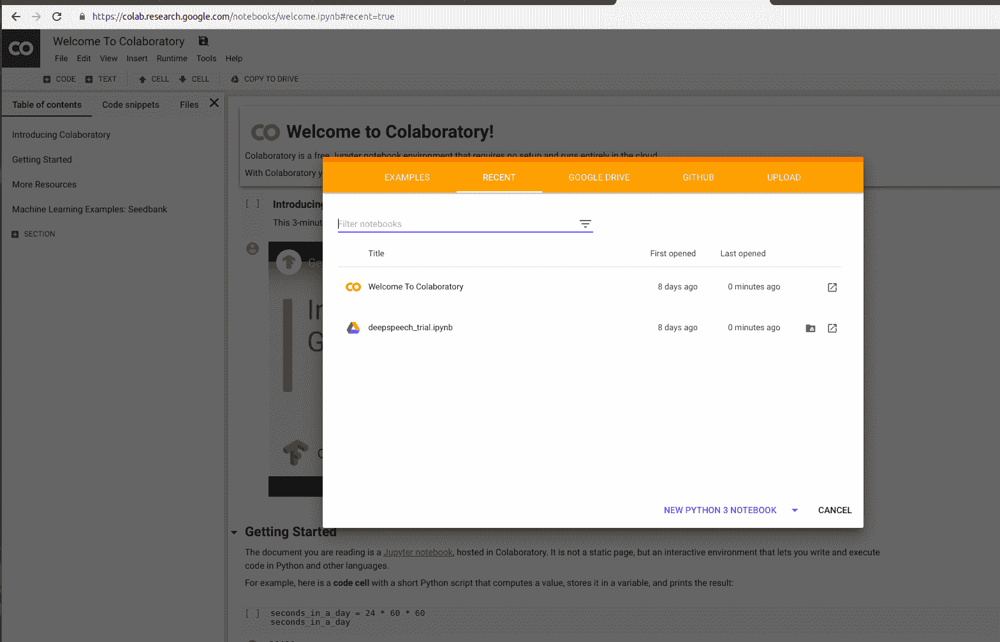
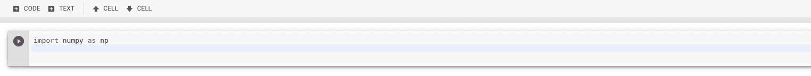
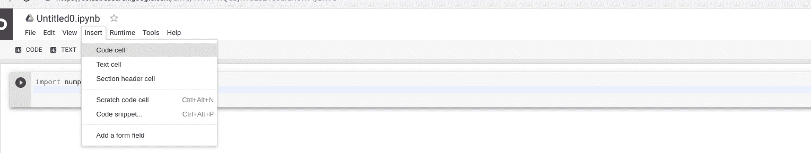
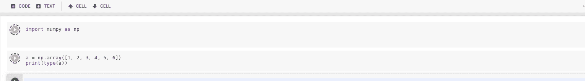
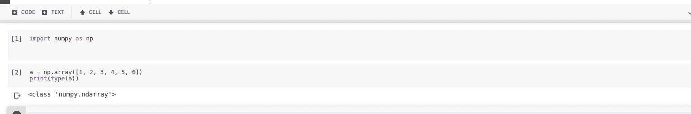

# 如何在谷歌协同实验室

上运行 Python 代码

> 原文:[https://www . geesforgeks . org/how-run-python-code-on-Google-co laboratory/](https://www.geeksforgeeks.org/how-to-run-python-code-on-google-colaboratory/)

**先决条件:** [如何使用谷歌可乐](https://www.geeksforgeeks.org/how-to-use-google-colab/)

谷歌提供了类似 Jupyter Notebook 的界面，可以在在线虚拟机上运行 Python 代码。在本文中，我们将看到如何在谷歌 Colab 上运行简单的 Python 代码。

**第一步:**开启[https://colab.research.google.com/](https://colab.research.google.com/)

**第 2 步:**选择新蟒 3 笔记本
T3

**第 3 步:**开始在代码单元格中输入代码。

导入所有必要的库。

**第 4 步:**添加新单元格，点击插入- >编码单元格

**第 5 步:**要运行特定的单元格，请选择该单元格并按下 **`Ctlr + ENTER`** 键。

正在处理的代码单元格

成功运行后的输出