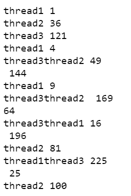

# Python 中如何在多个线程上运行同一个函数？

> 原文:[https://www . geesforgeks . org/如何在 python 多线程上运行相同的函数/](https://www.geeksforgeeks.org/how-to-run-same-function-on-multiple-threads-in-python/)

在大型现实应用程序中，模块和功能必须经历大量基于输入和输出的任务，如读取或更新数据库、与不同微服务的通信以及与客户端或对等方的请求响应。这些任务可能需要很长时间才能完成。

服务请求和响应客户端所花费的时间称为延迟，程序员需要尽可能减少延迟。这导致了对并行处理的需求，在这种情况下，我们的应用程序能够为不同的客户端执行一些具有不同参数的函数或方法。我们可以使用线程来实现这一点。一个线程可以与其他线程并行执行一个功能。每个线程共享相同的代码、数据和文件，同时它们有自己的堆栈和寄存器。

### 使用的模块:

在 Python 中，我们可以使用 [**【线程】**](https://www.geeksforgeeks.org/thread-based-parallelism-python/) 模块创建和运行线程。python 中的这个模块为线程提供了强大的高级支持。

### 逐步方法:

*   导入库。我们将使用**线程**模块来创建和运行线程。为了观察输出，我们将使用**时间**模块创建一些延迟。

```
import threading
import time
```

*   定义一个示例函数，我们将使用它在不同的线程上运行。在本例中，让我们创建一个函数，打印给定列表中数字的平方。

```
# A sample function to print squares
def print_squares(thread_name, numbers):

   for number in numbers:
       print(thread_name, number**2)

       # Produce some delay to see the output
       # syntax: time.sleep(<time in seconds : float>)
       time.sleep(1)
```

*   现在使用**线程创建 2 个或更多线程。螺纹**类。创建线程的语法如下:

> **语法:** thread_object = threading。Thread(target= <函数名>，args= <要传递的参数元组>)

```
# Creating 3 threads that execute the same function with different parameters
thread1 = threading.Thread(
   target=print_squares, args=("thread1", [1, 2, 3, 4, 5]))

thread2 = threading.Thread(
   target=print_squares, args=("thread2", [6, 7, 8, 9, 10]))

thread3 = threading.Thread(
   target=print_squares, args=("thread3", [11, 12, 13, 14, 15]))
```

*   现在我们需要开始执行死刑。线程类有一个 **start()** 方法，在运行模式下传输线程。线程将一直运行，直到它们没有完成。

```
# Start the threads
thread1.start()
thread2.start()
thread3.start()
```

*   我们可以使用 Thread 类的 **join()** 方法，在所有线程都没有完成的时候阻止程序执行。

```
# Join the threads before moving further
thread1.join()
thread2.join()
thread3.join()
```

**下面是完整代码:**

## 蟒蛇 3

```
# Import module
import threading
import time

# A sample function to print squares
def print_squares(thread_name, numbers):

    for number in numbers:
        print(thread_name, number**2)

        # Produce some delay to see the output
        time.sleep(1)

# Creating 3 threads that execute the same 
# function with different parameters
thread1 = threading.Thread(target=print_squares, 
                           args=("thread1", [1, 2, 3, 4, 5]))

thread2 = threading.Thread(target=print_squares, 
                           args=("thread2", [6, 7, 8, 9, 10]))

thread3 = threading.Thread(target=print_squares, 
                           args=("thread3", [11, 12, 13, 14, 15]))

# Start the threads
thread1.start()
thread2.start()
thread3.start()

# Join the threads before 
# moving further
thread1.join()
thread2.join()
thread3.join()
```

**输出:**

