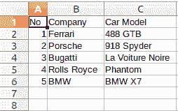

# 如何将 Python 字典保存到 CSV 文件中？

> 原文:[https://www . geesforgeks . org/如何保存一个 python-dictionary-to-a-CSV-file/](https://www.geeksforgeeks.org/how-to-save-a-python-dictionary-to-a-csv-file/)

**先决条件:** [使用 Python 中的 csv 文件](https://www.geeksforgeeks.org/working-csv-files-python/)

**CSV(逗号分隔值)**文件是以字符串形式传输数据的最简单方法之一，尤其是传输到任何电子表格程序，如微软 Excel 或谷歌电子表格。在本文中，我们将看到如何将 PYthon 字典保存到 CSV 文件中。按照以下步骤进行操作。

1.  **导入 csv 模块**

```
import csv
```

*   **创建域名列表**

    ```
    field_names= ['No', 'Company', 'Car Model']
    ```

    *   **创建 python 字典列表**

    > 汽车= [
    > {“否”:1、【公司】:“法拉利”、“车模”:“488 GTB”}、
    > {“否”:2、【公司】:“保时捷”、“车模”:“918 Spyder”}、
    > {“否”:3、【公司】:“布加迪”、“车模”}、
    > {“否”:4、【公司】:“劳斯莱斯”、“车模”:“幻影”}、【T8 宝马 X7

    *   **Writing content of dictionaries to CSV file**

    ```
    with open('Names.csv', 'w') as csvfile:
        writer = csv.DictWriter(csvfile, fieldnames=field_names)
        writer.writeheader()
        writer.writerows(cars)
    ```

    **语法:**

    ```
    DictWriter( (filename), fieldnames = [list of field names] )
    ```

    在上面的代码片段中 **writer** 是 csv 的一个实例。DictWriter 类，并使用以下两种方法:

    1.  字典作者。 **writeheader()** 用于将一行列标题/字段名称写入给定的 CSV 文件
    2.  csvwriter。 **writerows()** 方法用于将数据行写入指定文件。

    **注意:**要在 CSV 文件中编写单个字典，请使用 writerow()方法

    **完成在 CSV 文件中编写 python 字典的代码**

    ```
    import csv

    field_names = ['No', 'Company', 'Car Model']

    cars = [
    {'No': 1, 'Company': 'Ferrari', 'Car Model': '488 GTB'},
    {'No': 2, 'Company': 'Porsche', 'Car Model': '918 Spyder'},
    {'No': 3, 'Company': 'Bugatti', 'Car Model': 'La Voiture Noire'},
    {'No': 4, 'Company': 'Rolls Royce', 'Car Model': 'Phantom'},
    {'No': 5, 'Company': 'BMW', 'Car Model': 'BMW X7'},
    ]

    with open('Names.csv', 'w') as csvfile:
        writer = csv.DictWriter(csvfile, fieldnames = field_names)
        writer.writeheader()
        writer.writerows(cars)
    ```

    **输出:**

    