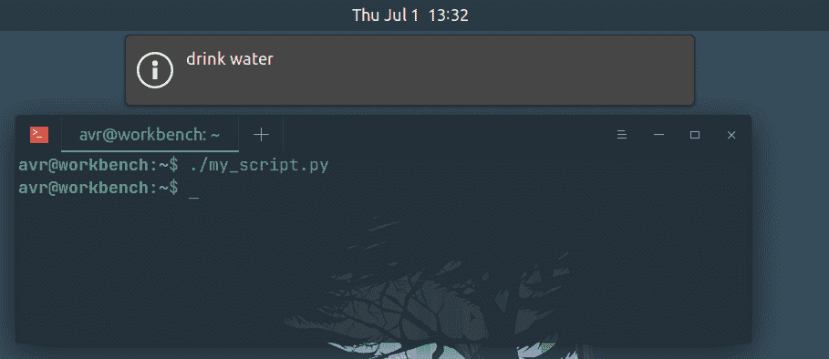
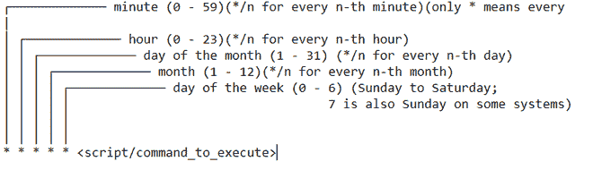
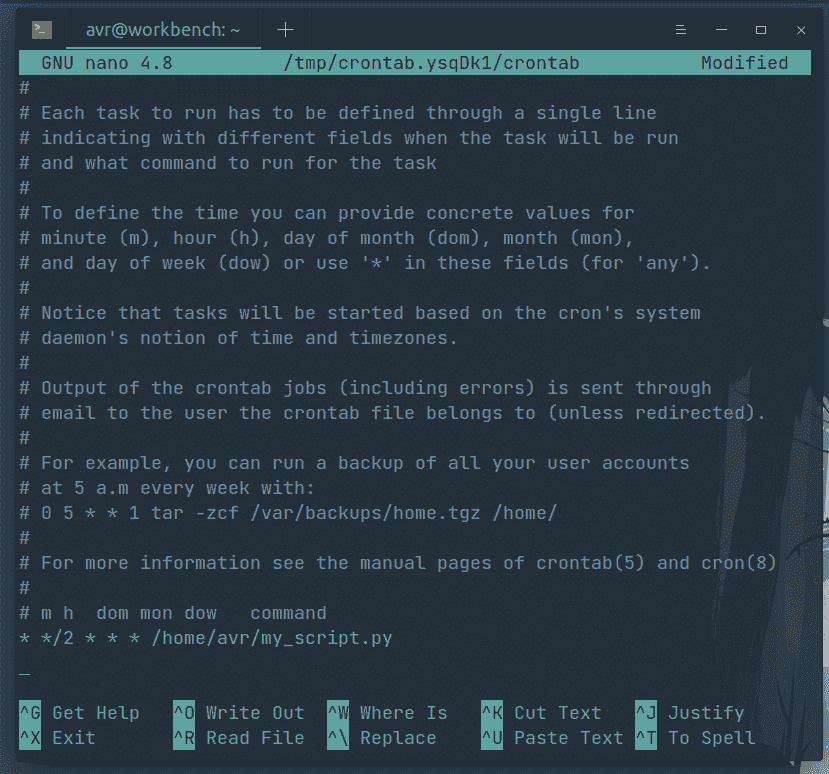

# 如何使用 Crontab 将 Python 脚本调度为 Cron 作业

> 原文:[https://www . geeksforgeeks . org/如何安排-python-scripts-as-cron-jobs-with-crontab/](https://www.geeksforgeeks.org/how-to-schedule-python-scripts-as-cron-jobs-with-crontab/)

在本文中，我们将讨论如何使用 crontab 调度 Python 脚本。

Cron 作业实用程序是类 Unix 操作系统中基于时间的作业调度程序。Cron 允许 Linux 和 Unix 用户在给定的时间和日期运行命令或脚本。可以安排脚本定期执行。 [crontab](https://www.geeksforgeeks.org/crontab-in-linux-with-examples/) 是您希望定期运行的命令列表，也是用于管理该列表的命令的名称。cron 是系统进程，它会根据设定的时间表自动为您执行任务。

### 入门指南

下面是一个简单的 Python 脚本，发送通知消息提醒用户喝水。我们将安排此脚本每 2 小时发送一次通知。(该脚本仅针对基于 Linux 的系统进行测试，但调度过程与任何脚本都类似)

## 蟒蛇 3

```
#!/usr/bin/env python3
#-*- coding: utf-8 -*-

import subprocess

def sendmessage(message="drink water"):
    subprocess.Popen(['notify-send', message])
    return

if __name__ == '__main__':
    sendmessage()
```

**注意:** #！/usr/bin/pyt 3(指定脚本解释器的路径)对于使脚本可执行是必要的。假设我们已经在主目录下将这个脚本保存为 my_script.py，我们可以通过在终端中输入以下命令来使它可执行:

```
$ sudo chmod +x my_script.py
```

**我们可以测试我们的脚本是否正常工作:**

```
./my_script.py
```



这将发送一个通知作为消息“喝水”。

**crontab 调度表达式有以下几部分:**



为了调度要执行的脚本，我们需要在 crontab 文件中输入 crontab 调度表达式。为此，只需在终端中输入以下内容:

```
crontab -e
```

系统可能会提示您选择一个编辑器，选择 nano，并在打开的 crontab 文件末尾添加以下行:

```
* */2 * * * /home/$(USER)/my_script.py
```



其中$(用户)可以用您的用户名替换。保存更改并退出。这将安排我们的 Python 脚本每 2 小时运行一次。

#### 验证文件保存成功:

它将列出所有计划的作业。

```
crontab -l
```

**在安排 cron 作业之前，有几件事要记住:**

*   所有 cron 作业都安排在计划作业的系统运行的本地时区。如果在跨国人员使用的服务器上安排工作，这可能会很麻烦。尤其是如果用户也属于遵循夏令时惯例的国家。
*   所有 cron 作业都在它们自己独立的匿名 shell 会话中运行，如果我们想看到它们，它们到 STDOUT(如果有的话)的输出必须指向一个文件。
*   所有 cron 作业都在为其计划的用户的上下文中运行。因此，提供脚本和输出文件的绝对路径总是一种好的做法，以避免任何混淆和混乱。