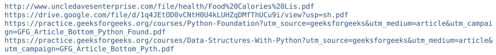

# 如何刮除一个网站中的所有 PDF 文件？

> 原文:[https://www . geesforgeks . org/how-to-scratch-all-pdf-files-in-a-site/](https://www.geeksforgeeks.org/how-to-scrape-all-pdf-files-in-a-website/)

**先决条件:** [用美图实现 Python 网页抓取](https://www.geeksforgeeks.org/implementing-web-scraping-python-beautiful-soup/)

网页抓取是一种从网站中提取数据并将该数据用于其他用途的方法。Python 中有几个用于进行网页抓取的库和模块。在本文中，我们将学习如何借助 python 中最好的网页抓取模块之一**beauty sup、**以及针对 GET 请求的 **requests** 模块从网站上抓取 PDF 文件。另外，为了获得更多关于 PDF 文件的信息，我们使用 **PyPDF2** 模块。

**分步代码–**

**第一步:**导入所有重要模块和包。

## 蟒蛇 3

```py
# for get the pdf files or url
import requests

# for tree traversal scraping in webpage
from bs4 import BeautifulSoup

# for input and output operations
import io

# For getting information about the pdfs
from PyPDF2 import PdfFileReader
```

**第二步:**传递 URL，借助 BeautifulSoup 做一个 HTML 解析器。

## 蟒蛇 3

```py
# website to scrap
url = "https://www.geeksforgeeks.org/how-to-extract-pdf-tables-in-python/"

# get the url from requests get method
read = requests.get(url)

# full html content
html_content = read.content

# Parse the html content
soup = BeautifulSoup(html_content, "html.parser")
```

**在上面的代码中:**

*   抓取是通过**https://www . geeksforgeeks . org/如何提取-pdf-python 中的表格/** 链接完成的
*   请求模块用于发出获取请求
*   **read.content** 用于遍历所有的 HTML 代码。打印将输出网页的源代码。
*   **汤**有 HTML 内容，用来解析 HTML

**第三步:**我们需要从网站遍历 pdf。

## 蟒蛇 3

```py
# created an empty list for putting the pdfs
list_of_pdf = set()

# accessed the first p tag in the html
l = soup.find('p')

# accessed all the anchors tag from given p tag
p = l.find_all('a')

# iterate through p for getting all the href links
for link in p:

    # original html links
    print("links: ", link.get('href'))
    print("\n")

    # converting the extention from .html to .pdf
    pdf_link = (link.get('href')[:-5]) + ".pdf"

    # converted to .pdf
    print("converted pdf links: ", pdf_link)
    print("\n")

    # added all the pdf links to set
    list_of_pdf.add(pdf_link)
```

**输出:**



**在上面的代码中:**

*   **list_of_pdf** 是为添加网页中的所有 pdf 文件而创建的一个空集合。使用 Set 是因为它从不重复同名的元素。并自动消除重复。
*   迭代是在所有链接内完成的。它是这样做的，因为 pdf 名称和 HTML 名称在格式上只有一个区别，其余的都一样。
*   我们使用集合是因为我们需要去掉重复的名字。该列表也可以使用，而不是添加，我们附加所有的 pdf。

**第四步:**用 pypdf2 模块创建**信息功能**，获取 pdf 所需的所有信息。

## 蟒蛇 3

```py
def info(pdf_path):

    # used get method to get the pdf file
    response = requests.get(pdf_path)

    # response.content generate binary code for
    # string function
    with io.BytesIO(response.content) as f:

        # initialized the pdf
        pdf = PdfFileReader(f)

        # all info about pdf
        information = pdf.getDocumentInfo()
        number_of_pages = pdf.getNumPages()

    txt = f"""
    Information about {pdf_path}:

    Author: {information.author}
    Creator: {information.creator}
    Producer: {information.producer}
    Subject: {information.subject}
    Title: {information.title}
    Number of pages: {number_of_pages}
    """
    print(txt)

    return information
```

**上图中代码:**

*   信息功能负责在 PDF 中提供所有需要的输出。
*   **io。BytesIO(response . content)–**之所以使用它，是因为 **response.content** 是一个二进制代码，请求库级别很低，一般是编译的(不是解释的)。所以要处理字节， **io。使用 BytesIO** 。
*   有几个 pypdfs2 函数可以访问 pdf 中的不同数据。

**注意:**详细信息请参考 [**使用 Python 中的 PDF 文件**](https://www.geeksforgeeks.org/how-to-extract-pdf-tables-in-python/) 。

## 蟒蛇 3

```py
# print all the content of pdf in the console
for i in list_of_pdf:
    info(i)
```

**完整代码:**

## 蟒蛇 3

```py
import requests
from bs4 import BeautifulSoup
import io
from PyPDF2 import PdfFileReader

url = "https://www.geeksforgeeks.org/how-to-extract-pdf-tables-in-python/"
read = requests.get(url)
html_content = read.content
soup = BeautifulSoup(html_content, "html.parser")

list_of_pdf = set()
l = soup.find('p')
p = l.find_all('a')

for link in (p):
    pdf_link = (link.get('href')[:-5]) + ".pdf"
    print(pdf_link)
    list_of_pdf.add(pdf_link)

def info(pdf_path):
    response = requests.get(pdf_path)

    with io.BytesIO(response.content) as f:
        pdf = PdfFileReader(f)
        information = pdf.getDocumentInfo()
        number_of_pages = pdf.getNumPages()

    txt = f"""
    Information about {pdf_path}:

    Author: {information.author}
    Creator: {information.creator}
    Producer: {information.producer}
    Subject: {information.subject}
    Title: {information.title}
    Number of pages: {number_of_pages}
    """
    print(txt)
    return information

for i in list_of_pdf:
    info(i)
```

**输出:**

