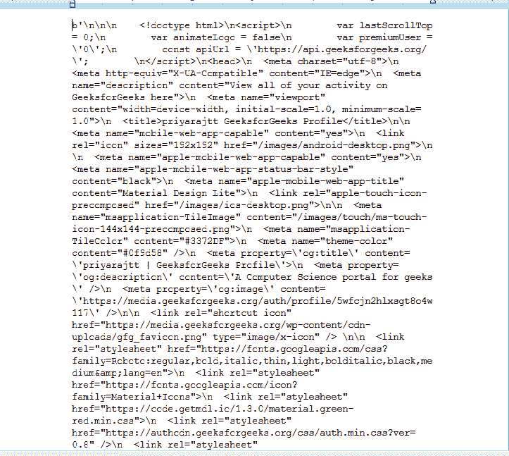
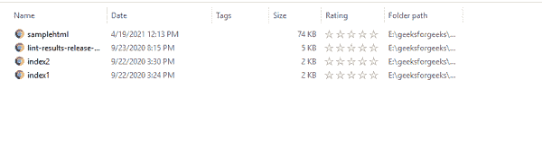

# 如何使用 Python 从本地 HTML 文件中抓取数据？

> 原文:[https://www . geeksforgeeks . org/如何使用 python 从本地 html 文件中获取数据/](https://www.geeksforgeeks.org/how-to-scrape-data-from-local-html-files-using-python/)

**Python 中的美化程序**模块允许我们从本地 HTML 文件中抓取数据。出于某种原因，网站页面可能会存储在本地(离线环境)中，无论何时需要，都可能需要从它们那里获取数据。有时可能也需要从多个本地存储的 HTML 文件中获取数据。通常 HTML 文件会有标签，如< h1 >、< h2 >、… < p >、< div >标签等。，使用 BeautifulSoup，我们可以废弃内容并获得必要的细节。

### 装置

它可以通过在终端中键入以下命令来安装。

```
pip install beautifulsoup4
```

### 入门指南

如果有一个 HTML 文件存储在一个位置，我们需要通过 Python 使用美丽的输出来废弃内容，那么 **lxml** 是一个很好的应用编程接口，因为它意味着**解析 xml 和 HTML。**支持一步解析和分步解析。

美化组中的**美化()**功能有助于查看标签性质及其嵌套。

**示例:**让我们创建一个示例 HTML 文件。

## 蟒蛇 3

```
# Necessary imports
import sys
import urllib.request

# Save a reference to the original
# standard output
original_stdout = sys.stdout

# as an example, taken my article list
# published link page and stored in local
with urllib.request.urlopen('https://auth.geeksforgeeks.org/user/priyarajtt/articles') as webPageResponse:
    outputHtml = webPageResponse.read()

# Scraped contents are placed in 
# samplehtml.html file and getting
# used for next set of examples
with open('samplehtml.html', 'w') as f:

    # Here the  standard output is 
    # written to the file that we 
    # used above
    sys.stdout = f
    print(outputHtml)

    # Reset the standard output to its 
    # original value
    sys.stdout = original_stdout
```

**输出:**



现在，使用 prettify()方法以更简单的方式查看标签和内容。

## 蟒蛇 3

```
# Importing BeautifulSoup and 
# it is in the bs4 module
from bs4 import BeautifulSoup

# Opening the html file. If the file
# is present in different location, 
# exact location need to be mentioned
HTMLFileToBeOpened = open("samplehtml.html", "r")

# Reading the file and storing in a variable
contents = HTMLFileToBeOpened.read()

# Creating a BeautifulSoup object and
# specifying the parser 
beautifulSoupText = BeautifulSoup(contents, 'lxml')

# Using the prettify method to modify the code
#  Prettify() function in BeautifulSoup helps
# to view about the tag nature and their nesting
print(beautifulSoupText.body.prettify())
```

**输出:**

<video class="wp-video-shortcode" id="video-591193-1" width="640" height="360" preload="metadata" controls=""><source type="video/mp4" src="https://media.geeksforgeeks.org/wp-content/uploads/20210419123712/gfg-priyaraj-article-page-scraped-to-offline-mode-html-and-printing-in-console.mp4?_=1">[https://media.geeksforgeeks.org/wp-content/uploads/20210419123712/gfg-priyaraj-article-page-scraped-to-offline-mode-html-and-printing-in-console.mp4](https://media.geeksforgeeks.org/wp-content/uploads/20210419123712/gfg-priyaraj-article-page-scraped-to-offline-mode-html-and-printing-in-console.mp4)</video>

这样就可以得到 HTML 数据。现在做一些操作和一些有见地的数据。

**例 1:**

我们可以使用 find()方法，随着 HTML 内容的动态变化，我们可能不知道确切的标签名称。在这段时间里，我们可以先使用 findAll(True)来获取标签名，然后我们可以做任何类型的操作。例如，获取标签名称和标签长度

## 蟒蛇 3

```
# Importing BeautifulSoup and it
# is in the bs4 module
from bs4 import BeautifulSoup

# Opening the html file. If the file
# is present in different location, 
# exact location need to be mentioned
HTMLFileToBeOpened = open("samplehtml.html", "r")

# Reading the file and storing in a variable
contents = HTMLFileToBeOpened.read()

# Creating a BeautifulSoup object and 
# specifying the parser
beautifulSoupText = BeautifulSoup(contents, 'lxml')

# To get all the tags present in the html 
# and getting their length
for tag in beautifulSoupText.findAll(True):
    print(tag.name, " : ", len(beautifulSoupText.find(tag.name).text))
```

**输出:**

<video class="wp-video-shortcode" id="video-591193-2" width="640" height="360" preload="metadata" controls=""><source type="video/mp4" src="https://media.geeksforgeeks.org/wp-content/uploads/20210419124258/gfg-scraped-data-and-get-the-tag-names-and-length.mp4?_=2">[https://media.geeksforgeeks.org/wp-content/uploads/20210419124258/gfg-scraped-data-and-get-the-tag-names-and-length.mp4](https://media.geeksforgeeks.org/wp-content/uploads/20210419124258/gfg-scraped-data-and-get-the-tag-names-and-length.mp4)</video>

**例 2 :**

现在，我们要做的不是抓取一个 HTML 文件，而是抓取该目录中存在的所有 HTML 文件(这种情况可能是必要的，例如在日常生活中，某个特定的目录可能会被在线数据填满，作为一个批处理过程，必须进行抓取)。

我们可以使用“os”模块功能。让我们以当前目录下的所有 HTML 文件为例



所以我们的任务是让所有的 HTML 文件报废。用下面的方法，我们可以实现。整个文件夹的 HTML 文件被一个接一个地抓取，所有文件的标签长度被检索出来，并在附加的视频中展示。

## 蟒蛇 3

```
# necessary import for getting
# directory and filenames
import os
from bs4 import BeautifulSoup

# Get current working directory
directory = os.getcwd()

# for all the files present in that
# directory
for filename in os.listdir(directory):

    # check whether the file is having
    # the extension as html and it can
    # be done with endswith function
    if filename.endswith('.html'):

        # os.path.join() method in Python join
        # one or more path components which helps
        # to exactly get the file
        fname = os.path.join(directory, filename)
        print("Current file name ..", os.path.abspath(fname))

        # open the file
        with open(fname, 'r') as file:

            beautifulSoupText = BeautifulSoup(file.read(), 'html.parser')

            # parse the html as you wish
            for tag in beautifulSoupText.findAll(True):
                print(tag.name, " : ", len(beautifulSoupText.find(tag.name).text))
```

**输出:**

<video class="wp-video-shortcode" id="video-591193-3" width="640" height="360" preload="metadata" controls=""><source type="video/mp4" src="https://media.geeksforgeeks.org/wp-content/uploads/20210419125444/gfg-scraping-multiple-files.mp4?_=3">[https://media.geeksforgeeks.org/wp-content/uploads/20210419125444/gfg-scraping-multiple-files.mp4](https://media.geeksforgeeks.org/wp-content/uploads/20210419125444/gfg-scraping-multiple-files.mp4)</video>