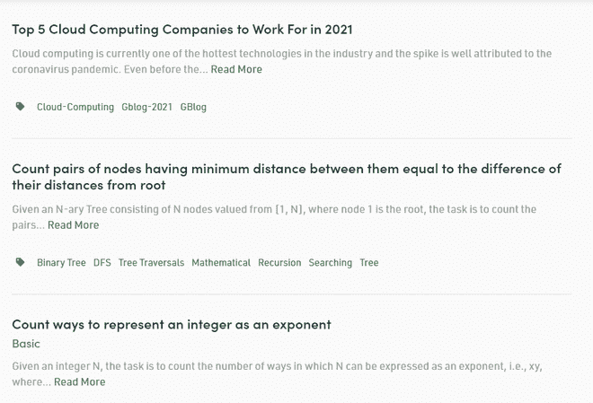

# 如何用 Python 刮网站的多个页面？

> 原文:[https://www . geeksforgeeks . org/如何使用 python 抓取网站的多个页面/](https://www.geeksforgeeks.org/how-to-scrape-multiple-pages-of-a-website-using-python/)

网页抓取是一种使用计算机程序从网站中提取有用数据的方法，无需手动操作。然后，这些数据可以被导出并分类组织用于各种目的。网络刮痧最常用的地方是市场研究和分析网站、价格比较工具、搜索引擎、人工智能/人工智能项目的数据收集等。

让我们深入挖掘并创建一个网站。在本文中，我们将访问 GeeksforGeeks 网站，并使用 Python 脚本提取主页上所有可用文章的标题。

如果你注意到，网站上有成千上万的文章，要提取所有的文章，我们必须浏览所有的页面，这样我们就不会错过任何一篇！



GeeksforGeeks 主页

## 使用 Python 抓取网站的多个页面

现在，可能会出现各种情况，您可能希望从同一网站的多个页面或多个不同的网址中获取数据，并且为每个网页手动编写代码是一项耗时且乏味的任务。另外，它定义了自动化的所有基本原则。废话！

为了解决这个确切的问题，我们将看到两种主要技术，它们将帮助我们从多个网页中提取数据:

*   同一个网站
*   不同的网站网址

**进场:**

该程序的方法将相当简单，并且以点的形式更容易理解:

*   我们将导入所有必要的库。
*   使用**请求**库设置我们的网址字符串进行连接。
*   使用**美观组**库的解析器解析目标页面中的可用数据。
*   从目标页面中，**识别**和**提取**包含对我们有价值的信息的类和标签。
*   **使用循环将它原型化为一页，然后将其应用于所有页面。**

**例 1:循环页码**


极客网站底部的页码

大多数网站都有从 1 到 n 标记的页面。这使得我们可以非常简单地遍历这些页面并从中提取数据，因为这些页面具有相似的结构。例如:


请注意网址的最后一部分–第/4 页/

在这里，我们可以看到网址末尾的页面详细信息。利用这些信息，我们可以很容易地创建一个 ***for 循环*** 迭代任意多的页面(通过将 ***页面/(i)/*** 放入 URL 字符串中，并迭代“*I*”*直到 N* )并从中刮取所有有用的数据。下面的代码将让您更加清楚如何使用 Python 中的 **For Loop** 来抓取数据。

## 计算机编程语言

```
import requests
from bs4 import BeautifulSoup as bs

URL = 'https://www.geeksforgeeks.org/page/1/'

req = requests.get(URL)
soup = bs(req.text, 'html.parser')

titles = soup.find_all('div',attrs = {'class','head'})

print(titles[4].text)
```