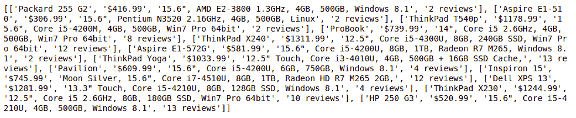
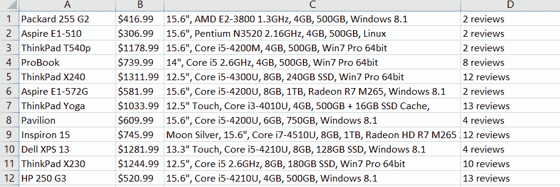

# 如何用 Python 中的 Selenium 来刮多页？

> 原文:[https://www . geeksforgeeks . org/如何使用 python 中的硒刮多页/](https://www.geeksforgeeks.org/how-to-scrape-multiple-pages-using-selenium-in-python/)

正如我们所知，selenium 是一个基于网络的自动化工具，可以帮助我们自动化浏览器。硒是一个开源测试工具，这意味着我们可以很容易地从互联网上下载并使用它。在 Selenium 的帮助下，我们还可以从网页上删除数据。这里，在本文中，我们将讨论如何使用 selenium 来废弃多个页面。

从网页上抓取数据的方法有很多种，我们将讨论其中一种。遍历页码是抓取数据最简单的方法。我们可以使用递增计数器将一页换成另一页。很多时候，我们的循环会运行，程序会从网页上删除数据。

**首页网址:**

```py
https://webscraper.io/test-sites/e-commerce/static/computers/laptops?page=1
```

最后，唯一页码会像**页面=1，页面=2** 一样递增……现在，让我们看看第二个页面网址。

**第二页网址:**

```py
https://webscraper.io/test-sites/e-commerce/static/computers/laptops?page=2
```

现在，让我们讨论一下方法

**安装:**

我们的第一步，在编写一行代码之前。我们必须为使用**网络驱动程序**类安装**硒**。通过它我们可以实例化浏览器，并从目标网址获取网页。

```py
pip install selenium
```

一旦硒安装成功。现在，我们可以进入下一步安装下一个软件包了。

下一个包是 **webdriver_manager，**让我们先安装一下，

```py
pip install webdriver_manager
```

耶！我们已经完成了重要或必要软件包的安装

现在，让我们看看下面的实现:

*   在这个程序中，借助 for 循环，我们将废弃两个网页，因为我们只运行了两次 for 循环。如果我们想废弃更多的页面，那么，我们可以增加循环数。
*   将页面网址存储在字符串变量 page_url 中，并使用 for 循环计数器增加其页码计数。
*   现在，实例化浏览器
*   使用驱动程序对象在 Chrome 浏览器中打开页面 URL
*   现在，使用像**这样的元素定位器从网页上抓取数据，找到 _elements_by_class_name** 方法。此方法将返回元素类型列表。我们将在列表变量中存储所有必要的数据，如**标题、价格、描述**、**和评级**。
*   将所有数据存储为单个产品的列表。在 element_list 中，我们将存储这个结果列表。
*   最后打印**元素 _ 列表**。然后关闭驱动程序对象。

## 蟒蛇 3

```py
# importing necessary packages
from selenium import webdriver
from webdriver_manager.chrome import ChromeDriverManager

# for holding the resultant list
element_list = []

for page in range(1, 3, 1):

    page_url = "https://webscraper.io/test-sites/e-commerce/static/computers/laptops?page=" + str(page)
    driver = webdriver.Chrome(ChromeDriverManager().install())
    driver.get(page_url)
    title = driver.find_elements_by_class_name("title")
    price = driver.find_elements_by_class_name("price")
    description = driver.find_elements_by_class_name("description")
    rating = driver.find_elements_by_class_name("ratings")

    for i in range(len(title)):
        element_list.append([title[i].text, price[i].text, description[i].text, rating[i].text])

print(element_list)

#closing the driver
driver.close()
```

**输出:**



**在 Excel 文件中存储数据:**

现在，我们将使用 **xlsxwriter** 包将**元素列表**中的数据存储到 Excel 文件中。所以，首先，我们必须安装这个 **xlsxwriter** 包。

```py
pip install xlsxwriter
```

一旦安装完成。让我们看看简单的代码，通过它我们可以将**元素列表**转换成 Excel **文件**。

## 蟒蛇 3

```py
with xlsxwriter.Workbook('result.xlsx') as workbook:
    worksheet = workbook.add_worksheet()

    for row_num, data in enumerate(element_list):
        worksheet.write_row(row_num, 0, data)
```

首先，我们正在创建一个名为 **result.xlsx** 的工作簿。之后，我们将**T3**单个产品**的列表考虑为**单排**。在 Excel 文件中将列表枚举为一行，将其数据枚举为列，该文件从行号 0 和列号 0 开始。**

现在，让我们看看它的实现:

## 蟒蛇 3

```py
import xlsxwriter
from selenium import webdriver
from webdriver_manager.chrome import ChromeDriverManager

element_list = []

for page in range(1, 3, 1):

    page_url = "https://webscraper.io/test-sites/e-commerce/static/computers/laptops?page=" + str(page)
    driver = webdriver.Chrome(ChromeDriverManager().install())
    driver.get(page_url)
    title = driver.find_elements_by_class_name("title")
    price = driver.find_elements_by_class_name("price")
    description = driver.find_elements_by_class_name("description")
    rating = driver.find_elements_by_class_name("ratings")

    for i in range(len(title)):
        element_list.append([title[i].text, price[i].text, description[i].text, rating[i].text])

with xlsxwriter.Workbook('result.xlsx') as workbook:
    worksheet = workbook.add_worksheet()

    for row_num, data in enumerate(element_list):
        worksheet.write_row(row_num, 0, data)

driver.close()
```

**输出:**



输出文件。

[点击这里](https://drive.google.com/file/d/1ASaTu3DYZ51xQNtf4GIU2yq_wgS1Ja8T/view?usp=sharing)下载输出文件。