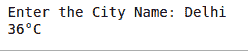

# 如何用 Python 从谷歌抓取网页数据？

> 原文:[https://www . geeksforgeeks . org/如何使用 python 从谷歌获取网络数据/](https://www.geeksforgeeks.org/how-to-scrape-web-data-from-google-using-python/)

**先决条件:** [Python 请求](https://www.geeksforgeeks.org/python-requests-tutorial/)、[在 Python 中用漂亮的程序](https://www.geeksforgeeks.org/implementing-web-scraping-python-beautiful-soup/)实现网页抓取

**[网页抓取](https://www.geeksforgeeks.org/introduction-to-web-scraping/)** 是一种从网站获取数据的技术。在网上冲浪时，许多网站不允许用户保存数据供个人使用。一种方法是手动复制粘贴数据，这既繁琐又耗时。网页抓取是从网站提取数据过程的自动化。

在本文中，我们将从谷歌的搜索结果中抓取天气更新。

**所需模块**

*   **美观组:**该模块用于在 HTML 或 XML 解析器上迭代、搜索和修改解析树。要下载它，请在终端中键入以下命令。

    ```
    pip install beautifulsoup4
    ```

*   **请求:**请求库是 Python 的一个组成部分，用于向指定的网址发出 HTTP 请求。要下载它，请在终端中键入以下命令。

    ```
    pip install requests
    ```

下面是实现。

```
import requests
from bs4 import BeautifulSoup

# Enter the City Name
city = input("Enter the City Name: ")
search = "Weather in {}".format(city)

# URL 
url = f"https://www.google.com / search?&q ={search}" 

# Sending HTTP request
req = requests.get(url)

# Pulling HTTP data from internet
sor = BeautifulSoup(req.text, "html.parser") 

# Finding temperature in Celsius
temp = sor.find("div", class_='BNeawe').text

print(temp)
```

**输出:**

