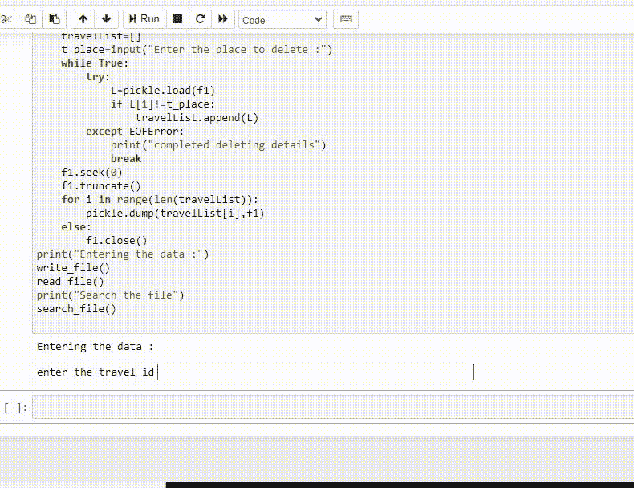

# 如何用 Python 搜索一个 pickle 文件？

> 原文:[https://www . geesforgeks . org/how-search-a-pickle-file-in-python/](https://www.geeksforgeeks.org/how-to-search-a-pickle-file-in-python/)

**先决条件** : [泡菜档](https://www.geeksforgeeks.org/understanding-python-pickling-example/)

Python pickle 模块用于序列化和反序列化 Python 对象结构。Python 中的任何对象都可以被腌制，以便保存在磁盘上。pickle 所做的是在将对象写入文件之前先“序列化”对象。酸洗是一种转换 python 对象(列表、字典等)的方法。)转换成字符流。想法是这个字符流包含在另一个 python 脚本中重建对象所需的所有信息

Pickle 一次序列化一个对象，并回读一个对象—酸洗后的数据按顺序记录在文件中。

如果您只是执行 pickle.load，您应该读取序列化到文件中的第一个对象(而不是您编写的最后一个对象)。

在反序列化第一个对象后，文件指针位于下一个对象的开头，如果您简单地再次调用 pickle.load，它将读取下一个对象，直到文件结束。

### **使用的功能:**

*   **dump()**–用于将 obj 的腌制表示写入打开的文件对象文件。

**语法:**

> *pickle.dump(obj，文件，协议=无，* fix _ imports =真)*

*   **load()**–用于从打开的文件对象文件中读取一个腌制对象表示，并返回指定的重构对象层次。

**语法:**

> *pickle.load(文件，* fix _ imports = True，编码=“ASCII”，错误=“strict”)*

*   **seek(0)-** Pickle 记录可以连接成一个文件，所以是的，你可以多次 pickle.load(f)，但是文件本身没有索引，这样你就可以在给定的记录中进行 seek。f.seek(0)正在查找文件中的第三个字节，该字节位于 pickle 记录的中间，因此是不可取出的。如果您需要随机访问，您可能希望查看内置的搁置模块，该模块使用数据库文件模块在 pickle 之上构建类似字典的接口。
*   **truncate()-** 更改文件大小

下面给出了添加到 pickle 文件的植入。

**程序:**

## 蟒蛇 3

```
import pickle

print("GFG")

def write_file():

    f = open("travel.txt", "wb")
    op = 'y'

    while op == 'y':

        Travelcode = int(input("enter the travel id"))
        Place = input("Enter the Place")
        Travellers = int(input("Enter the number of travellers"))
        buses = int(input("Enter the number of buses"))

        pickle.dump([Travelcode, Place, Travellers, buses], f)
        op = input("Dp you want to continue> (y or n)")

    f.close()

print("entering the details of passengers in the pickle file")
write_file()
```

创建 pickle 文件并成功加载数据后，即可执行搜索。

### 方法:

*   导入模块
*   打开泡菜文件
*   拿一些元素作为搜索的基础
*   如果找到，显示结果

**程序:**

## 蟒蛇 3

```
import pickle

print("GFG")

def search_file():
    f = open("travel.txt", 'rb')
    t_code = int(input("Enter the travel code to traveller : "))

    while True:
        try:

            L = pickle.load(f)

            if L[0] == t_code:
                print("Place", L[1], "\t\t Travellers :",
                      L[2], "\t\t Buses :", L[3])

                break

        except EOFError:

            print("Completed reading details")
    f.close()

print("entering the details of passengers in the pickle file")
write_file()

print("Search the file using the passenger Code")
search_file()
```

**输出:**

