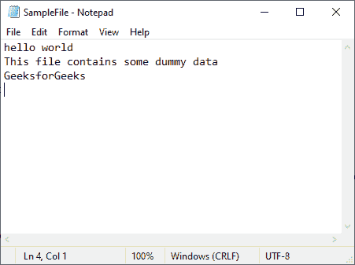
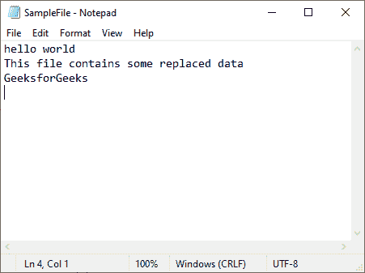
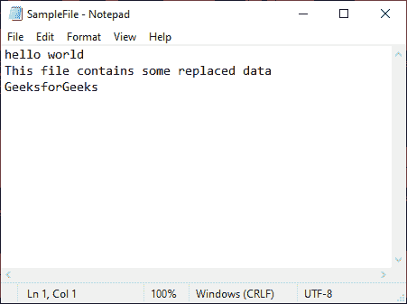
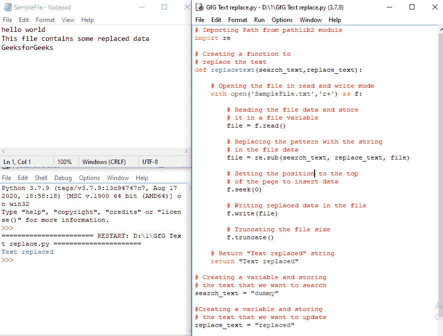

# 如何在 Python 中搜索和替换文件中的文本？

> 原文:[https://www . geesforgeks . org/如何在 python 中搜索和替换文件中的文本/](https://www.geeksforgeeks.org/how-to-search-and-replace-text-in-a-file-in-python/)

在本文中，我们将学习如何使用 python 替换文件中的文本。

### 方法 1:在不使用任何外部模块的情况下搜索和替换文本

让我们看看如何在文本文件中搜索和替换文本。首先，我们创建一个文本文件，在其中搜索和替换文本。假设这个文件是 SampleFile.txt，包含以下内容:



要替换文件中的文本，我们将使用 open()函数以只读方式打开文件。然后我们将使用 read()和 replace()函数读取并替换文本文件中的内容。

> **语法:**打开(文件，模式='r ')
> 
> **参数:**
> 
> *   文件:文件的位置
> *   模式:您想要打开文件的模式。

然后我们将在写入模式下打开同一个文件来写入替换的内容。

## 蟒蛇 3

```
# creating a variable and storing the text
# that we want to search
search_text = "dummy"

# creating a variable and storing the text
# that we want to add
replace_text = "replaced"

# Opening our text file in read only
# mode using the open() function
with open(r'SampleFile.txt', 'r') as file:

    # Reading the content of the file
    # using the read() function and storing
    # them in a new variable
    data = file.read()

    # Searching and replacing the text
    # using the replace() function
    data = data.replace(search_text, replace_text)

# Opening our text file in write only
# mode to write the replaced content
with open(r'SampleFile.txt', 'w') as file:

    # Writing the replaced data in our
    # text file
    file.write(data)

# Printing Text replaced
print("Text replaced")
```

**输出:**

```
Text replaced
```



### 方法 2:使用 pathlib2 模块搜索和替换文本

让我们看看如何使用 pathlib2 模块搜索和替换文本。首先，我们创建一个文本文件，在其中搜索和替换文本。假设这个文件是 SampleFile.txt，包含以下内容:


使用以下命令安装 pathlib2 模块:

```
pip install pathlib2
```

该模块提供了表示文件系统路径的类，这些类具有适合不同操作系统的语义。要使用 pathlib2 模块替换文本，我们将使用 pathlib2 模块的 Path 方法。

> **语法:**路径(文件)
> 
> 参数:
> 
> *   文件:要打开的文件的位置

在下面的代码中，我们将文本文件中的“虚拟”替换为“替换”。使用 pathlib2 模块。

**代码:**

## 蟒蛇 3

```
# Importing Path from pathlib2 module
from pathlib2 import Path

# Creating a function to
# replace the text
def replacetext(search_text, replace_text):

    # Opening the file using the Path function
    file = Path(r"SampleFile.txt")

    # Reading and storing the content of the file in
    # a data variable
    data = file.read_text()

    # Replacing the text using the replace function
    data = data.replace(search_text, replace_text)

    # Writing the replaced data
    # in the text file
    file.write_text(data)

    # Return "Text replaced" string
    return "Text replaced"

# Creating a variable and storing
# the text that we want to search
search_text = "dummy"

# Creating a variable and storing
# the text that we want to update
replace_text = "replaced"

# Calling the replacetext function
# and printing the returned statement
print(replacetext(search_text, replace_text))
```

**输出:**

```
Text replaced
```



### 方法 3:使用[正则表达式模块](https://www.geeksforgeeks.org/regular-expression-python-examples-set-1/)搜索和替换文本

让我们看看如何使用正则表达式模块来搜索和替换文本。我们将使用 re.sub()方法来替换文本。

> **语法:** re.sub(模式，repl，字符串，计数=0，标志=0)
> 
> **参数:**
> 
> *   **回复:**要添加的文本
> *   **字符串:**要替换的文本

**代码:**

## 蟒蛇 3

```
# Importing re module
import re

# Creating a function to
# replace the text
def replacetext(search_text,replace_text):

    # Opening the file in read and write mode
    with open('SampleFile.txt','r+') as f:

        # Reading the file data and store
        # it in a file variable
        file = f.read()

        # Replacing the pattern with the string
        # in the file data
        file = re.sub(search_text, replace_text, file)

        # Setting the position to the top
        # of the page to insert data
        f.seek(0)

        # Writing replaced data in the file
        f.write(file)

        # Truncating the file size
        f.truncate()

    # Return "Text replaced" string
    return "Text replaced"

# Creating a variable and storing
# the text that we want to search
search_text = "dummy"

#Creating a variable and storing
# the text that we want to update
replace_text = "replaced"

# Calling the replacetext function
# and printing the returned statement
print(replacetext(search_text,replace_text))
```

**输出:**

```
Text replaced
```



### 方法 4:使用文件输入

让我们看看如何使用 fileinput 模块搜索和替换文本。为此，我们将使用 FileInput()方法迭代文件的数据并替换文本。

> **语法:**文件输入(文件=无，位置=假，备份=，*，模式='r ')
> 
> **参数:**
> 
> *   文件:文本文件的位置
> *   模式:您想要打开文件的模式
> *   就地:如果值为真，则文件被移动到备份文件，并且
> *   标准输出指向输入文件
> *   备份:备份文件的扩展名

**代码:**

## 蟒蛇 3

```
# Importing FileInput from fileinput module
from fileinput import FileInput

# Creating a function to
# replace the text
def replacetext(search_text, replace_text):

    # Opening file using FileInput
    with FileInput("SampleFile.txt", inplace=True,
                   backup='.bak') as f:

        # Iterating over every and changing
        # the search_text with replace_text
        # using the replace function
        for line in f:
            print(line.replace(search_text,
                               replace_text), end='')

    # Return "Text replaced" string
    return "Text replaced"

# Creating a variable and storing
# the text that we want to search
search_text = "dummy"

# Creating a variable and storing
# the text that we want to update
replace_text = "replaced"

# Calling the replacetext function
# and printing the returned statement
print(replacetext(search_text, replace_text))
```

**输出:**

```
Text replaced
```