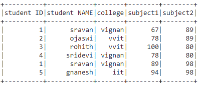

# 如何在 PySpark 中从数据框中选择一系列行？

> 原文:[https://www . geeksforgeeks . org/如何从 pyspark 中的数据框中选择行范围/](https://www.geeksforgeeks.org/how-to-select-a-range-of-rows-from-a-dataframe-in-pyspark/)

在本文中，我们将从 PySpark 数据框中选择一系列行。

**可以这样做:**

*   使用过滤器()。
*   使用 where()。
*   使用 SQL 表达式。

**创建用于演示的数据框:**

## 蟒蛇 3

```
# importing module
import pyspark

# importing sparksession from pyspark.sql module
from pyspark.sql import SparkSession

# creating sparksession and giving an app name
spark = SparkSession.builder.appName('sparkdf').getOrCreate()

# list  of students  data
data = [["1", "sravan", "vignan", 67, 89],
        ["2", "ojaswi", "vvit", 78, 89],
        ["3", "rohith", "vvit", 100, 80],
        ["4", "sridevi", "vignan", 78, 80],
        ["1", "sravan", "vignan", 89, 98],
        ["5", "gnanesh", "iit", 94, 98]]

# specify column names
columns = ['student ID', 'student NAME',
           'college', 'subject1', 'subject2']

# creating a dataframe from the lists of data
dataframe = spark.createDataFrame(data, columns)

# display dataframe
dataframe.show()
```

**输出:**



**方法 1:使用滤镜()**

该函数用于根据给定的条件选择记录来过滤数据帧。

> **语法** : dataframe.filter(条件)

**示例:**基于 subject2 列选择数据框的 Python 代码。

## 蟒蛇 3

```
# select dataframe between
# 23 and 78 marks in subject2 
dataframe.filter(
  dataframe.subject1.between(23,78)).show()
```