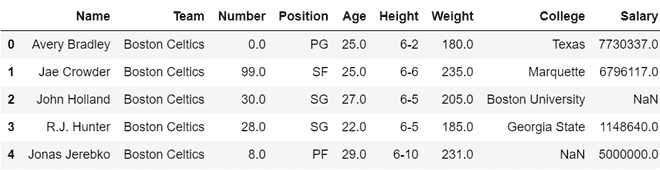
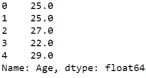

# 如何选择数据帧的子集？

> 原文:[https://www . geesforgeks . org/如何选择数据框子集/](https://www.geeksforgeeks.org/how-to-select-a-subset-of-a-dataframe/)

在本文中，我们将讨论如何从数据框中选择列和行的子集。我们将使用 [nba.csv](https://media.geeksforgeeks.org/wp-content/uploads/nba.csv) 数据集来执行所有操作。

## 蟒蛇 3

```py
# import required module
import pandas as pd

# assign dataframe
data = pd.read_csv("nba.csv")

# display dataframe
data.head()
```

**输出:**



下面是各种操作，通过这些操作，我们可以为给定的数据帧选择一个子集:

*   **从数据框中选择特定的列**

要选择单个列，我们可以使用方括号[ ]:

## 蟒蛇 3

```py
# import required module
import pandas as pd

# assign dataframe
data = pd.read_csv("nba.csv")

# get a single columns
ages = data["Age"]

# display the column
ages.head()
```

**输出:**



*   **从数据框中选择多列**

我们可以在方括号[]内传递一个列名列表，以获得多个列:

## 蟒蛇 3

```py
# import required module
import pandas as pd

# assign dataframe
data = pd.read_csv("nba.csv")

# get a single columns
name_sex = data[["Name","Age"]]

# display the column
name_sex.head()
```