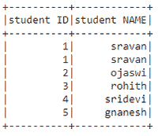
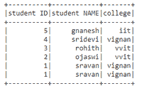
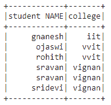

# 如何在 Pyspark DataFrame 中选择和排序多列？

> 原文:[https://www . geeksforgeeks . org/如何选择和订购 pyspark-dataframe 中的多列/](https://www.geeksforgeeks.org/how-to-select-and-order-multiple-columns-in-pyspark-dataframe/)

在本文中，我们将讨论如何使用 Python 中的 pyspark 从数据框中选择和排序多个列。为此，我们使用 sort()和 orderBy()函数以及 select()函数。

### 使用的方法

*   Select():此方法用于选择数据框列的一部分，并返回新选择的数据框的副本。

> **语法:** dataframe.select(['column1 '，' column2 '，' column n']。显示()

*   sort():此方法用于对数据帧的数据进行排序，并返回新排序的数据帧的副本。默认情况下，这将按升序对数据帧进行排序。

> **语法:** dataframe.sort(['column1 '，' column2 '，' column n']，升序=True)。显示()

*   oderBy():该方法类似于 sort，也用于对数据帧进行排序。默认情况下，这将按升序对数据帧进行排序。

> **语法:** dataframe.orderBy(['column1 '，' column2 '，' column n']，升序=True)。显示()

让我们创建一个示例数据帧

## 蟒蛇 3

```
# importing module
import pyspark

# importing sparksession from 
# pyspark.sql module
from pyspark.sql import SparkSession

# creating sparksession and giving an app name
spark = SparkSession.builder.appName('sparkdf').getOrCreate()

# list  of students  data
data = [["1", "sravan", "vignan"], ["2", "ojaswi", "vvit"],
        ["3", "rohith", "vvit"], ["4", "sridevi", "vignan"],
        ["1", "sravan", "vignan"], ["5", "gnanesh", "iit"]]

# specify column names
columns = ['student ID', 'student NAME', 'college']

# creating a dataframe from the lists of data
dataframe = spark.createDataFrame(data, columns)

print("Actual data in dataframe")
# show dataframe
dataframe.show()
```

**输出:**


使用 sort()方法选择多个列和顺序

## 蟒蛇 3

```
# show dataframe by sorting the dataframe
# based on two columns in ascending
# order using sort() function
dataframe.select(['student ID', 'student NAME']
                ).sort(['student ID', 'student NAME'], 
                       ascending=True).show()
```

**输出:**



## 蟒蛇 3

```
# show dataframe by sorting the dataframe
# based on three columns in desc order
# using sort() function
dataframe.select(['student ID', 'student NAME', 'college']
                ).sort(['student ID', 'student NAME', 'college'],
                       ascending=False).show()
```

**输出:**



使用 order by()方法选择多个列和顺序

## 蟒蛇 3

```
# show dataframe by sorting the dataframe
# based on three columns in desc
# order using orderBy() function
dataframe.select(['student ID', 'student NAME', 'college']
                ).orderBy(['student ID', 'student NAME', 'college'],
                          ascending=False).show()
```

**输出:**


## 蟒蛇 3

```
# show dataframe by sorting the dataframe
# based on two columns in asc
# order using orderBy() function
dataframe.select(['student NAME', 'college']
                ).orderBy(['student NAME', 'college'],
                          ascending=True).show()
```

**输出:**

